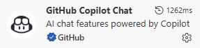
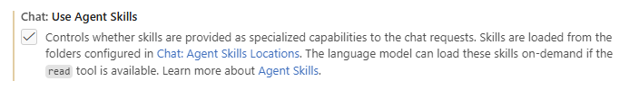
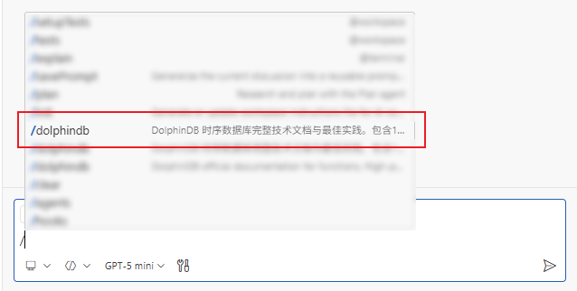
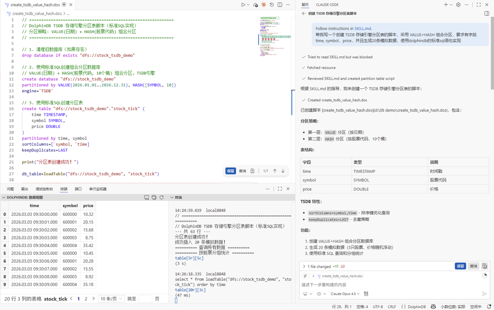
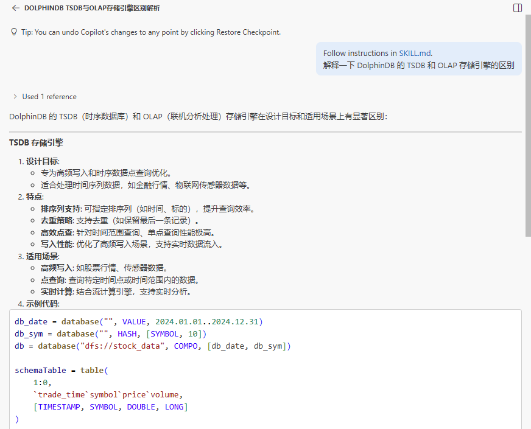
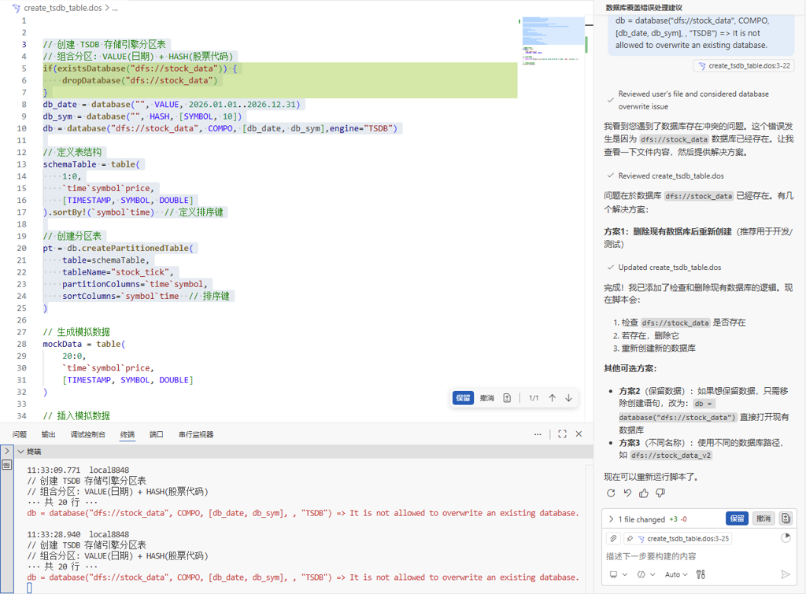

# DolphinDB Skill - 完整技术文档库

> **版本**: 2.0.0 (优化版) | **评分**: 9.5/10 ⭐  
> **DolphinDB版本**: 3.00.4 | **更新时间**: 2026-01-22

一站式DolphinDB时序数据库技术文档与最佳实践指南。包含1493个技术文档 + 3份官方白皮书，涵盖数据库设计、流计算、量化回测等全场景。

---

## 📚 核心资源

### 🎯 官方白皮书 (4557行深度内容)

| 白皮书 | 行数 | 适用场景 |
|--------|------|---------|
| [数据库白皮书](references/whitepapers/database.md) | 1073 | 架构设计、性能优化、生产部署 |
| [流数据白皮书](references/whitepapers/streaming.md) | 2279 | 实时计算、CEP、流式ETL |
| [回测白皮书](references/whitepapers/backtest.md) | 2205 | 量化回测、算法交易、策略研发 |

### 📖 技术文档 (1490篇)

| 分类 | 数量 | 说明 |
|------|------|------|
| 函数参考 | 1171+ | 数学、统计、时序、SQL等 |
| 流数据处理 | 22 | 流表、订阅、引擎 |
| 数据库核心 | 13 | 存储引擎、分区、事务 |
| 部署与配置 | 9 | 集群部署、参数配置 |
| 其他 | 97+ | API、运维、教程等 |

**完整索引**: 见 [CATALOG.md](CATALOG.md) (1536行)

---

### **前置准备（必看）**：

1. 确保已安装 DolphinDB 相关环境，具体环境部署可参考 [部署](https://docs.dolphindb.cn/zh/deploy/deploy_intro.html)；
2. 安装 VS Code 客户端 ；
3. 安装 GitHub Copilot 和 DolphinDB 扩展，具体 DolphinDB 扩展安装可参考 [VS Code 插件](https://docs.dolphindb.cn/zh/db_distr_comp/vscode.html)；



4. 克隆本仓库到本地目录：
| **类型**   | **VSCODE**           | Antigravity                                     | **CLAUDE**          |
| :--------- | :------------------- | ----------------------------------------------- | :------------------ |
| 项目 Skill | `.github/skills/`    | <workspace-root>/.agents/skills/<skill-folder>/ | `.claude/skills/`   |
| 个人 Skill | `~/.copilot/skills/` | ~/.gemini/antigravity/skills/<skill-folder>/    | `~/.claude/skills/` |

保证层级目录为：
```
skills/ 
└── dolphindb_skill/    
    ├── assets/    
    ├── ...       
    └── SKILL.md
```

项目路径：适用于团队协作或特定项目开发，将 DolphinDB Skill 放入当前开发项目根目录下的 `.github/skills/` 文件夹中，仅对当前项目生效，不影响其他项目的 AI 代理配置，方便团队共享统一的 Skill 版本。

个人路径：适用于个人日常开发，将 DolphinDB Skill 放入个人用户目录下的 `.copilot/skills/` 文件夹中，全局生效，无论打开哪个 DolphinDB 开发项目，都能调用该 Skill，无需重复配置。

其他 AI Agent 使用 DolphinDB Skill，可以将其配置到对应的目录下，例如配置 Google Antigravity 的Global Skill，可以将其配置到 `~/.gemini/antigravity/skills/<skill-folder>/` 目录下，重启 Google Antigravity 即可直接使用，具体可参考 [Google Antigravity Documentation](https://antigravity.google/docs/skills) 。

#### Step 1：配置 DolphinDB Skill
打开 VS Code，进入 GitHub Copilot 插件设置，找到“Chat: Use Agent Skills”配置项并启用。


配置完成后，如果 `/dolphindb` 指令可被正常查找到，则证明 DolphinDB Skill 配置成功。



#### Step 2：3 个高频场景，解锁 AI 辅助开发

温馨提示：以下所有场景的提问前，需添加 `/dolphindb` ，才能成功调用 DolphinDB Skill 

#### **场景 1：自然语言转脚本**

打开 Copilot 聊天视图，输入自然语言指令，比如：

“/dolphindb 帮我写一个创建 TSDB 存储引擎分区表的脚本，采用 VALUE+HASH 组合分区，要求有字段 time, symbol，price，并且生成20条模拟数据，使用 dolphindb 的标准 sql 语句实现”

“/dolphindb 写一个流计算实时 K 线合成的脚本”

Copilot 会生成符合语法规范的完整脚本，可直接复制使用，还能通过内联聊天精准调整。



#### **场景 2：概念与知识点讲解**

在 Copilot 聊天视图输入提问，比如：

“/dolphindb 解释一下 DolphinDB 的 TSDB 和 OLAP 存储引擎的区别”

“/dolphindb DolphinDB 中时序聚合引擎的用法”

DolphinDB Skill 会结合官方文档内容，用通俗语言拆解知识点+搭配示例，边开发边学习，无需额外查文档。


#### 场景 3：调试与优化

生成脚本后，若出现语法报错，可直接在聊天界面提问，快速获取针对性解决方案。


### 为什么值得用？

1. 零成本上手：依托 VS Code+Copilot 熟悉操作，简单配置即可使用；
2. 精准适配：专为 DolphinDB 设计，同步官方文档核心内容；
3. 效率翻倍：节省语法记忆、调试、查文档时间，新手快速入门，资深开发者提效；
4. 边学边练：支持知识点讲解，边开发边夯实基础。

---

## 📖 主要文档说明

| 文件 | 大小 | 用途 |
|------|------|------|
| **SKILL.md** | 12KB | 主文档，包含完整指南、代码示例、工作流 |
| **CATALOG.md** | 64KB | 1493个文档的完整索引，按13类组织 |
| **metadata.json** | 209KB | 元数据，包含所有文档的详细信息 |
| **references/** | ~7.8MB | 所有技术文档和白皮书 |
| **assets/** | - | 图片等资源文件 |

---

## 🔍 快速查找

### 按问题查找

| 问题 | 答案位置 |
|------|---------|
| 如何选择TSDB vs OLAP? | [SKILL.md](SKILL.md) → 存储引擎选择 |
| 如何设计分区策略? | [数据库白皮书](references/whitepapers/database.md) 第2.2节 |
| 流计算引擎有哪些? | [流数据白皮书](references/whitepapers/streaming.md) 第3章 |
| 如何实现高可用? | [doc_3934.md](references/doc_3934.md) |

### 按角色查找

| 角色 | 推荐路径 |
|------|---------|
| **架构师** | 数据库白皮书 → 分布式架构 → SKILL.md工作流 |
| **量化工程师** | 回测白皮书 → SKILL.md代码示例 → CATALOG函数查询 |
| **后端开发** | 流数据白皮书 → SKILL.md流计算示例 → API文档 |
| **数据分析师** | SKILL.md SQL示例 → CATALOG函数参考 |

---

## 💡 v2.0 核心特性

相比v1.x版本，v2.0优化版提供：

✅ **完整文档索引** - CATALOG.md覆盖所有1493个文档  
✅ **3份官方白皮书** - 4557行深度技术内容  
✅ **场景化导航** - 15个常见问题快速定位  
✅ **5大类代码示例** - 可直接运行的完整示例  
✅ **13个细分类别** - 更精准的文档分类  
✅ **版本信息明确** - 标注DolphinDB 3.00.4  

---

## 📊 目录结构

```
dolphindb_skill/
├── README.md                    # 本文件 (快速入门)
├── SKILL.md                     # 主文档 (详细指南)
├── CATALOG.md                   # 文档索引 (1493个文档)
├── metadata.json                # 元数据
├── assets/                      # 资源文件
│   └── images/
└── references/                  # 参考文档
    ├── whitepapers/            # 官方白皮书
    │   ├── database.md         # 数据库白皮书
    │   ├── streaming.md        # 流数据白皮书
    │   ├── backtest.md         # 回测白皮书
    │   └── images/
    └── doc_*.md                # 1490篇技术文档
```

---

## 🔗 相关资源

- **官网**: https://www.dolphindb.com
- **文档中心**: https://docs.dolphindb.cn
- **社区论坛**: https://ask.dolphindb.cn/
- **GitHub**: https://github.com/dolphindb

---

## 📞 技术支持

遇到问题？

1. 先查阅 [SKILL.md](SKILL.md) 常见问题导航
2. 使用 [CATALOG.md](CATALOG.md) 搜索相关文档
3. 访问 [DolphinDB社区](https://ask.dolphindb.cn/)
4. 联系官方技术支持

---

## 📝 更新日志

### v2.0 (2026-01-22)
- ✅ 整合3份官方白皮书 (4557行)
- ✅ 生成完整文档索引 CATALOG.md
- ✅ 新增15个常见问题快速导航
- ✅ 补充5大类可运行代码示例
- ✅ 优化为13个细分类别
- ✅ 更新DolphinDB版本信息至3.00.4

### v1.x (2025-01-20)
- 初始版本，包含1490个技术文档

---

**Skill版本**: 2.0.0 | **DolphinDB版本**: 3.00.4 | **质量评分**: 9.5/10 ⭐  
**维护**: Skill Creator | **许可**: MIT
