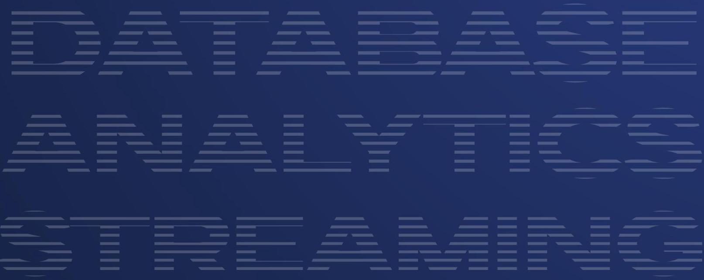
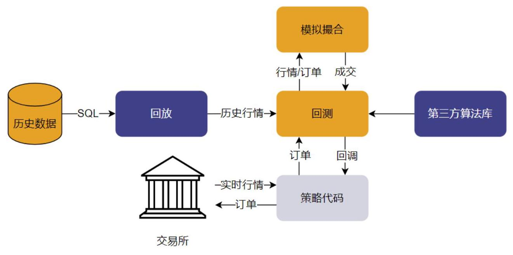
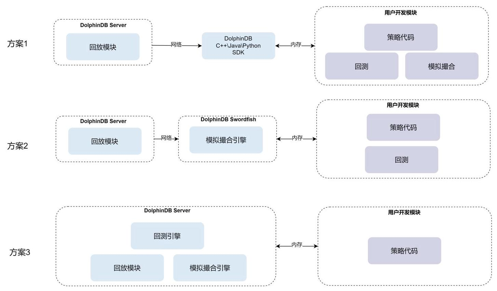
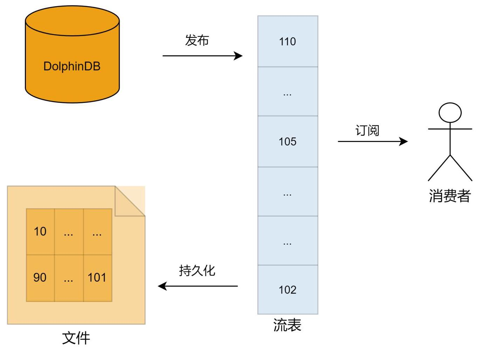
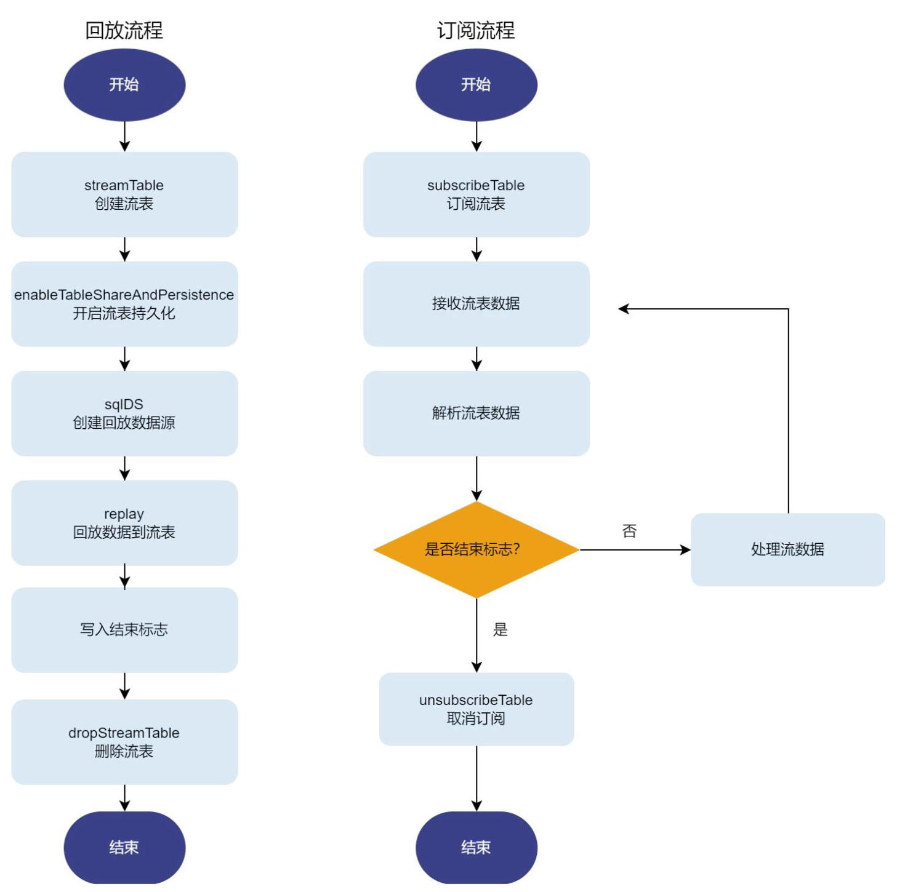
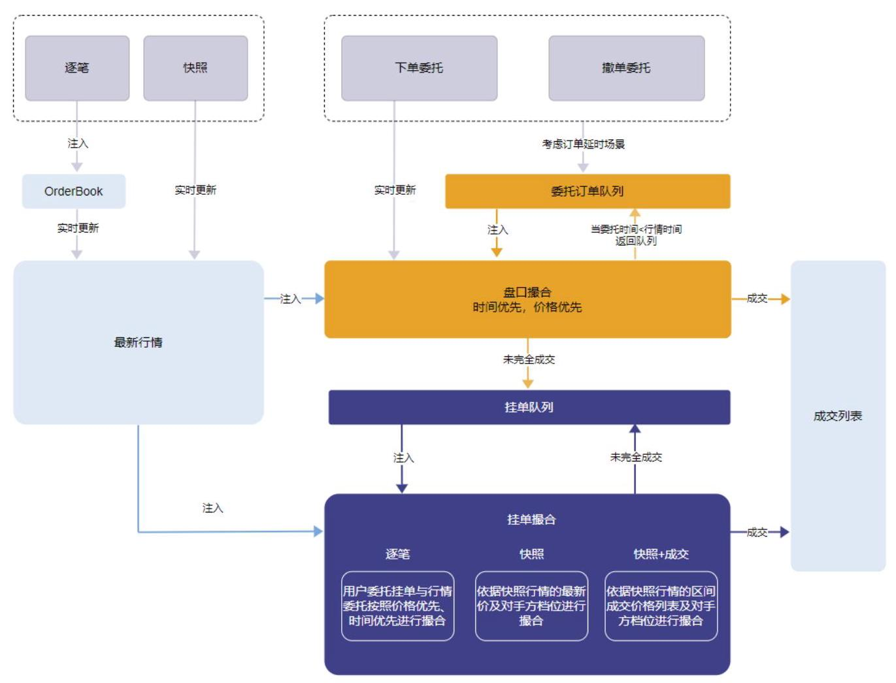
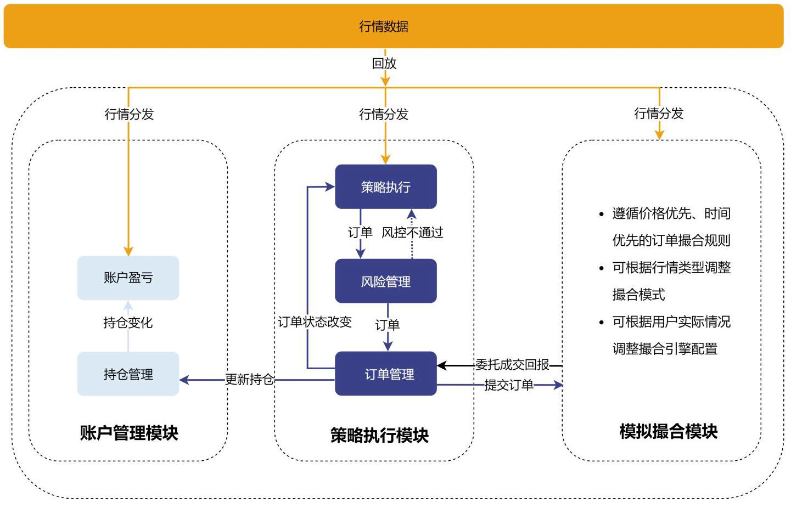
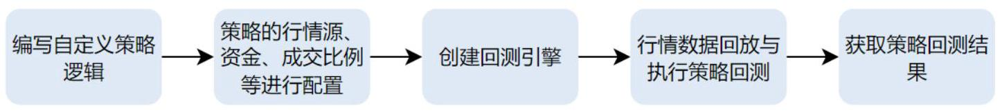
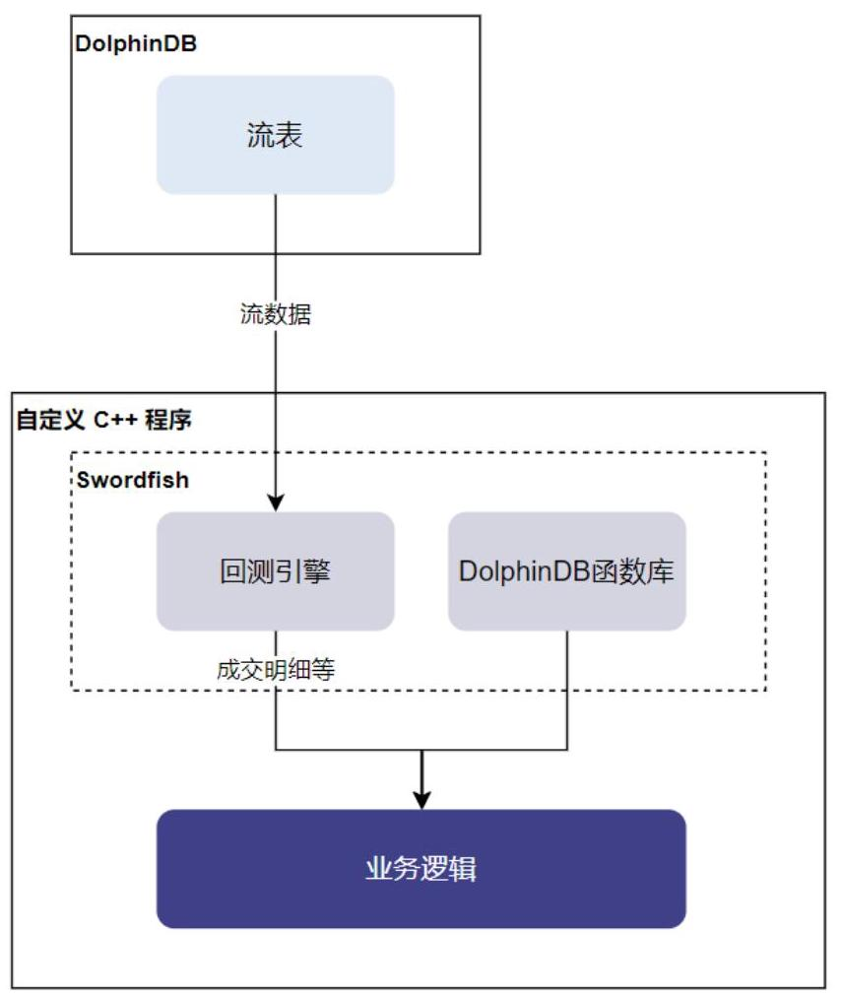

# DolphinDB 白皮书 中高频策略回测

## 内容

前言. .iii

第 1 章. 中高频回测方案概述. .4

第 2 章. 数据回放与订阅 .6

2.1 单表回放. .7

2.2 多表回放. 9

2.3 回放与订阅处理示例 11

第 3 章. 模拟撮合引擎. 13

3.1 模拟撮合引擎功能介绍 13

3.2 模拟撮合引擎使用示例 15

3.3 开发算法交易策略 17

第 4 章. 回测引擎. 21

4.1 中高频回测引擎功能介绍 21

4.2 编写自定义策略. 22

4.3 回测引擎配置参数. .23

4.4 回测引擎使用注意事项. 25

4.5 使用示例 .25

第 5 章. DolphinScript 编写回测策略 28

5.1 动态网格交易策略回测 .28

5.2 科创版做市策略回测示例. 33

5.3 股票中高频 CTA 策略回测 36

5.4 期货分钟频 CTA 策略回测 37

5.5 银行间债券双边跟随最优价做市策略 .39

第 6 章. Python Parser 编写回测策略. 42

6.1 Python Parser 脚本改写策略回测 42

6.2 Python Parser 和 DolphinScript 的性能对比 43

第 7 章. C++ 编写回测策略. 44

7.1 C++ 策略实现 .45

7.2 C++和 DolphinScript 的性能对比 .48

第 8 章. 总结和展望. 50

第 9 章. 附录 51

## 前言

回测是量化交易投研的一个重要环节。量化策略上线之前，必须通过回测评估策略在历史数据上的表现。中高频策略回测相比于低频策略回测，存在两个新的挑战。首先，数据量增加了几个数量级，无论数据查询或者计算都对性能有更加苛刻的要求。其次，在中高频策略回测中，并不能简单的假设每个订单以当前价格或日终价格全部成交，需要一个模拟撮合引擎来模拟实际的交易过程，例如考虑订单能否成交、成交价格、成交量以及市场冲击等因素。DolphinDB 基于其高性能的分布式存储和计算架构，实现了行情回放、模拟撮合引擎和事件型中高频回测引擎三大核心组件，支持通过 DolphinScript、Python 或 C++语言完成中高频策略的研发和测试，提供了一个性能优异且易扩展的中高频量化交易策略回测解决方案。 目前，DolphinDB 已实现对沪深交易所所有股票标的的多种策略回测支持，包括逐笔+快照、逐笔(逐笔合成快照触发策略)、快照和快照+成交、分钟以及日频行情策略回测。同时，还支持期货和期权的快照、分钟和日频行情，以及银行间现券和融资融券等策略的回测。

## 第 1 章. 中高频回测方案概述

一个量化中高频策略在投入实盘交易之前，都需要使用市场的历史数据来进行回测，以评估交易策略的有效性。一个量化交易回测平台的基本架构如下图所示:

图 1-1 策略回测基本架构

中高频量化交易策略回测平台的实现主要包括三个重要环节:

- 行情数据回放

一个量化策略在用于实际交易时，处理实时数据的程序通常为事件驱动。为了实现使用同一套策略逻辑进行回测和实盘交易，量化策略回测平台一般需要分批获取历史行情数据，并严格按时间排序后注入回测引擎。沪深交易所的中高频行情数据通常包括逐笔委托、逐笔成交、快照等多种类型的数据，每日的数据量在50G左右。 基于3秒快照行情订单撮合时，需要将快照行情数据严格按照时间先后顺序注入引擎；基于逐笔行情对策略生成的订单撮合时，需要同时注入逐笔委托单和逐笔成交单两个数据源，并且严格按照时间顺序和委托单序号先后顺序注入数据，才能准确模拟实际的交易过程。

·委托订单模拟撮合

在中高频策略或者中高频算法交易策略中，我们常常会遇到这样的情况:一些在回测中表现良好的策略或者算法交易策略，一旦应用于实际交易，效果就不如预期。其中一个非常重要的原因是回测和真实交易时的订单撮合情况不同。为了确保策略的委托订单撮合时尽可能模拟真实交易时的订单撮合情况，我们需要在中高频回测过程中引入模拟撮合系统。

·策略开发与策略回测绩效评估

在设计中高频交易策略时，通常会采用一些指标、模型或者机器学习方法来辅助判断市场的趋势，这些指标计算和模型需要丰富的函数库。策略的制定通常需要针对不同的事件，如新行情的出现、订单的成交等，因此开发策略时需要利用多样化的事件函数来应对这些情况。回测系统还应提供包括交易记录、持仓情况、收益信息等在内的全面的回测结果，以便用户深入分析策略的回测表现。 DolphinDB 提供了完整的解决方案，涵盖以下 3 个环节:

- 回放功能:支持将一个或多个不同结构的分布式表中的数据严格按照时间或者按指定多列排序顺序回放到流表中，模拟实时行情数据。

·模拟撮合引擎插件:支持沪深交易所 Level-2 逐笔行情和快照行情，实现了与交易所一致的“价格优先，时间优先”高精度撮合、支持基于多种行情数据的撮合模式、并提供丰富的撮合配置，模拟真实的实盘交易环境。

·回测插件:用户可以在其中自定义指标，支持基于逐笔、快照、分钟和日频行情进行策略回测，获取回测的收益、持仓、交易明细等信息。其中基于逐笔和快照行情进行高精度策略回测，用户可以实现仿真和回测一体化的策略验证。

这 3 个模块化解决方案涵盖了中高频策略回测平台所需的所有环节，整合在一起就构成了 DolphinDB 一站式的中高频策略回测解决方案。这些解决方案与外部解决方案兼容性良好。如果用户已经实现了回测平台中某个环节，DolphinDB 提供的解决方案也可以与其融合成一个完整的回测方案。例如:

1. 用户已实现了基于其他语言的量化交易实盘和中高频回测一体化平台，可以将数据存储在 DolphinDB 中，采用 DolphinDB 的回放功能，将中高频行情数据回放到 C++、Java 和 Python 等客户端，快速对接已有量化交易回测系统。

2. 用户可以采用 DolphinDB 的回放功能和模拟撮合引擎，基于 Swordfish 编写回测系统。

3. 用户可以采用全套 DolphinDB 回测框架，编写 DolphinDB 脚本、Python 和 C++ 三种不同语言的策略代码。

图1-2 中高频策略回测方案的三种实现方式

不同方案的模块部署如图 1-2 所示，其中紫色部分是需要用户实现的模块，蓝色部分为 DolphinDB 内置模块。本文第 2-4 章，我们将分别介绍 DolphinDB 的数据回放、模拟撮合引擎和中高频回测引擎插件。在第 5 章中，我们将实现一些具体的策略，展示如何在实际场景中使用 DolphinDB 中高频策略回测解决方案。

## 第 2 章. 数据回放与订阅

用户的量化策略在生产(交易)环境中运行时，通常由事件驱动处理实时数据。为确保研发和生产使用同一套代码，通常在研发阶段需要将历史数据，严格按照事件发生的时间顺序进行回放，以此模拟交易环境进行回测。在回测时，对数据回放的要求包含以下几点:

・速度快:作为回测的一个环节，为了提高回测效率，能在最短时间内回放完所有数据。

- 支持多种数据:实时数据可能是一自单张表，也可能分布在多张表中，要求具备对多种数据源的支持能力。

- 支持多种部署方式:数据的发布和订阅可以部署在一台服务器上，也能部署在两台不同的服务器上。

- 灵活选择数据源:以类似 SQL 的方式，指定需要回放的数据，方便调试和测试。

针对以上要求，DolphinDB 以流表为中心，建立了一套包含发布、订阅、持久化功能的数据回放方案。上述提及的流表是 DolphinDB 中一种特殊的内存表，能支持同时读写，且只能添加记录，用户不能修改或删除记录。通过开启持久化功能可以将部分记录存盘，同时将其从内存中移除，以免流表内存占用过大。下图展示了方案的整体流程。

图2-1 发布-订阅-消费流程

以流表为中心，整个方案包含三个任务。

1. 发布任务从数据库中取数据，并插入流表顶部，通过多线程执行发布任务以满足对回放性能的要求。

2. 消费者订阅流表后，订阅任务从流表中取数据，分批发给消费者，可以同时满足多个客户端订阅的需求。

3. 为了节省流表对系统内存的占用，通过开启持久化任务，定期将流表尾部的数据迁移到文件中。

DolphinDB 通过以上方案能解决多种回放方式、多种数据源、多种消费方式的需求，并提供以下功能:

·控制回放速率:通过调整回放的速率可以测试不同压力下的系统表现。DolphinDB 支持四种回放速率:

。指定每秒内的回放记录数；

。按时间范围加速N倍回放；

。按两条数据的精确时间间隔加速N倍回放；

。全速回放。

·从指定位置订阅:回测时用户可以从第一条数据开始订阅、从上次消费的位置后面开始订阅或者订阅将来的数据。

·对同一个流表进行多个订阅:用户可以对同一个流表进行多个订阅，每次订阅验证不同的仿真交易，每个订阅可以配置不同的参数和开始位置。

·筛选订阅:用户可以在订阅时指定筛选条件，确保只收到符合条件的数据，这样用户可以在一次回放后，启动多个回测任务，每个任务只回测部分股票。

针对用户回放数据库表的数量不同，分为单表回放和多表回放。下面将分别介绍单表回放、多表回放以及在中高频回测中常见的对回放数据的处理方法。

### 2.1 单表回放

单表回放是将一张表的数据回放到流表中，客户端订阅流表并处理收到的数据。以下是在 Server 中回放和客户端订阅的整体流程和涉及到的关键函数。

图2-2 单表回放-订阅流程

回放的过程包括创建流表、回放和删除流表。创建流表时用户可以开启持久化以节省服务器内存。客户端订阅流表后，解析并处理数据，在收到结束标记时取消订阅。回放过程中用到的函数包含丰富的配置参数，能满足回测过程中的各种需求。

---

		//构造和entrust字段一致的流表并开启持久化

	colName = ["symbol", "symbolSource", "TradeTime", "sourceType", "orderType",

"price", "qty", "buyNo", "sellNo", "direction", "ChannelNo", "seqNum"]

colType = [SYMBOL, SYMBOL, TIMESTAMP, INT, INT, DOUBLE, LONG,

LONG, LONG, INT, INT, LONG]

enableTableShareAndPersistence(table=streamTable(10000000:0, colName, colType),

tableName=msgStreamName, cacheSize=10000000)

//构造数据源

ds1_chunk = replayDS(sqlObj=<select * from loadTable(dbName,"entrust") where

	SecurityID in chunkCodes and date(TradeTime) between startDate:endDate>,

	dateColumn=`TradeTime, timeColumn=`TradeTime)

	//启动回放

	replay(inputTables=ds1_chunk, outputTables=objByName(msgStreamName),

dateColumn=`time, timeColumn=`time)

---

上面的代码片段演示了单表数据回放的核心代码。完整代码请参考附录 2.1 单表回放脚本。用户可以通过将一个 SQL 表达式作为查询的元代码来描述需要回放的数据源，作为参数 sqlObj，传给 replayDS 函数描述需要回放的数据源。然后通过 replay函数，将上述 replayDS 函数返回的数据源列表 ds1_chunk 传递给参数 inputTables，最终将数据回放到指定的输出表(outputTables 参数指定)。由此可见，在 DolphinDB 中进行数据回放，非常简单且灵活。

### 2.2 多表回放

多表回放是将多个不同表的数据写入到同一张流表中，并严格按数据的时间顺序回放。DolphinDB 通过对单表回放接口的扩展就能很好的支持多表回放，简单的说，就是将多个数据源的表序列化为一个BLOB 字段，消费时针对不同数据源再反序列为原来的表。以下是多表回放和单表回放的主要区别:

- 流表结构不同。与单表回放不同，流表与参与回放的表结构没有关系，固定由日期时间 (TradeTime) 、数据源(DataSource)、序列化数据(Data)、排序列 (ChannelNo、ApplSeqNum)组成。流表中的数据会按照日期时间+排序列统一排序，这可以解决回放逐笔委托和逐笔成交时同一时间按照流水号排序的需求。多表回放时，需要将多个数据源排序，因此比单表回放更耗时。

- 反序列化不同。多表回放时，需要根据不同数据源反序列化Data中的内容，比起单表回放，这一步也更耗时。

<table><tr><td colspan="4">entrust</td></tr><tr><td>TradeTime</td><td>ChannelNo</td><td>ApplSeqNum</td><td>OrderQty</td></tr><tr><td>2024.03.01 09:15:00</td><td>1</td><td>101</td><td>500</td></tr><tr><td>2024.03.01 09:15:01</td><td>1</td><td>202</td><td>1000</td></tr></table>

<table><tr><td colspan="4">trade</td></tr><tr><td>TradeTime</td><td>ChannelNo</td><td>ApplSeqNum</td><td>TradeQty</td></tr><tr><td>2024.03.01 09:15:00</td><td>1</td><td>102</td><td>100</td></tr><tr><td>2024.03.01 09:15:01</td><td>1</td><td>201</td><td>400</td></tr></table>

<table><tr><td colspan="5">流表</td></tr><tr><td>TradeTime</td><td>DataSource</td><td>Data</td><td>ChannelNo</td><td>ApplSeqNum</td></tr><tr><td>2024.03.01 09:15:00</td><td>entrust</td><td>BLOB</td><td>1</td><td>101</td></tr><tr><td>2024.03.01 09:15:00</td><td>trade</td><td>BLOB</td><td>1</td><td>102</td></tr><tr><td>2024.03.01 09:15:01</td><td>trade</td><td>BLOB</td><td>1</td><td>201</td></tr><tr><td>2024.03.01 09:15:01</td><td>entrust</td><td>BLOB</td><td>1</td><td>202</td></tr></table>

图2-3 多表数据回放流程

下面的代码片段展示了多表回放的使用方法。完整代码可参看附录 2.2 异构多表数据回放脚本。与单表回放相比，差异主要表现在两个方面。首先，流表的 schema 不同。异构流表回放时，流表的前三个字段类型必须是 TIMESTAMP、SYMBOL 和 BLOB，分别代表消息的时间戳，数据源以及序列化数据，后面又添加了两个用于排序的公共字段 ChannelNo 和 ApplSeqNum。其次，replay 函数的三个参数，inputTables，dateColumn 和 timeColumn，输入为一个字典(字典的每一个键值代表一个表)，当所有表的 dateColumn/timeColumn 相同时也可以填入一个值。

---

		//构造固定格式流表并开启持久化

		colName=`msgTime`msgType`msgBody`symbol`ChannelNo`seqNum

	colType= [TIMESTAMP, SYMBOL, BLOB, STRING, INT, LONG]

	enableTableShareAndPersistence(table=streamTable(10000000:0, colName, colType),

	tableName=msgStreamName, asynWrite=true, compress=true,

	cacheSize=1000000000, retentionMinutes=1440, flushMode=0)

	//构造entrust/trade/snapshot三张表的数据源

ds1_chunk = replayDS(sqlObj=<select *from loadTable(dbName, "entrust") where

SecurityID in chunkCodes and date(TradeTime) between startDate:endDate>,

dateColumn=`TradeTime, timeColumn=`TradeTime)

ds2_chunk = replayDS(sqlobj=<select * from loadTable(dbName,"trade") where

SecurityID in chunkCodes and date(TradeTime) between startDate:endDate>,

	dateColumn=`TradeTime, timeColumn=`TradeTime)

ds3_chunk = replayDS(sqlObj=<select* from

	loadTable(dbName,"snapshot") where SecurityID in chunkCodes and

---

date(TradeTime) between startDate:endDate and

time(TradeTime) between startTime:endTime >, dateColumn=`TradeTime,

timeColumn=`TradeTime)

inputDict_chunk = dict(["entrust", "trade","snapshot"],

[ds1_chunk, ds2_chunk, ds3_chunk])

//启动后台回放

jobId = submitJob("replayTest", "code size: " + string(chunkCodes.size()),

replay, inputDict_chunk, objByName(msgStreamName),

`time,`time, , , 1,`ChannelNo`seqNum)

### 2.3 回放与订阅处理示例

DolphinDB 为了满足不同客户的开发需求(譬如开发语言、开发环境、开发目的的不同)，基于这套灵活的回放架构，提供了丰富的实现方式。针对回放、订阅和消费的功能，DolphinDB 提供了以下 3 种常用的实现方式:

- C++ SDK，Python SDK，Java SDK 等客户端 SDK。不同 SDK 的功能支持和使用说明参见官方文档《连接器 & API》。

- DolphinDB 插件。插件是可以被 DolphinDB Server 加载的动态库，用户可以通过 C++ 开发动态库， 并在 DolphinDB 中访问插件提供的函数。

- Swordfish 嵌入式数据库。Swordfish 可以视作一个动态库，用户可以通过 C++ 开发应用程序，链接 Swordfish 以运行 DolphinDB 丰富的函数。

我们测试了这三种实现方式，在不同线程数的场景下，单表回放和多表回放的性能。单表回放使用一个交易日 2000 只深交所股票的逐笔委托数据(50,741,836行，5.2G)。多表回放使用一个交易日 2000 只深交所股票的快照、逐笔成交和逐笔委托数据(103,687,651行，5.0G)。统计耗时是从回放开始到订阅数据全部接收完成的时间。测试时，订阅客户端和服务端在同一台机器上运行，其中 C++ SDK 和 Swordfish 的耗时统计中包括与 DolphinDB Server 数据序列化与反序列化的耗时。测试代码参考附录 2.1 单表回放脚本和附录 2.2 异构多表数据回放脚本，测试结果详见表 2-1。

表 2-1 插件、SDK 和 Swordfish三种模式下单表回放和多表回放的性能对比

<table><tr><td>回放模式</td><td>线程数(个)</td><td>DolphinDB 插件总耗时(秒)</td><td>C++ SDK总耗时 (秒)</td><td>Swordfish 总耗时(秒)</td></tr><tr><td rowspan="3">单表回放</td><td>2</td><td>24</td><td>26</td><td>28</td></tr><tr><td>5</td><td>12</td><td>15</td><td>19</td></tr><tr><td>10</td><td>8</td><td>13</td><td>14</td></tr><tr><td rowspan="3">异构多表回放</td><td>2</td><td>193</td><td>205</td><td>198</td></tr><tr><td>5</td><td>100</td><td>111</td><td>112</td></tr><tr><td>10</td><td>72</td><td>78</td><td>79</td></tr></table>

2 - 数据回放与订阅从测试结果不难看出，在回放模式上，单表回放性能比异构多表回放更好，因为单表回放不需要排序合并数据，也不需要拆解数据。在实现方式上，插件性能最好，因为插件直接在 DolphinDB 进程内运行，没有网络开销，而 C++ SDK 和 Swordfish 需要远程连接 DolphinDB 取数据，存在网络开销。多线程并行能够有效提高性能，但并不是线性的提升，因为服务端的数据回放到流表需要一定的耗时。订阅端并行能够更快消费数据，但生产数据受到服务端性能限制。故需要根据实际情况设置线程数，使消费速度与生产速度一致。

表 2-2 DolphinDB 数据回放三种客户端实现方式对比

<table><tr><td>订阅端</td><td>实现方式</td><td>开发需求</td><td>应用场景</td><td>优势</td></tr><tr><td>同一进程内订阅</td><td>DolphinDB 插件</td><td>·熟悉 C++ 代码开发动态库   - 需集成 C++ 资源</td><td>- 对性能有极致要求</td><td>-通过内存传输数据， 没有网络延迟   - 有丰富的 DolphinDB 函数</td></tr><tr><td rowspan="2">不同进程订阅</td><td>C+ +/Java/Pyt hon 等 SDK</td><td>·熟悉 C++/Java/Python 代码开发应用程序   ·需集成其他语言的资源</td><td>·需利用客户端算力</td><td>·支持开发语言丰富   ·应用程序运行更灵活</td></tr><tr><td>Swordfish</td><td>- 熟悉 C++ 开发支持 Swordfish 接口的应用程序   - 需集成 C++ 资源</td><td>·需利用客户端算力   ·对性能有极致要求</td><td>·有丰富的 DolphinDB 函数   ·应用程序运行更灵活</td></tr></table>

DolphinDB 采用发布-订阅-消费的模式，通过与数据库系统紧密集成，实现了单表和多表的数据回放方案。相比其他回放系统，具备如下优势:

- 回放速度快，能充分发挥 DolphinDB 数据库的优势。

- 回放功能丰富，开发简单，通过一套接口，满足单表、多表回放、倍速回放、数据持久化的需求。

- 数据处理时能充分利用 DolphinDB 的丰富函数和模块。

- 能满足多种语言、多种场景的开发需求。

## 第 3 章. 模拟撮合引擎

在中高频策略回测中，不能简单地假设每个订单以当前价格或日终价格全部成交，需要一个模拟撮合引擎来模拟实际的交易过程，例如考虑订单能否成交、成交价格、成交量以及市场冲击等因素。订单撮合时，对模拟撮合引擎的要求包含以下几点:

- 撮合规则与交易所一致:使用中高频逐笔行情时，为了使回测结果和实盘交易中的接近，订单撮合规则应遵照 “价格优先，时间优先” 的原则。

- 支持多种撮合模式:用户可能基于逐笔委托和成交、快照等数据进行撮合，模拟撮合引擎应能根据行情类型调整撮合模式。

- 可灵活调整撮合配置:用户可以根据自己的实际情况，对模拟撮合引擎进行配置。比如，用户可能网络环境不佳，则希望自定义下单的延时，以模拟实盘环境中的下单情况。

针对以上要求，DolphinDB 开发了模拟撮合引擎插件。该插件是一个基于 C++ 开发的动态库，可以在需要时动态加载到 DolphinDB 服务器进程。插件中暴露的函数，可以在 DolphinDB 的脚本中被调用。

### 3.1 模拟撮合引擎功能介绍

不同于 DolphinDB 内置的流数据引擎，模拟撮合引擎以插件的形式提供服务。模拟撮合引擎的主要功能是模拟用户在某个时间点发出订单或取消之前已发出订单的操作，并获取相应的交易结果。一笔委托订单进入模拟撮合引擎，首先会根据订单委托时间+设置的延时与行情时间的先后考虑是否即时与订单薄进行撮合，当订单委托时间+设置的延时大于引擎中最新的行情时间时，委托订单会进入待撮合队列；直到行情时间大于订单委托时间+设置的延时时间时，委托订单与行情订单薄进行撮合订单；未成交的部分订单进入挂单队列等待与新的行情进行订单撮合，具体流程图如下图所示。

3 - 模拟撮合引擎

图 3-1 模拟撮合引擎流程图

模拟撮合引擎以某一天的行情(快照数据或逐笔数据)和用户委托订单(买方或卖方)作为输入，根据订单撮合规则模拟撮合。订单的成交结果(包含部分成交结果、拒绝订单和已撤订单)输出至订单交易明细表，未成交部分等待与后续行情撮合成交或者等待撤单。模拟撮合引擎支持以下功能:

- 支持订单成交比例、延时、订单在行情中的位置信息输出、逐笔或快照行情等设置。

- 多笔同方向的用户委托订单同时撮合时，遵循按照价格优先、时间优先的原则进行撮合成交。

- 支持沪深交易所 Level 2 逐笔和快照行情，分钟和日频行情的股票、债券和基金；支持各商品交易所的期货、期权以及 7*24 小时交易的数字货币。

・行情数据为逐笔数据时，撮合引擎实时合成行情订单薄。当用户委托订单到达时，与订单簿即时匹配并产生成交信息，未成交部分与后续行情委托订单一起，后续按照价格优先、时间优先的原则进行撮合成交。

·行情数据为快照数据时，当用户委托订单到达时，与订单簿即时匹配并产生成交信息，未成交部分根据不同的行情类型，有不同的撮合成交模式。

。快照行情:与最新成交价以及对手方盘口按配置的比例撮合。

。快照+区间成交行情:与最新的区间成交列表以及对手方盘口撮合成交。

从用户委托订单角度来讲，包含了限价订单(Limit Order)、沪深交易所的所有市价订单(Market Order) 和上交所的市价保护订单、撤单(Cancel Order)。委托订单类型与行情数据类型的不同组合对应着不同的撮合规则，详见模拟撮合教程的撮合规则部分。

使用模拟撮合引擎，主要有修改配置文件、定义行情表和用户订单表结构及配置列名映射、定义订单明细等结果表、创建引擎、输入行情与委托订单、查看成交情况等六个步骤，具体配置项详见 模拟撮合接口说明文档。3.2 节中，我们将基于逐笔数据，演示如何使用模拟撮合引擎，并介绍其中重要的配置以及接口。3.3节， 我们将介绍如何在C++编写的策略中调用模拟撮合引擎。

### 3.2 模拟撮合引擎使用示例

为便于理解，我们将模拟撮合引擎的演示代码分成了 6 个步骤。完整的使用示例见附录 3.2 完整示例代码。

步骤一:进行模拟撮合引擎的配置

---

config = dict(STRING, DOUBLE)

config["dataType"] = 0

	//行情类别:0表示逐笔，1表示快照，2表示快照+成交数据

config["latency"] = 30 																					//用户订单时延为30

config["orderBookMatchingRatio"] = 1 //与订单薄匹配时的成交百分比

config["outputQueuePosition"] = 2 																					//输出订单在真实行情数据位置信息

---

在 config 中, 我们进行如下配置

- dataType 为传入的行情类别，0 表示逐笔，1 表示快照，4 表示分钟频，5 表示日频

- latency 为模拟用户订单从发出到被处理的时延，单位为毫秒。

- orderBookMatchingRatio 为下单成交百分比。

- outputQueuePosition 设置是否输出订单在真实行情数据位置信息。

模拟撮合引擎还提供更多的配置项，可以在 模拟撮合引擎插件接口说明文档 中查阅。

步骤二:根据行情表和用户订单表的表结构来创建相应的列名映射字典

---

dummyQuotationTable = table(1:0, [`symbol,`symbolSource,`time,`sourceType,

`orderType, `price, `qty, `buyNo, `sellNo, `BSFlag, `seqNum], [STRING, STRING,

TIMESTAMP, INT, INT, DOUBLE, LONG, LONG, LONG, LONG, INT, LONG])

quotationColMap = dict( [`symbol,`symbolSource,`timestamp,`sourceType,

			`orderType, `price, `qty, `buyNo, `sellNo, `direction, `seqNum],

												[`symbol,`symbolSource,`time,`sourceType,`orderType,`price,`qty,

																	`buyNo, `sellNo, `BSFlag, `seqNum])

dummyUserOrderTable = table(1:0, [`symbol, `time, `orderType, `price,

`qty, `BSFlag, `orderID], [STRING, TIMESTAMP, INT, DOUBLE, LONG, INT, LONG])

userOrderColMap = dict( [`symbol,`timestamp,`orderType,`price,`orderQty,

	`direction,`orderId], [`symbol,`time,`orderType,`price,`qty,`BSFlag,`orderID])

---

3 - 模拟撮合引擎

设置模拟撮合引擎内部行情字段与真实的行情字段的映射关系。行情字段名称映射字典 quotationColMap 的key 值是引擎内部的字段名称，value 值是行情相应字段的名称。委托订单字段名称映射字典 userOrderColMap 的 key 值是引擎内部的字段名称，value 值是用户委托订单相应字段名称。从上面的代码中可以看到, orderType 对应的是订单类型, 可以选择限价单、市价单或者是撤单。

步骤三:定义订单明细输出表以及合成的快照输出表

---

orderDetailsOutput= table(10000:0,

														[`orderD, `symbol, `direction, `sendTime, `orderPrice,

		`orderQty,`tradeTime,`tradePrice,`tradeQty,`orderStatus,`sysReceiveTime,

			`openVolumeWithBetterPrice,`openVolumeWithWorsePrice,`openVolumeAtOrderPrice,

	`priorOpenVolumeAtOrderPrice], [LONG, STRING, INT, TIMESTAMP, DOUBLE,

LONG, TIMESTAMP, DOUBLE, LONG, INT, NANOTIMESTAMP, LONG, LONG, LONG, LONG, LONG])

snapshotOutput = table(1:0, [`symbol,`timestamp,`avgBidPrice,`avgOfferPrice,

	`totalBidQty,`totalOfferQty,`bidPrice,`bidQty,`offerPrice,`offerQty,`lastPrice,

	`highPrice,`lowPrice], [STRING, TIMESTAMP, DOUBLE, DOUBLE, LONG, LONG, DOUBLE[],

LONG[], DOUBLE[], LONG[], DOUBLE, DOUBLE, DOUBLE])

---

## 步骤四:设置引擎名称，创建引擎

engine = MatchingEngineSimulator::createMatchEngine(name, exchange, config, dummyQuotationTable, quotationColMap, dummyUserOrderTable, userOrderColMap, orderDetailsOutput, , snapshotOutput)

设置引擎名称、模拟交易所名称、引擎配置项、真实行情表的结构和字段映射字典、委托订单的结构和字段映射字典，以及订单详情输出表和合成快照输出表等相应参数之后，通过接口 createMatchEngine 创建模拟撮合引擎实例。

## 步骤五: 通过 insertMsg 接口向引擎插入行情或者订单

插入委托订单时此函数会返回委托订单的订单号，插入行情时无返回值。

---

MatchingEngineSimulator::insertMsg(engine, msgBody, msgType)

---

## 步骤六:查看成交情况

---

opentable = MatchingEngineSimulator::getOpenOrders(engine)

---

订单详情输出表 (orderDetailsOutput) 如下:

<table><tr><td>orderD</td><td>symbol direction</td><td>sendTime</td><td>orderPrice orderOty</td><td>tradeTime</td><td>tradePrice</td><td>tradeQty</td><td>orderStatus</td><td>sysReceiveTime</td><td>openVolumeWithBetterPrice</td><td>openVolumeWithWorsePrice</td><td>openVolumeAtOrderPrice</td><td>priorOpenVolumeAtOrderPrice</td></tr><tr><td>1</td><td>000001</td><td>2021.01.08T09:34:00.400</td><td>6.00000000 100</td><td>2021.01.08T09:36:00.100</td><td>0.0</td><td>0</td><td></td><td>2024.03.12T22:10:26.217125567</td><td>100</td><td>100</td><td>100</td><td>100</td></tr><tr><td></td><td></td><td></td><td></td><td></td><td></td><td></td><td></td><td></td><td></td><td></td><td></td><td></td></tr><tr><td>2</td><td>000001</td><td>2021.01.08T09:36.00.400</td><td>6.00000000 100</td><td>2021.01.08T09:37:00.100</td><td>0.0</td><td>0</td><td></td><td>2024.03.12T22:10:26.217264207</td><td>0</td><td>100</td><td>0</td><td>0</td></tr><tr><td>2</td><td>000001</td><td>2021.01.08T09:36:00.400</td><td>6.00000000 100</td><td>2021.01.08T09:37:00.100</td><td>6.00000000</td><td>100</td><td></td><td>2024.03.12T22.10:26.217264207</td><td>0</td><td>100</td><td>0</td><td>0</td></tr></table>

## 图3-2 订单详情输出表

每笔订单在订单详情输出表中有 2 条记录，第一条 orderStatus 为 4，代表模拟撮合引擎确认收到用户委托； 第二条 orderStatus 为 1 ，代表用户委托完全成交。

### 3.3 开发算法交易策略

算法交易是指通过计算机程序执行交易决策的一种方法。算法交易策略需要满足低延时和高性能的要求，因此通常使用C++语言来实现算法交易策略。用户可以基于 DolphinDB 的数据回放和模拟撮合引擎功能，快速搭建算法交易策略回测框架，以评估其可靠性。通过这个框架，无需修改 C++ 编写的算法交易策略代码，即可直接应用于实盘中的算法交易订单的执行。

我们以实现 TWAP 算法交易策略为例，介绍如何在插件中调用模拟撮合引擎接口。回放数据的方法与 2.2 节基本相同，本节主要介绍如何在插件里调用模拟撮合引擎。

TWAP ( Time-Weighted Average Price ) 策略的核心思想是将交易量均匀地分散在一段时间内进行交易，以平滑交易对市场的影响。这种策略通过将整个交易量平均分配到一段时间内的多个小交易中，避免了在特定时间点引起市场的剧烈波动。在这个例子中，我们将交易时间，按每30秒一个单位，分成N个区间。然后在每个时间区间的开始时间点，执行两个操作:(1)对上一时刻订单中未成交的订单进行撤单，(2)每次下单量为剩余下单量/剩余的区间数量。

#### 3.3.1 算法交易策略回测框架实现

本节通过一个简单的示例，介绍如何在 DolphinDB 插件中调用模拟撮合引擎接口。本节使用的示例插件是 TWAP 算法交易插件，完整的插件代码将在附件中提供。完整插件及 demo 代码见附录 3.3 模拟撮合引擎算法交易策略回测案例代码。

在编写插件前，用户需要先学习 插件开发教程，以了解插件开发的基本概念和流程。例如在 TWAP 算法交易插件中，通过 getFunctionDef 方法可以获取模拟撮合引擎的函数接口，该方法返回一个函数指针，然后通过 createEngineFunc->call(heap_, args) 来调用该函数。以下是代码示例:

---

string methodName = "MatchingEngineSimulator::createMatchEngine";

FunctionDefSP createEngineFunc =

									heap_->currentSession()->getFunctionDef(methodName);

vector<ConstantSP> args = \{...\};

auto engine = createEngineFunc->call(heap_, args);

---

为了便于使用模拟撮合引擎，我们封装了 MatchEngineSimulatorWrapper 类来调用模拟撮合引擎的相关接口，主要接口为 appendQuotationMsg 写入行情数据和 submitOrder 提交订单，均通过调用模拟撮合引擎的 insertMsg 接口实现:

---

ConstantSP MatchEngineSimulatorWrapper::insertMsg(ConstantSP msgBody, int msgId) \{

	std::vector<ConstantSP> arguments = \{engine_, msgBody, new Int(msgId)\};

	ConstantSP res = insertMsgFunc_->call(heap_, arguments);

	return res;

\}

void MatchEngineSimulatorWrapper::appendQuotationMsg(ConstantSP data) \{

	insertMsg(data, 1);

\}

VectorSP MatchEngineSimulatorWrapper::submitOrder(ConstantSP data) \{

	VectorSP res = insertMsg(data, 2);

---

3 - 模拟撮合引擎

---

	return res;

\}

---

本算法交易框架实现逻辑如下:

- 首先创建算法交易回测框架，其中创建一个上交所逐笔行情的模拟撮合引擎。

- TWAP 算法交易策略回测实现逻辑如下:

。当行情时间小于等于算法订单的开始时间 t 时，接收上交所股票逐笔行情数据。

。当行情时间第一次大于算法订单的开始时间 t 时，把接收到行情数据分发给模拟撮合引擎。

。在行情时间第一次大于 t+N*30 秒(N=0,1,…)时，对模拟撮合引擎执行以下操作:

- 对上一时刻订单中未成交的订单进行撤单。

- 每次委托数量为剩余下单量/剩余的区间数量，价格为最新的成交价格。

。接收 t+(N-1)*30 秒到 t+N*30 秒的行情数据，把接收到行情数据分发给模拟撮合引擎。

。重复 以上两个步骤。

。当行情时间大于算法订单的结束时间时，结束算法交易逻辑。

·获取订单成交结果。

为了实现这个逻辑，我们定义了 AlgoOrder (AO) 类。这是这个插件的主要类，包含了构建回测框架、根据策略逻辑处理行情数据等功能。AO 类中，最重要的函数为构造函数 AlgoOrder 和 run 函数。AlgoOrder 函数负责创建模拟撮合引擎，而 run 函数负责根据到来的逐笔委托和成交行情生成订单，并将行情和订单分发到相应的模拟撮合引擎中。伪代码如下:

// 创建引擎

---

engineXSHG = new MatchEngineSimulatorWrapper(market="XSHG", ...)

...

// 输入行情，遍历解析

for (msg in msgs) \{

	if (数据为逐笔成交行情或逐笔委托) \{

		// 如果快照时间戳变化，写入之前两个快照之间的逐笔数据到引擎

		if (全局快照时间戳发生变化) \{

				tickBufferMsg = tickDeserializer->getTable();

				engineXSHG->appendQuotationMsg(tickBufferMsg)

				tickDeserializer->clear();

		\}

		tickDeserializer->deserialize(msg);

	\} else if (数据类型为快照行情) \{

		// 如果快照时间戳变化，检查是否执行交易策略

		if (全局快照时间戳发生变化) \{

				snapshotBufferMsg = tickDeserializer->getTable();

				if (msg time in strategy's time) \{

					// 遍历未成交的用户订单，撤单

---

openOrders = engineXSHG->getOpenOrders()

orderTable = createCancelOrderXSHG(openOrders)

engineXSHG->submitOrder(orderTable);

\}

// 遍历快照，下单

for (snapshotMsg in snapshotBufferMsg) \{

order = createOrderXSHG(snapshotMsg)

engineXSHG->submitOrder(order);

\}

// 更新策略信息

updateStrategy()

\}

tickDeserializer->clear();

\}

snapshotDeserializer->deserialize(msg);

\} else if (msgType == "END") \{

clearEnv()

\}

return

\}

#### 3.3.2 TWAP 性能测试

实验回放 1 天的深圳市场的股票快照、逐笔委托、逐笔成交数据。TWAP 插件订阅上述三张表的数据完成算法交易。测试结果如表3-1 所示。可以看到，撮合性能具有较好的线性拓展性，即回放+撮合耗时与数据量成正比。同时，撮合性能具有较好的并行拓展性，即回放+撮合耗时与线程数成反比。

表 3-1 TWAP 插件的性能测试结果

<table><tr><td>数据</td><td>数据量</td><td>订单数</td><td>线程数</td><td>回放耗时(秒)</td><td>回放+撮合耗时(秒)</td></tr><tr><td>1天，500 支股票</td><td>25, 553, 988行   (1.4G)</td><td>394,353</td><td>1</td><td>68</td><td>122</td></tr><tr><td>1天，1000 支股票</td><td>51, 191, 848行(2.6G)</td><td>846,976</td><td>1</td><td>141</td><td>243</td></tr><tr><td rowspan="4">1天，2000 支股票</td><td rowspan="4">103, 687, 651行   (5.0G)</td><td rowspan="4">1, 410, 536</td><td>1</td><td>306</td><td>552</td></tr><tr><td>2</td><td>176</td><td>277</td></tr><tr><td>5</td><td>98</td><td>127</td></tr><tr><td>10</td><td>49</td><td>78</td></tr></table>

3 - 模拟撮合引擎

通过本章的介绍可以看到，DolphinDB 的模拟撮合使用 C++语言开发，不仅具备丰富的撮合功能，而且还具备高性能和良好的扩展性。同时，用户可以在自己的 C++回测系统中调用 DolphinDB 模拟撮合引擎，极其灵活。

## 第 4 章. 回测引擎

中高频回测引擎对于验证策略在实盘中的效果必不可少。对中高频回测引擎的要求包含以下几点:

·丰富的策略触发机制:中高频回测中，策略通常是事件驱动的，而一个策略逻辑通常需要涉及多种事件，比如新的行情到来、新的订单成交等等。回测引擎需要提供全面的事件函数，供用户实现不同事件下的策略逻辑。

- 全面的回测结果信息:回测完成之后，用户需要回顾这次回测的表现，比如年化收益、年化波动、夏普比率等；然后进一步观察每日持仓、订单明细等信息，复盘策略。回测引擎需要提供接口，以便客户可以方便地获取这些信息。

针对以上要求，我们基于 DolphinDB 分布式存储和计算、多范式的编程语言和模拟撮合引擎插件，实现了针对沪深交易所的中高频 Level 2 逐笔以及快照行情的事件型回测引擎插件。本章主要介绍 DolphinDB 中高频事件型回测引擎的功能，使用方法将在第 5 章介绍。

### 4.1 中高频回测引擎功能介绍

DolphinDB 中高频回测引擎主要分为四个核心部分:用户自定义策略函数，策略配置与创建，行情数据回放，执行回测引擎获取回测结果。中高频回测引擎以插件的形式提供服务，其逻辑架构如图 4-1 所示。回测的主要工作流程包括:(1)回测引擎接收按时间先后顺序回放的数据流、引擎内部把数据流分发给模拟撮合引擎和相应的行情回调函数，(2)行情回调函数处理策略逻辑并发送委托订单，(3)回测引擎根据策略委托订单进行风控管理，(4)通过风险控制的委托订单发送给模拟撮合引擎进行订单撮合，(5)回测引擎根据订单成交情况实时进行持仓和资金统计管理，策略回测结束返回策略的收益、成交明细等信息。

图 4-1 中高频回测引擎实现框架图

回测引擎支持沪深交易所所有标的的逐笔+快照、逐笔(逐笔合成快照触发策略)、快照和快照+成交、分钟和日频行情策略回测；以及期货和期权的快照、分钟和日频的行情；以及银行间的现券等策略回测。策略委托订单撮合逻辑基于 DolphinDB 模拟撮合引擎，具体见 模拟撮合引擎使用教程。

图 4-2 使用回测引擎流程图

使用 DolphinDB 脚本来编写回测策略，通常包含图 4-2 所示的 5 个步骤。首先，回测引擎提供多个事件函数，包括策略初始化、每日盘前和盘后回调函数、逐笔、快照和K线行情的回调函数、委托和成交回报函数等。用户可以在策略初始中定义指标、在其他相应的回调函数中编写自定义策略。其次，对策略的行情源、资金、订单延时和成交比例等进行配置。再次，根据策略和配置，创建相应的回测引擎。接着，回放数据源、执行回测引擎。最后获取回测的结果。

### 4.2 编写自定义策略

回测引擎采用事件驱动机制。它提供事件函数如表 4-1 所示。事件函数的实现，目前支持三种语言: DolphinDB 内置的脚本语言，通过 Python Parser 实现的 Python 脚本，以及用 C++ 开发的 DolphinDB 插件。这三种方式实现事件函数的案例，分别会在第 5 章, 第 6 章和第 7 章中介绍。

表 4-1 回测引擎提供的事件函数

<table><tr><td>事件函数</td><td>说明</td></tr><tr><td>initialize(mutable contextDict)</td><td>策略初始化函数，只触发一次。参数 contextDict 为逻辑上下文。   可以在该函数中通过 contextDict   参数初始化一些全局变量，或者订阅指标计算。</td></tr><tr><td>beforeTrading(mutable contextDict)</td><td>盘前回调函数，每日盘前触发一次。可以在该函数中执行当日启动前的准备工作，如订阅行情等。</td></tr><tr><td>onTick(mutable contextDict, msg)</td><td>逐笔行情回调函数，逐笔委托和逐笔成交行情更新时触发。</td></tr><tr><td>onSnapshot(mutable contextDict, msg)</td><td>快照行情回调函数。</td></tr><tr><td>onBar(mutable contextDict, msg)</td><td>中低频行情回调函数。</td></tr><tr><td>onOrder(mutable contextDict, orders)</td><td>委托回报回调函数，每个订单状态发生变化时触发。</td></tr><tr><td>onTrade(mutable contextDict, trades)</td><td>成交回报回调函数，发生成交时触发。</td></tr><tr><td>afterTrading(mutable contextDict)</td><td>策略每日盘后的回调函数，每日盘后触发一次。可以在该函数统计当日的成交、持仓等信息。</td></tr><tr><td>finalize(mutable contextDict)</td><td>策略结束之前回调一次该函数。</td></tr></table>

事件回调函数中的参数 contextDict 为字典类型, 提供策略逻辑上下文。用户的所有自定义变量都可以设置在 contextDict 中。但是引擎会维护这 3 个变量:contextDict.tradeTime 获取行情的最新时间，contextDict.tradeDate 获取当前日期，contextDict.engine 获取回测引擎实例。

用户可以在相应的回调函数中编写策略逻辑实现相应的策略，行情回调函数 onTick、onSnapshot 和 onBar 中的 msg 参数是回测引擎提供的相应行情数据，委托订单回调函数 onOrder 和 onTrade 中的相应订单状态包括委托回报、拒单、撤单和成交等信息。具体字段名称以及字段说明详见回测引擎的接口文档说明。

### 4.3 回测引擎配置参数

回测的开始与结束日期、初始资金、手续费和印花税、行情类型，订单延时和动态分红除权等功能都可以通过参数进行配置。引擎也支持设置深交所科创版逐笔行情前收盘价。在逐笔行情模式下，策略可以实时获取优于或等于委托订单价格的行情中的未成交委托总量等指标。具体详见回测插件接口说明文档。

表 4-2 回测引擎配置参数

<table id="cross-table-1"><tr><td>配置项</td><td>数据类型</td><td>说明</td><td>备注</td></tr><tr><td>startDate</td><td>DATE</td><td>开始日期</td><td>如 2020.01.01</td></tr><tr><td>endDate</td><td>DATE</td><td>结束日期</td><td>如 2024.01.01</td></tr><tr><td>strategyGroup</td><td>STRING</td><td>策略类型</td><td>如股票回测:"stock"</td></tr><tr><td>cash</td><td>DOUBLE</td><td>初始资金</td><td>策略初始资金</td></tr><tr><td>commission</td><td>DOUBLE</td><td>手续费</td><td></td></tr><tr><td>tax</td><td>DOUBLE</td><td>印花税</td><td></td></tr><tr><td>dataType</td><td>INT</td><td>行情类型:    0:逐笔+快照    1:快照    2:快照+成交    3:分钟频率</td><td>frequency>0 and dataType=0 时，行情为逐笔行情。引擎内部合成 frequency    频率的快照行情，合成的快照行情触发 onSnapshot 回调函数</td></tr><tr><td>frequency</td><td>INT</td><td>frequency $> 0$ 时，行情为逐笔行情，引擎内部合成frequency频率的行情触发onSnapshot</td><td>默认为0</td></tr><tr><td>msgAsTable</td><td>BOOL</td><td>行情的数据形式</td><td>table 或 dict</td></tr><tr><td>latency</td><td>INT</td><td>订单延时</td><td>单位:毫秒</td></tr><tr><td>orderBookMatchingRatio</td><td>FLOAT</td><td>与行情订单薄的成交百分比</td><td>默认值 1</td></tr><tr><td>matchingRatio</td><td>FLOAT</td><td>快照行情时，区间成交比例</td><td>默认值 1</td></tr><tr><td>enableSubscriptionToTick Quotes</td><td>BOOL</td><td>是否订阅逐笔行情</td><td>设置为 true 时，需定义 onTick 回调函数</td></tr><tr><td>outputQueuePosition</td><td>INT</td><td>是否需要获取订单在行情中的位置，默认为0；    0:不输出    1:表示订单撮合成交计算上述指标的时，把最新的一行行情纳入订单薄    2:表示订单撮合成交计算上述指标的时，把最新的一行行情不纳入订单薄，即统计的是撮合计算前的位置信息</td><td>当订单还没有完全成交时，可以通过 getOpenOrders 接口实时获取优于、次于或等于委托订单价格的行情中的未成交委托总量，以及等于委托订单价格的行情中的未成交委托总量。</td></tr><tr></tr><tr><td>preClosePrice</td><td>TABLE</td><td>前收盘价</td><td>当含有深交所创业版的逐笔行情时，必须设置前收盘价，否则订单撮合结果可能不符合预期。</td></tr><tr><td>stockDividend</td><td>TABLE</td><td>分红除权基本信息表</td><td></td></tr></table>

### 4.4 回测引擎使用注意事项

前面几个小节介绍了回测引擎的功能，事件接口以及主要的参数。本节我们再补充使用回测引擎的一些注意事项和常见问题:

- 一个回测引擎可以同时支持多只股票的回测，只需要同时回放多只股票的行情即可。

·如果策略想并行回测，可以创建多个回测引擎，在脚本中向多个引擎并发插入数据执行回测。

·基于沪深交易所中高频逐笔行情进行策略回测时，支持同时回测沪深两个交易所的股票，引擎内部维护两个交易所的模拟撮合引擎，此时行情中的 symbol 必须带有交易所标识(".XSHG",".XSHE")结尾，例如 "600000.XSHG"，否则系统会报错。

- 引擎接收到 symbol 为 "END" 时，表示策略回测结束。

·订阅行情指标时，内部创建了相应的响应式状态引擎，状态因子的编写参考DolphinDB 响应式状态引擎介绍教程。

·目前支持的品种为沪深交易所股票、可转债和基金逐笔、快照、分钟和日频行情，银行间债券的快照行情、期货和期权快照、分钟和日频行情。数字货币回测功能还在开发中，目前可以暂时用通用资产类型来回测。

### 4.5 使用示例

接下来，我们通过一个简单的例子演示如何使用中高频回测引擎进行回测，并介绍其中重要的配置以及接口。 本例中将使用快照数据作为行情。

回测引擎提供多个事件函数，包括策略初始化、每日盘前和盘后回调函数、逐笔、快照和K线行情的回调函数、订单委托和成交回报函数等。用户可以在策略初始化函数中定义指标、在其他相应的回调函数中编写自定义策略逻辑。然后配置相应开始和结束日期，执行策略回测。

完整代码参考附录 4.5 使用示例。

## 步骤一:编写自定义策略

首先在策略初始化回调函数 initialize 中设置策略全局变量或者订阅指标。本例中，定义了 1 个指标 ret，为当前 tick 相比上一个 tick 的收益率。

---

def ret(lastPrice, prevClosePrice)\{

												return lastPrice\\prevClosePrice-1

---

4 - 回测引擎

---

\}

def initialize(mutable contextDict)\{

	//初始化回调函数

	print("initialize")

	//订阅快照行情的指标

	d=dict(STRING, ANY)

	d["ret"]=<ret(lastPrice, prevClosePrice)>

	Backtest::subscribeIndicator(contextDict["engine"], "snapshot", d)

\}

---

subscribeIndicator 接口获取回测引擎名、需要计算的数据类型 (如 snapshot、tick 等) 、需要计算的指标字典(key 为指标名，用于之后访问；value 为指标计算的元代码)，之后计算结果将传入 onSnapshot 等策略回调函数。

在每日盘前回调交易函数中，可以初始化当日的全局变量或者订阅当日的股票池。这里回测接口 Backtest::setUniverse 可以更换当日股票池。

---

		def beforeTrading(mutable contextDict)\{

															////每日盘前回调函数

															////通过contextDict["tradeDate"]可以获取当日;

															print ("beforeTrading: "+contextDict["tradeDate"])

															//通过Backtest::setUniverse可以更换当日股票池

																Backtest::setUniverse(contextDict["engine"],["000001.XSHE"])

\}

---

快照行情回调函数 onSnapshot，基于快照行情编写策略逻辑，根据行情以及策略信号下达委托买或者委托卖订单。onSnapshot 的 msg 参数，为回测引擎传来的最新快照行情，以及 initialize 中定义的指标计算结果。msg 是一个字典，字典的 key 为股票名，而 value 为这支股票对应的行情信息以及指标计算结果。 比如，msg["000001.XSHE"]["bidPrice"] 返回的是 000001.XSHE 最新十档买价，而 msg["000001.XSHE"] ["ret"]返回的就是最新价相比于前价的收益率。

---

def onSnapshot(mutable contextDict, msg)\{

	for( istock in msg.keys())\{

		lastPrice=msg[istock]["offerPrice"][0]

		qty=msg[istock]["offerQty"][0]

		if (msg[istock]["ret"]>0.01)\{

			Backtest::submitOrder(contextDict["engine"],

			(istock, contextDict["tradeTime"] , 5, lastPrice, qty, 1),"buy")

		\}

	\}

\}

---

这里的 Backtest::submitOrder 是回测引擎提供的下单接口:

---

Backtest::submitOrder(engine, msg, label="")

//engine 引擎实例

---

//msg:订单信息元组或表，(股票代码, 下单时间, 订单类型, 订单价格, 订单数量, 买卖方向) //label: 可选参数，方便用于对订单进行分类

所以本例中，将根据收益率判断，如果最新价相比于前价涨幅超过1%，则下单 000001.XSHE 的限价买单，下单时间为最新的快照时间，价格为一档卖价，股数为一档卖量。

除了根据行情到来编写相应策略外，中高频回测引擎还支持针对委托订单发生订单状态变化、成交、每日盘后进行账户信息统计、策略结束之前处理相应的业务逻辑等编写相应策略。要了解所有中高频回测引擎支持的事件回调函数，请参阅回测插件接口说明文档。

## 步骤二: 根据策略设置相应的配置参数

以下只是列出了一些配置参数，完整的配置参数列表请参阅 回测插件接口说明文档。

---

	userConfig=dict(STRING, ANY)

	userConfig["startDate"]= 2022.04.11

	userConfig["endDate"]= 2022.04.11

	userConfig["strategyGroup"]="stock"

	userConfig["frequency"]=0

userConfig["cash"]= 100000000

	userConfig["commission"]= 0.00015

userConfig["tax"] = 0.001

//行情类型，0:逐笔+快照，1:快照，2:快照+成交

userConfig["dataType"] = 1

//tick的数据格式，table或dict

userConfig["msgAsTable"]= false

---

步骤三: 创建回测引擎

---

engine=Backtest::createBacktestEngine(strategyName, userConfig,, initialize,

	beforeTrading, onTick, onSnapshot, onOrder, onTrade, afterTrading, finalize)

---

步骤四: 执行回测引擎

通过 Backtest::createBacktestEngine 创建回测引擎之后, 可以通过以下方式执行回

测。messageTable 数据为相应的逐笔(逐笔成交和委托或者快照三个数据源)、快照或快照+成交行情数据。行情数据字段和类型说明参考 回测插件的接口文档。

---

Backtest::appendQuotationMsg(engine, messageTable)

---

## 步骤五: 获取回测结果

回测运行结束之后，可以通过相应的接口获取每日持仓、每日权益、收益概述、成交明细和策略中用户自定义的逻辑上下文。回测插件提供的完整回测结果接口可以参阅 回测插件的接口说明文档。下图为本例获得的每日持仓数据:

<table><tr><td>symbol</td><td>tradeDate</td><td>lastDayLongPosition</td><td>lastDayShortPosition</td><td>longPosition</td><td>longPositionAvgPrice</td><td>shortPosition</td><td>shortPositionAvgPrice</td><td>todayBuyVolume</td><td>todayBuyValue</td><td>todaySellVolume</td><td>todaySellValue</td></tr><tr><td>000001.XSHE</td><td>2022.04.11</td><td>0</td><td>0</td><td>2,000</td><td>7.350000000000000000</td><td>0</td><td>0.0</td><td>2,000</td><td>14700.0000000000000000000</td><td></td><td>0.0</td></tr></table>

图 4-3 每日持仓数据

## 第 5 章. DolphinScript 编写回测策略

我们通过动态网格交易策略、科创版做市策略、股票中高频 CTA 策略、和期货分钟频 CTA 策略等 4 个案例展示如何使用内置的 DolphinDB 脚本来编写事件回调函数，深入介绍 DolphinDB 中高频回测引擎的使用。

### 5.1 动态网格交易策略回测

本节通过一个具体的网格交易策略示例，详细展示如何在 DolphinDB 中高频回测引擎中基于快照行情来实现这一策略。传统网格交易策略主要围绕基准价进行买卖操作。每当价格下跌时，在触发点位执行买入操作；每当价格上升时，在触发点位执行卖出操作。这种方法只能应对一般情况下的小范围波动，对于突发的大波动就会显得束手无策，无法捕捉上升趋势，也无法躲避暴跌大行情。 如果在暴跌的时候先减少买入，等行情平稳再买入；在上升趋势暂停卖出，等趋势减缓再卖出，将有效提高网格交易策略的整体收益。

动态网格策略设置网格间距 alpha 和反弹间距 beta，当标的价格触发网格线之后再次触发反弹价格时执行买入或卖出操作。具体策略逻辑:

- 构建网格策略参数:初始价格为策略开盘时的第一个成交价，网格间距 alpha 设置为 2%，反弹间距 beta 设置为 1%，每格的交易金额 M 设置为 10 万。

- 开仓逻辑:标的价格触发基准价之下的第 n 个网格线，等待最新价格从最低价反弹 beta 买入，数量为 (n*M/最新价)。

- 平仓逻辑:标的价格触发基准价之上的第 n 个网格线，等待最新价格从最高价回落 beta 卖出，数量为 (n*M/最新价)。

- 根据开仓或者平仓信号，更新基准价为最新买或卖价格。

#### 5.1.1 网格交易策略实现

行情数据可以使用快照，也可以使用更细精度的逐笔+快照行情。策略初始化函数 initialize 只在创建引擎之后触发一次。可以在初始化函数 initialize 中通过逻辑上下文 contextDict 参数，设置网格策略的参数， 包括网格间距、反弹间距，以及每只标的相应的初始价格基准价等策略回测全局参数。

---

						def initialize(mutable contextDict)\{

																				print("initialize")

																					// 初始价格

																					contextDict["initPrice"] = dict(SYMBOL, ANY)

																						// 网格间距 (百分数)

																						contextDict["alpha"] = 0.01

																					// 回落间距 (百分数)

																						contextDict["beta"] = 0.005

																							...

\}

---

在快照行情的 onSnapshot 回调函数中，实现策略的主要逻辑。首先，定义一个自定义函数

updateBaseBuyPrice，当最新价格突破新的网格上线或网格下线时，根据最新的网格线更新基准买卖价格， 以及更新当前的最高或最低价格。

---

def updateBaseBuyPrice(istock, lastPrice, basePrice, mutable baseBuyPrice,

		mutable baseSellPrice, mutable N, mutable highPrice, mutable lowPrice, alpha,

		n, mode=0)\{

	//根据最新价和最新的基准价更新网格线和最高或者最低价

	baseBuyPrice[istock]=basePrice*(1-alpha)

	baseSellPrice[istock]=basePrice*(1+alpha)

	N[istock]=n

	if(mode==0)\{//买入、卖出等初始化

		lowPrice[istock]=0.

		highPrice[istock]=10000.

	\}

	else if(mode==1)\{//下跌,更新下网格线

		lowPrice[istock]=lastPrice

		highPrice[istock]=10000.

	\}

	else if(mode==2)\{//上涨，更新上网格线

		lowPrice[istock]=0.

		highPrice[istock]=lastPrice

	\}

\}

---

然后，在 onSnapshot 回调函数中，根据上涨或下跌行情实时更新网格数量和最新的网格线，并记录下跌过程中的最低价和上涨过程中的最高价。当最新价格触发反弹价或者回落价格时，执行买入或卖出相应数量的标的操作，然后动态更新最新价的基准价格。在买入或者卖出时，调用 Backtest::getPosition 接口获取当日的买入或者卖出数量。Backtest::getPosition 接口是引擎提供的实时获取账户买\\卖持仓量，买\\卖成交金额等接口函数，具体返回字段见 回测引擎插件接口说明文档。

完整的策略脚本详见附录 5.1 网格交易策略。

#### 5.1.2 网格交易策略调试

在策略研究过程中，完成策略编写后，通常会使用少量标的进行策略调试与验证。

## 通过 userConfig 对回测进行配置

userConfig=dict(STRING, ANY)

userConfig["startDate"]=startDate

userConfig["endDate"]=endDate

//策略初始资金设置

---

userConfig["cash"]= 100000000

	...

---

## 调用 createBacktestEngine 创建回测引擎

engine = Backtest::createBacktestEngine(strategyName, userConfig,, initialize, beforeTrading,, onSnapshot, onOrder, onTrade, afterTrading, finalize)

5 - DolphinScript 编写回测策略

## 调用自定义的 getSnapShotHqData 函数

获取上交所 3 个交易日 10 支 ETF 的快照+成交行情数据

---

snapshotTable = getSnapShotHqData(startDate, endDate, codes,2)

---

## 调用 appendQuotationMsg

将行情传入回测引擎，开始执行回测，并输出策略中的打印信息。

Backtest::appendQuotationMsg(engine, snapshotTable)

$>$ backtest::appendQuotationMsg(engine, messageTable)

initialize

beforeTrading: 2022.04.13

afterTrading: 2022.04.13

beforeTrading: 2022.04.14

afterTrading: 2022.04.14

beforeTrading: 2022.04.15

afterTrading: 2022.04.15

finalized

## 图5-1 策略打印信息

获取策略回测结果包括每日持仓、每日权益、收益概述和订单的成交明细等。

//成交明细

tradeDetails=Backtest::getTradeDetails(engine)

//每日持仓

dailyPosition=Backtest::getDailyPosition(long(engine))

// 可用资金

enableCash=Backtest::getAvailableCash(long(engine))

//日组合指标展示

totalPortfolios=Backtest::getDailyTotalPortfolios(long(engine))

//回测结果综合展示

returnSummary=Backtest::getReturnSummary(long(engine))

<table><tr><td>symbol</td><td>tradeDate</td><td>lastDayLongPosition</td><td>lastDayShortPosition</td><td>IongPosition</td><td>longPositionAvgPrice</td><td>shortPosition</td><td>shortPositionAvgPrice</td><td>todayBuyVolume</td><td>todayBuyValue</td><td>todaySellVolume</td><td>todaySellValue</td></tr><tr><td>501011.XSHG</td><td>2022.04.13</td><td>0</td><td>0</td><td>499,100</td><td>1.18057803</td><td>0</td><td>0.0</td><td>508,100</td><td>599851.70000000</td><td></td><td>0.0</td></tr><tr><td>501011.XSHG</td><td>2022.04.14</td><td>499,100</td><td>0</td><td>500,000</td><td>1.17791561</td><td>0</td><td>0.0</td><td>170,900</td><td>199953.00000000</td><td></td><td>0.0</td></tr><tr><td>501011.XSHG</td><td>2022.04.15</td><td>500,000</td><td>0</td><td>672,600</td><td>1.17255697</td><td>0</td><td>0.0</td><td>344,200</td><td>399955.60000000</td><td></td><td>0.0</td></tr></table>

图5-2 策略回测结果

#### 5.1.3 网格交易策略执行

一般来说，技术指标策略更关注策略的胜率指标，因为胜率越高，策略价值越大。中高频回测行情数据量大， 这里通过并行回测提升策略回测效率。

首先定义函数 runBacktest_snapshot，用于通过快照+成交行情执行策略回测。回测过程包括获取回测开始到回测结束日期的所有交易日，对每个交易日进行策略回测。最后，在回测结束时增加一行 symbol 为 "END" 的消息，表示行情回放结束。回测引擎接收到 "END" 标志后结束回测，并统计策略的收益和胜率等指标。

---

def runBacktest_snapshot(userConfig, initialize, beforeTrading, onTick, onSnapshot,

onOrder, onTrade, afterTrading, finalize, strategyName, startDate, endDate, codes)\{

	//快照+成交行情进行策略回测

	engine = Backtest::createBacktestEngine(strategyName, userConfig,,

	initialize, beforeTrading,, onSnapshot, onOrder, onTrade, afterTrading, finalize)

	go

	tradeDates=getMarketCalendar("CFFEX", startDate, endDate)

	for( idate in tradeDates)\{

		messageTable=select iif(substr(SecurityID, 6, 2)=="SH",

		strReplace(SecurityID, "SH", ".XSHG"),

		strReplace(SecurityID,"SZ",".XSHE")) as symbol,

		if(substr(SecurityID,6,2)=="SH","XSHG","XSHE") as symbolSource,

		dateTime as timestamp, lastPrice, upperLimitPrice as upLimitPrice,

		lowerLimitPrice as downLimitPrice, long(totalBidQty) as totalBidQty,

		long(totalOfferQty) as totalOfferQty, bidPrice, bidOrderQty as bidQty,

		OfferPrice as offerPrice, offerOrderQty as offeQty,

		fixedLengthArrayVector([lastPrice]) as signal, tradePrice2 as tradePrice,

		tradeQty2 as tradeQty,0.0 as prevClosePrice from

		loadTable("dfs://Level2_tickTrade", 'tickTradeTable)

		where SecurityID in codes and date(dateTime) between startDate:endDate and

		second(dateTime) between startTime:endTime order by timestamp

		Backtest::appendQuotationMsg(engine, messageTable)

	\}

	//增加回测结束标志

	temp=select * from messageTable where timestamp=max(timestamp) limit 1

	update temp set symbol="END"

	Backtest::appendQuotationMsg(engine, temp)

	return engine

\}

---

把股票池分为 $\mathrm{n}$ 份，进行策略并行回测。

---

def runBacktestParallelMode(userConfig, initialize, beforeTrading, onTick,

onSnapshot, onOrder, onTrade, afterTrading, finalize, startDate, endDate, codes,

	parallelMode=4, nSize=1)\{

														dates=getMarketCalendar("CFFEX", startDate, endDate)

															destroyAllBacktestEngine()

																jobs = array(STRING, 0, 10)

															//把股票分成 n 份，并行

---

5 - DolphinScript 编写回测策略

---

	cuts=cut(codes, nSize)

	for( icodes in cuts)\{

		strategyName=strReplace("backtest"+concat(icodes,""),".","")

		jobId=submitJob(strategyName, strategyName+"job", runBacktest_snapshot,

		userConfig, initialize, beforeTrading, onTick, onSnapshot, onOrder, onTrade,

		afterTrading, finalize, strategyName, min(dates), max(dates), icodes)

		jobs=jobs.append!(jobId)

	\}

	//获取每个引擎的回测结果，并返回，具体代码请见附件

\}

---

选取 2021 年沪深交易所的最活跃 800 只标的并行回测，获取成交明细，分析策略最终的胜率等指标。

// step 1: 策略编写

// step 2: 策略配置

// step 3:把股票分成 n 份，取2021年1月1日到12月31日的数据并行回测，并获取计算结果

startDate=2021.01.01

endDate=2021.12.31

dailyReport, tradeOutputTable, engines, removejobs=runBacktestParallelMode(userConfig,

initialize, beforeTrading,, onSnapshot, onOrder, onTrade, afterTrading, finalize,

startDate, endDate, codes,4, n)

我们选取了 2021 年部分月份上海证券交易所交易最活跃80只标的，行情为快照+区间成交，进行性能测试。 性能测试结果见表 5-1。

表 5-1 动态网格交易策略性能测试结果

<table><tr><td>标的</td><td>数据量</td><td>核数</td><td>数据回放耗时(s)</td><td>执行回测耗时 (s)</td></tr><tr><td>2021   年上交所交易最活跃的 10 只股票</td><td>8,447,769 行</td><td>1</td><td>18s</td><td>282.6s</td></tr><tr><td>一个交易日 80 只股票</td><td>306,003 行</td><td>1</td><td>0.5s</td><td>6s</td></tr><tr><td>2021   年上交所交易最活跃的 80 只股票</td><td rowspan="2">70,528,043 行</td><td>8</td><td>16.1s</td><td>247.7s</td></tr><tr><td>2021   年上交所交易最活跃的 80 只股票</td><td>16</td><td>9.2s</td><td>153.6s</td></tr></table>

从测试结果可以看出，执行回测的耗时和线程数并非是成比例的。这是因为回测引擎是计算密集型的任务，当线程数过多时，增加线程数会引入更多的资源竞争和调度开销，这些额外的开销影响了总体运行的耗时。

### 5.2 科创版做市策略回测示例

做市策略通过赚取买卖价差来获取利润，是中高频交易策略中最主要的策略。由于该策略需要持续地提供报价，当标的出现单边等行情时，做市策略可能会面临存货增加的风险，进而增加策略的风险。因此做市策略通常包括报价管理、持仓对冲管理、风控管理三大模块。报价模块涉及买卖双边的报价设定，以及在单边成交发生时及时撤单并重新报价的操作。持仓管理则包括在持仓大于一定量等情况下进行的平仓操作。

#### 5.2.1 做市策略模型逻辑

以下实现一个简单的做市策略逻辑:

- 策略参数说明

。最小报价金额

。双边报价最大的买卖价差(百分数)

。单边最大的持仓量

。对冲价格偏移量(单位为元)

。当日亏损金额上限

。最新一分钟的价格波动上限

- 双边报价逻辑:当前没有报价时，首先获取最新 tick 盘口的买卖中间价 midPrice = (ask1+bid1)/2，以 min(midPrice-最大的买卖价差/2, bid1)和 max(midPrice+最大的买卖价差/2, ask1) 的价格进行双边报价，报价数量为最小报价金额除以相应的价格

- 对冲模块逻辑:报价订单发生成交时，以成交价加减对冲价格偏移量进行对冲

- 风控模块逻辑:

。当当日亏损金额超过限制时，停止当日报价

。当单边的持仓量超过规定上限时，停止接受新的报价，并进行平仓操作。直到持仓数量减少至单边最大持仓量的四分之一时，重新开始接受报价

。当最新一分钟的价格波动超过设定的上限时，暂定本次报价

#### 5.2.2 做市策略实现

做市策略使用逐笔行情回测，策略信号触发使用快照行情，策略的委托订单撮合使用逐笔行情数据进行高精度的撮合(与行情订单按照价格优先、时间优先原则撮合订单)。

在策略初始化函数 initialize 中设置双边报价最大的买卖价差、报价金额等全局参数，同时订阅行情的最新一分钟的价格波动指标。该函数还有一个 userParam 参数，可通过该外部参数为策略参数赋值。

---

def initialize(mutable contextDict, userParam)\{

											print("initialize")

---

5 - DolphinScript 编写回测策略

// 报价模块参数

contextDict["maxBidAskSpread"]=userParam["maxBidAskSpread"]//双边报价最大的买卖价差

...

\}

在 onSnapshot 策略回调函数中，根据风控规则进行买卖双边报价，并在持仓超限时进行平仓逻辑处理。在 onTrade 成交回报回调函数中对成交订单进行对冲。

---

def onTrade(mutable contextDict, trades)\{

		// trades 为字典列表

	///成交主推回调

	///在这里处理对冲模块

	hedgeOffsetAmount=contextDict["hedgeAmount"] // 对冲偏移金额

	for (itrade in trades)\{

		...

		///下达对冲单

		Backtest::submitOrder(contextDict["engine"], (stock, itrade.tradeTime,

			5, price, vol, bsFlag),"hedgeOrder")

	\}

\}

---

对科创版做市策略进行回测时，使用逐笔行情进行买卖双边报价，利用逐笔数据进行订单撮合，同时可以设置订单延时等。使用 replay 函数把逐笔成交、逐笔委托和快照数据按顺序异构回放到 tickHqTable 表中，然后可以通过接口 Backtest::appendQuotationMsg(engine, msg) 执行逐笔行情的策略回测。

---

userConfig=dict(STRING, ANY)

	//逐笔行情

userConfig["dataType"]=0

	//策略参数设置

userParam=dict(STRING, FLOAT)

userParam["maxBidAskSpread"]=0.03//双边报价最大的买卖价差

userParam["quotAmount"]=100000 ///报价金额

...

engine = Backtest::createBacktestEngine(strategyName, userConfig,,

initialize\{, userParam\}, beforeTrading,, onSnapshot, onOrder, onTrade, afterTrading,

finalize)

///开始执行回测

Backtest::appendQuotationMsg(engine, select * from tickHqTable)

---

打印部分成交明细如下

<table><tr><td>orderld</td><td>symbol</td><td>direction</td><td>sendTime</td><td>orderPrice</td><td>orderQty</td><td>tradeTime</td><td>tradePrice</td><td>tradeQty</td><td>orderStatus</td><td>label</td></tr><tr><td>1</td><td>688981.XSHG</td><td>1</td><td>2023.02.01T09:30:00.000</td><td>41.98000000</td><td>2,383</td><td>2023.02.01T09:30:00.170</td><td>0.0</td><td>0</td><td>4</td><td>MakingMakertOrder</td></tr><tr><td>2</td><td>688981.XSHG</td><td>2</td><td>2023.02.01T09:30:00.000</td><td>83.98500000</td><td>1,191</td><td>2023.02.01T09:30:00.170</td><td>0.0</td><td>0</td><td>4</td><td>MakingMakertOrder</td></tr><tr><td>2</td><td>688981.XSHG</td><td>2</td><td>2023.02.01T09:30:00.000</td><td>83.98500000</td><td>1,191</td><td>2023.02.01T09:30:00.120</td><td>41.99000..</td><td>1,191</td><td>1</td><td>MakingMakertOrder</td></tr><tr><td>3</td><td>688981.XSHG</td><td>4</td><td>2023.02.01T09:30:00.170</td><td>41.97000000</td><td>1,191</td><td>2023.02.01T09:30:00.260</td><td>0.0</td><td>0</td><td>4</td><td>hedgeOrder</td></tr><tr><td>1</td><td>688981.XSHG</td><td>1</td><td>2023.02.01T09:30:00.000</td><td>41.98000000</td><td>2,383</td><td>2023.02.01T09:30:00.260</td><td>41.98000..</td><td>45</td><td>0</td><td>MakingMakertOrder</td></tr><tr><td>1</td><td>688981.XSHG</td><td>1</td><td>2023.02.01T09:30:00.000</td><td>41.98000000</td><td>2,383</td><td>2023.02.01T09:30:01.770</td><td>41.98000..</td><td>237</td><td>0</td><td>MakingMakertOrder</td></tr><tr><td>4</td><td>688981.XSHG</td><td>3</td><td>2023.02.01T09:30:01.770</td><td>42.00000000</td><td>282</td><td>2023.02.01T09:30:01.930</td><td>0.0</td><td>0</td><td>4</td><td>hedgeOrder</td></tr><tr><td>1</td><td>688981.XSHG</td><td>1</td><td>2023.02.01T09:30:00.000</td><td>41.98000000</td><td>2,383</td><td>2023.02.01T09:30:02.250</td><td>41.98000..</td><td>200</td><td>0</td><td>MakingMakertOrder</td></tr><tr><td>5</td><td>688981.XSHG</td><td>3</td><td>2023.02.01T09:30:02.250</td><td>42.00000000</td><td>200</td><td>2023.02.01T09:30:02.390</td><td>0.0</td><td>0</td><td>4</td><td>hedgeOrder</td></tr><tr><td>1</td><td>688981.XSHG</td><td>1</td><td>2023.02.01T09:30:00.000</td><td>41.98000000</td><td>2,383</td><td>2023.02.01T09:30:02.750</td><td>41.98000..</td><td>463</td><td>0</td><td>MakingMakertOrder</td></tr><tr><td>1</td><td>688981.XSHG</td><td>1</td><td>2023.02.01T09:30:00.000</td><td>41.98000000</td><td>2,383</td><td>2023.02.01T09:30:02.750</td><td>41.98000..</td><td>537</td><td>0</td><td>MakingMakertOrder</td></tr><tr><td>。</td><td>20000 VIVIE</td><td>E</td><td>000101000000000000</td><td>temperature</td><td>100</td><td></td><td>0.0</td><td>-</td><td>IN</td><td></td></tr></table>

## 图5-3 部分成交明细

科创板做市策略的完整脚本见附录 5.2 科创版做市策略回测脚本。

#### 5.2.3 策略参数寻优

我们可以调整策略参数，包括最大买卖价差、报价金额、对冲偏移金额、风控模块的最大单边持仓上限、当日亏损上限金额和价格波动等指标，以对策略进行优化。对冲偏移金额和价格波动率的参数进行参数寻优的示例如下:

---

// step 3: 并行策略回测

jobs=array(STRING, 0, 10)

codes=(exec distinct(SecurityID) from loadTable("dfs://Level 2_t1","snapshot") where

	SecurityID like "68%")[:10]

for(hedgeAmount in [0.01,0.02,0.03,0.04])\{

	for(maxVolatility_1m in [0.03,0.04,0.05])\{

	//策略参数设置

		userParam=dict(STRING, FLOAT)

		userParam["maxBidAskSpread"]=0.03//双边报价最大的买卖价差

		userParam["quotAmount"]=100000 //报价金额

		// 对冲模块参数

		userParam["hedgeAmount"]=hedgeAmount//对冲偏移金额

		//风控参数

		userParam["maxPos"]=2000//最大单边持仓上限

		userParam["maxLossAmount"]=200000 //当日亏损上限金额

		userParam["maxVolatility_1m"]=maxVolatility_1m //最新一分钟

		strategyName="marketMakingStrategy"

		strategyName=strategyName+strReplace(concat(each(def(a, b):a+"_"+string(b),

		userParam.keys(), userParam.values())),".","")

		jobId=submitJob(strategyName, strategyName+"job", runBacktest_tick, userConfig,

		initialize\{, userParam\}, beforeTrading,, onSnapshot, onOrder, onTrade,

		afterTrading, finalize, strategyName, startDate, endDate, codes)

		jobs=jobs.append!(jobId)

	\}

\}

---

5 - DolphinScript 编写回测策略

我们对科创板做市策略的参数寻优进行了性能测试。股票池为 2023 年 02 月份 20 个交易日的科创版股票，对策略参数对冲偏移金额分别为 0.01、0.02、0.03、0.04 和最新一分钟的价格波动上限分别为 0.03、0.04、0.05 的总共 12 种场景并行回测，测试结果见表5-2。

表 5-2 科创板做市策略参数寻优性能测试结果

<table><tr><td>标的数量</td><td>数据量</td><td>数据回放平均耗时 (秒)</td><td>回测执行平均耗时 (秒)</td></tr><tr><td>1</td><td>309,588 行</td><td>3.5</td><td>11.4</td></tr><tr><td>100</td><td>34,618,130 行</td><td>184.8</td><td>909.6</td></tr></table>

### 5.3 股票中高频 CTA 策略回测

在中高频交易中，CTA 策略是一种预测价格走势的策略，可以抓住大单的动向。该策略的核心思想是在分析订单流信息或特定事件后，获取短期价格波动的大致方向，利用速度优势提前建仓，等待价格波动到预期水平后平仓。

基于 Level 2 快照数据和逐笔成交数据，实现以下的 CTA 策略逻辑:

•快照数据计算 MACD 指标，当 MACD 指标出现金叉之后，且满足下面两个条件之一时，执行买入:

。基于逐笔成交，成交价的过去 30 秒内的 CCI 指标从下向上突破+100线进入超买区间，并且过去 30 秒的成交量大于 50000 股时，买入 500 股。

。当成交价的过去 30 秒内 CCI 指标从下向上突破-100线时，买入 500股。

- MACD 指标死叉时，卖出

#### 5.3.1 策略实现

首先基于 Level2 快照定义 MACD 指标、基于 Level2 逐笔成交行情定义30秒内的 CCI 和成交量指标。回测引擎内部创建的是状态响应式引擎，因子指标定义的方式，可以具体参考状态响应式引擎用户手册。在策略初始化函数中，首先订阅基于 Level2 快照行情 MACD 指标、订阅基于成交行情的 30 秒的 CCI 和成交量指标。

---

							def initialize(mutable contextDict)\{

																			print("initialize")

																				//订阅快照行情的指标

																					d=dict(STRING, ANY)

																					d["macd"]=<macd(lastPrice,240,520,180)[0]>

																					d["prevMacd"]=<macd(lastPrice,240,520,180)[1]>

																					Backtest::subscribeIndicator(contextDict["engine"], "snapshot", d)

																					d=dict(STRING, ANY)

																					d["cci"]=<myCCI(price, timestamp, orderType)[0]>

																			d["prevcci"]=<myCCI(price, timestamp, orderType)[1]>

																					d["tradeVol30s"]=<tradeVol30s(qty, timestamp, orderType)>

																			Backtest::subscribeIndicator(contextDict["engine"], "trade", d)

\}

---

在快照行情回调函数 onSnapshot 中，通过获取订阅的 MACD 指标记录买入卖出信号。在逐笔成交行情 onTick 中执行买入操作。

股票中高频 CTA 策略回测的完整脚本见附录 5.3 股票 CTA 策略回测脚本。

#### 5.3.2 性能测试

系统配置同5.2.3测试环境，对以上订阅三个指标的 CTA 策略，选取 2023.02 月份 20 个交易日的部分活跃标的。测试结果见表 5-3。

表 5-3 股票中高频 CTA 策略回测性能测试结果

<table><tr><td>标的数量</td><td>数据量</td><td>测试模式</td><td>总耗时(秒)</td><td>每个引擎数据回放平均耗时(秒)</td><td>每个引擎回测执行平均耗时 (秒)</td></tr><tr><td>1</td><td>309,588 行</td><td>单线程</td><td>11.1</td><td>0.6</td><td>10.5</td></tr><tr><td>50</td><td>18,702,208 行</td><td>按股票分成10 份、10个并行</td><td>163.4</td><td>21.2</td><td>142.2</td></tr></table>

### 5.4 期货分钟频 CTA 策略回测

当期货市场出现剧烈上涨或下行波动时，期货 CTA 策略往往能够有效从中获取收益，其原因主要在于期货资产买卖开的双向交易和 T+0 交易的制度优势，使得 CTA 策略能够快速适应市场环境并且更加直观地捕捉市场变化所带来的机遇。

本节基于 ATR(平均真实范围)和 RSI(相对强弱指数)结合的技术分析指标实现期货 CTA 策略。基于分钟频率数据，实现以下的 CTA 策略逻辑:

- 计算 1 分钟内标的的最高价、最低价与前收盘价的差值的绝对值 TR 指标，然后求得 TR 指标平均值，即 ATR。

- 用过去 10 分钟的收盘价数据计算 RSI 指标。

- 开仓:

。当 RSI 值大于 70 且 ATR 大于其 10 分钟均值时，买入开仓。

。当 RSI 值小于 30 且 ATR 大于其 10 分钟均值时，卖出开仓。

- 止损:

。持有多仓时，K 线达到最高点后，回落 0.004 时，卖平。

。持有空仓时，K 线达到最地点后，反弹 0.004 时，买平。

#### 5.4.1 策略实现

首先基于分钟频行情定义平均真实范围 ATR 和相对强弱 RSI 指标。回测引擎内部创建的是状态响应式引擎， 具体也可以参考状态响应式引擎用户手册定义相应的指标。在策略初始化函数中，首先订阅基于主连复权(平滑)处理之后的最高价、最低价和收盘价行情数据计算 ATR、过去 10 分钟的 ATR 均值指标和 RSI 指标。这里 signal 字段为数组向量，存储的数据分别为主连行情复权之后的最高价，最低价和最新收盘价。

---

def initialize(mutable contextDict)\{

	d=dict(STRING, ANY)

	d["TR"]=<atr(signal[0], signal[1], signal[2], 14,10)[0]>

	d["ATR"]=<atr(signal[0], signal[1], signal[2], 14,10)[1]>

	d["RSI"]=<rsi(signal[2], 14)>

	Backtest::subscribeIndicator(contextDict["engine"], "kline", d)

\}

---

在 K 线行情回调函数 onBar 中，通过获取订阅的 ATR 和 RSI 指标进行买入卖出信号，在存在多仓或者空仓时，当行情回调时进行相应的止损操作。

---

def onBar(mutable contextDict, msg)\{

	//行情回测，编写策略逻辑

	for(istock in msg.keys())\{

		longPos=Backtest::getPosition(contextDict["engine"], istock).longPosition[0]

		shortPos=Backtest::getPosition(contextDict["engine"], istock).shortPosition[0]

		price=msg[istock]["close"]

		//没有多头持仓，并且多头趋势时，买入

		if(longPos<1 and shortPos<1 and msg[istock]["ATR"]>msg[istock]["mATR"] and

		msg[istock]["RSI"]>contextDict["buySignalRSI"] and msg[istock]["mATR"]>0)\{

			Backtest::submitOrder(contextDict["engine"],

			(istock, msg[istock]["symbolSource"], contextDict["tradeTime"],5,

			price+0.02, 0., 2, 1, 0),"buyOpen")

						contextDict["highPrice"][istock]=price

						continue\}

		//没有空头持仓，并且空头趋势时，卖出

		if(longPos<1 and shortPos<1 and msg[istock]["ATR"]>msg[istock]["mATR"] and

		msg[istock]["RSI"]<contextDict["sellSignalRSI"] and msg[istock]["mATR"]>0)\{

			Backtest::submitOrder(contextDict["engine"],

			(istock, msg[istock]["symbolSource"], contextDict["tradeTime"],5,

			price-0.02, 0., 2, 2, 0),"sellOpen")

						contextDict["lowPrice"][istock]=price

						continue\}

		if(longPos>0 and price>contextDict["highPrice"][istock])\{//更新最高价

								contextDict["highPrice"][istock]=max(price,

		contextDict["highPrice"][istock])\}

		else if(longPos>0 and

		price<=contextDict["highPrice"][istock]*(1-contextDict["closeLine"]))

		\{//平仓

			Backtest::submitOrder(contextDict["engine"],

---

---

			(istock, msg[istock]["symbolSource"], contextDict["tradeTime"],5,

			price-0.02, 0., 2, 3, 0),"sellClose")\}

		if(shortPos>0 and price<contextDict["highPrice"][istock])\{//更新最低价

											contextDict["lowPrice"][istock]=max(price,

		contextDict["lowPrice"][istock]])

		else if(shortPos>0 and

		price>=contextDict["highPrice"][istock]*(1+contextDict["closeLine"]))\{//平仓

			Backtest::submitOrder(contextDict["engine"],

			(istock, msg[istock]["symbolSource"], contextDict["tradeTime"],5,

			price+0.02, 0., 2, 4, 0),"buyClose")\}

	\}

\}

---

创建期货回测时，需要用户配置期货合约的基本信息表，包括期货合约的合约乘数、交易单位、手续费和手续费的计费方式的 (按手数计费或者按成交金额计费) 等，具体配置可见回测引擎接口说明文档。

期货分钟频 CTA 策略回测的完整脚本见附录 5.4 期货 CTA 策略回测脚本。

#### 5.4.2 性能测试

系统配置同5.2.3测试环境，使用 2023 年 2 月份的期货 1 分钟频数据，1 个线程测试结果见表 5-4。

表 5-4 期货分钟频 CTA 策略回测性能测试结果

<table><tr><td>标的数量</td><td>订单数 (笔)</td><td>总耗时 (秒)</td></tr><tr><td>1 只主力合约 1 个月, 12,232 行数据</td><td>19</td><td>0.6</td></tr><tr><td>77 只主力合约 1 个月, 597,316 行数据</td><td>1,792</td><td>24</td></tr></table>

### 5.5 银行间债券双边跟随最优价做市策略

#### 5.5.1 银行间债券回测和撮合引擎介绍

中国债券市场是全球第二大债券市场，存量规模突破 130 万亿元，形成以银行间和交易所市场为主，柜台市场为补充的市场格局。银行间债券市场成立于 1997 年，经过 20 余年发展，市场规模稳步增长，融资功能持续增强，市场参与主体与投资品种不断丰富，金融基础设施不断完善，对外开放稳步推进。截至 2021 年 12 月末，银行间债券市场托管余额近 115 万亿元，年内交易量突破 1400 万亿元，市场参与主体近 3800 家，是中国债券市场最主要的构成部分，是国债、政策性金融债以及同业存单等国际投资者最为关注券种的主要流通市场。

因此，为了满足对于债券回测功能的需求，回测插件基于 DolphinDB 模拟撮合功能也为债券提供了订单撮合的支持，可以基于深度报价快照行情和成交行情数据进行 tick 级策略回测。在回测和撮合上使用了高频数据， 能够更加精准的反映真实的市场波动和成交状况，为策略投研提供更加精确的工具。

5 - DolphinScript 编写回测策略

作为国内债券市场的最重要组成部分，目前 DolphinDB 对于银行间债券品种的支持主要是基于外汇交易中心 X-Bond 匿名点击行情的债券， X-Bond 匿名点击方式是指交易双方提交匿名的限价订单，订单撮合逻辑根据授信情况按照价格优先、时间优先原则自动匹配成交的交易方式。

同时，模拟撮合引擎对于债券也提供了多样的订单方式，订单方向既支持传统的买卖，也可以支持双边同时挂单，方便双边做市商报价的时候使用。另外，除了常见的回测收益风险指标，如收益率，夏普比，波动率，回撤等之外，引擎中也提供了很多债券专有的指标的统计，如持仓总量，应计利息，浮动损益，实际损益，久期，凸性，DV01 等，方便用户对自己的持仓及损益和风险有更加精准的把握。债券回测引擎的具体信息可以详见:MatchingEngineSimulator

#### 5.5.2 策略实现

因为银行间债券市场实行做市商制度，因此本节将以做市策略中最为普遍的双边跟随最优价行情报价做市策略为例，基于X-Bond深度行情，进行策略回测:

首先，加载会侧重所需的对应债券的基础信息表到引擎中取，因为引擎中很多指标的计算都要依赖于基础信息表的信息。这一步骤其实并不是策略编写所必需的，等后续如果工程化实现的过程中，公司it适配之后，就可以定义为函数视图的形式，无需再额外自行导入。

---

def getFICCBondBasicInfo()\{

	//加载基础信息表，公司it适配之后，定义为函数视图的形式

	basicInfo = table(2:0, `symbol` couponRate`valueDate`maturityDate`frequency,

	[STRING, DOUBLE, DATE, DATE, INT])

	insert into basicInfo values("230012", 1.65, 2022.01.01, 2024.01.01,1)

	insert into basicInfo values("230410", 1.65, 2022.01.01, 2024.01.01,1)

	insert into basicInfo values("230311", 1.65, 2022.01.01, 2024.01.01,1)

	insert into basicInfo values("230305", 1.65, 2022.01.01, 2024.01.01,1)

	return basicInfo

\}

---

其次，在 onTick 事件中，对获取到的多档位的深度行情进行筛选和判断，确认不存在空值和负价等异常行情后，就可以调用 submitOrder 下单接口，将双边跟随的做市订单报价根据买卖一档行情最优价加减一定的点差之后报出去。

---

def onTick(mutable contextDict, msg)\{

														/*

															230012->tradeTime->2023.09.18T09:02:46.726

															symbol->230012

															messageSource->cfets

															byield->[2.67,2.67,...,]

																ayield->[,,,,,,]

															bmdEntryPrice->[99.9979,99.9979,...]

															amdEntryPrice->[,,,, , ]

															bmdEntrySize->[50000000,50000000,...]

															amdEntrySize->[, , , , ,]

															bsettlType->[2, 2, , , , ]

															asettlType->[2, , , , ,]

															settlType->[001]

---

---

	tradePrice->[00F]

	tradeYield->[00F]

	tradeQty->[001]

		*/

	//print("onTick")

	//print msg

		//Backtest::cancelOrder(contextDict["engine"],,,"baojiea")

	for (istock in msg.keys())\{

		price=msg[istock]["bmdEntryPrice"][0]

		// 先判断 是否存在空值

		if(any([price]<=0) or any(isNull([price])))\{

				continue

		\}

		settlType=msg[istock]["bsettlType"][0]

		istock=msg[istock]["symbol"]

		Backtest::submitOrder(contextDict["engine"],

			(istock, contextDict["tradeTime"], 1,

		int(settlType), price+0.05, long(1000), 0.0, long(0), 1,1,"X_BOND"),"baojia")

	\}

\}

---

#### 5.5.3 性能测试

系统配置同5.2.4测试环境，使用 2023 年 9 月份的 X-Bond 高频深度行情数据，1 个线程测试结果见表 5-5。

表 5-5 银行间债券双边跟随最优价做市策略回测性能测试结果

<table><tr><td>标的个数</td><td>订单数(笔)</td><td>成交数(笔)</td><td>总耗时(秒)</td></tr><tr><td>1 只活跃券 01 个月, 4,537,195 行数据</td><td>459,060</td><td>1001</td><td>16</td></tr><tr><td>4 只活跃券1 个月, 9,740,880 行数据</td><td>985,656</td><td>995</td><td>30</td></tr></table>

## 第 6 章. Python Parser 编写回测策略

Python Parser 是 Python 语言的 DolphinDB 实现。通过 Python Parser，用户可以在 DolphinDB 支持的编程 IDE 中用 Python 语言编写脚本，然后提交给 DolphinDB Server 进行解析执行并得到结果。

在策略研究和回测方面，Python 是一种非常流行的语言。Python 具有易用性和灵活性，能够快速地进行原型开发和回测测试。DolphinDB 的中高频回测引擎也支持使用 Python Parser 实现中高频策略的开发。

Python Parser 完全遵循 Python 语言的标准，包括语法，数据类型，数据结构等。Python Parser 也可以把 DolphinDB 当作一个外部包，调用其数据结构和函数等。这种调用方式完全类似 Python 中调用 numpy 包中的数据结构或函数。但由于 DolphinDB 中的数据结构和数据类型不能与 Python Parser 一一对应，在使用 Python Parser 编写程序时，有一些区别需要注意。

•如果需要使用 DolphinDB 中的数据类型，枚举类型，数据结构和函数，需要加上包的名称，例如 ddb.SYMBOL 表示 DolphinDB 中的 SYMBOL 类型。

- 在调用 DolphinDB 的内置函数时，需要将 Python 中的数据结构通过 toddb 方法转换成 DolphinDB 中的数据结构。下面的例子中，在调用建表函数 createPartitionedTable 时，需要将参数 partitionColumns, compressMethods 和 sortColumns 通过 toddb 方法, 将 Python 中的列表、字典、列表结构分别转换为 DolphinDB 中的向量、字典、向量结构。

---

db.createPartitionedTable(schemaTB, tbName,

	partitionColumns=["datetime", "SecurityID"].toddb(),

	compressMethods=\{"datetime":"delta"\}.toddb(),

	sortColumns=["SecurityID","datetime"].toddb(), keepDuplicates=ddb.ALL)

---

- Python 本身没有数组类型，在 Pyhon Parser 中创建数组向量指定数据类型时，可在 DolphinDB 的数据类型后加上" + 64 "，例如:ddb.DOUBLE + 64。

- Python Parser 中回测插件的函数暂时不支持关键字参数的用法。调用函数时需按照函数定义的参数顺序输入参数，如需使用可省略参数的默认值，在该参数位置上用 “None” 占位。

- 回测引擎中订阅指标时暂时不支持 Python 自定义的函数定义指标，只支持使用 DolphinDB 内置的函数。通过如下方式订阅指标，可以在 onSnapshot 函数中获取最新价的指数加权移动平均值 "ewmMean":

---

	d = dict()

	d["ewmMean"] = <round(ewmMean(lastPrice, 240, False),4)>

backtest.subscribeIndicator(contextDict["engine"], "snapshot", d.toddb())

---

### 6.1 Python Parser 脚本改写策略回测

5.1 章节的动态网格策略 onSnapshot 回调函数和执行回测的代码，在 Python Parser 中转换如下。在 Python Parser 中，DolphinDB 被以库的形式加载，回测插件也以库的形式被加载。调用回测插件接口时，使用和 Python 一致的 backtest.func 格式，如 backtest.appendQuotationMsg()。

import backtest

import dolphindb as ddb

import pandas as pd

userConfig=dict(STRING, ANY)

userConfig["startDate"]=startDate

userConfig["endDate"]=endDate

//策略初始资金设置

userConfig["cash"]= 100000000

...

engine = backtest.createBacktestEngine(strategyName, userConfig.toddb(), None, initialize, beforeTrading, None, onSnapshot, onOrder, onTrade, afterTrading, finalized)

...

snapshotTable = getSnapShotHqData(startDate, endDate, codes, 2)

backtest.appendQuotationMsg(engine, snapshotTable)

### 6.2 Python Parser 和 DolphinScript 的性能对比

这里使用 Python 语言实现了第 5 章的网格交易、做市商和股票 CTA 这三个策略，具体脚本见附录 6.1 Python parser 策略实现脚本。使用单线程测试了 Python 和 DolphinScript 实现策略的性能。测试结果见表 6-1，这里的时间是策略执行整体的总耗时，包含了行情数据查询和数据处理的耗时。从实验结果可知，DolphinScript 回测性能比 Python 更优。这归根于 Python Parser 大量调用 DolphinScript 内置函数时，需要作数据结构的转换。

表 6-1 Python Parser 和 DolphinScript 实现策略回测时的性能对比

<table><tr><td>策略</td><td>数据量</td><td>Python Parser 耗时 (秒)</td><td>DolphinScript 耗时(秒)</td></tr><tr><td>网格交易策略</td><td>10 只股票 3 个交易日，7.6 万行数据</td><td>7.7</td><td>4.7</td></tr><tr><td>做市商策略</td><td>1 只科创版股票 2 个交易日，2.7 万行数据</td><td>5.8</td><td>4.5</td></tr><tr><td>股票 CTA 策略</td><td>5 只创业板股票 3 个交易日，77 万行数据</td><td>5.5</td><td>3.9</td></tr></table>

## 第 7 章. C++ 编写回测策略

DolphinDB 中高频策略回测引擎已经使用 C++ 来编写实现。如果希望进一步提升中高频策略回测的性能， 可以使用 C++ 来实现事件回调函数。用 C++ 编写回调函数，有两种做法。第一个方法，用 C++ 开发一个 DolphinDB 插件，在插件中实现回测引擎需要的回调函数。第二个方法，自己开发一个 C++ 应用程序，并引入嵌入式版本 Swordfish (也就是以动态库形式封装了 DolphinDB 的核心功能)，然后用 C++ 编写事件回调函数，最后在 Swordfish 中加载回测插件。

第二种方法赋予用户更大的灵活性，可以让用 C++ 开发的量化程序与 DolphinDB 紧密的集成，本章采用了第二种实现方法。C++通过 Swordfish 调用回测插件或者 DolphinDB 函数库的架构如图 7-1 所示。

图 7-1 Swordfish 实现策略回测的程序架构图

Swordfish 的提供形式为 C++ 共享库，可以嵌入到用户自定义的 C++ 程序中作为 DolphinDB 的客户端，提供 DolphinDB 丰富的函数供用户直接使用。通过 Swordfish 调用回测插件，可以订阅 DolphinDB Server 上的流表，将流数据写入到回测引擎，输出成交明细等结果。开发者可以在自定义 C++ 程序中使用回测引擎的接口、输出结果，以及调用 DolphinDB 的丰富的函数来实现自己的业务逻辑。

使用 Swordfish 调用回测引擎有的优势包括:

- C++ 本身的性能优势，比 DolphinScript 性能更优。

- 相较于 C++ SDK，SwordFish 可以调用 DolphinDB 的丰富的函数库。

- Swordfish 能够更方便地集成到现有的量化交易系统中以及充分利用本地资源。

### 7.1 C++ 策略实现

C++ 程序通过如下步骤调用并执行回测:

- 初始化 DolphinDB

- 加载模拟撮合和回测插件

- 获取各事件函数的定义

·创建回测引擎

- 获取参与回测的代码列表

- 从远端 DolphinDB 获取行情数据

- 回测结束之后，查看交易明细、每日持仓信息

完整的 C++ 实现代码见附录 7.1 频策略回测案例 Swordfish 代码。

接下来我们将详细介绍每一个步骤。

## 初始化 DolphinDB

要在 C++ 进程内调用 DolphinDB 相关功能，首先需要初始化

---

DolphinDBLib: : initializeRuntime();

---

然后创建或者打开一个数据库，并创建一个到该数据库的连接

---

	oltp::DBOption option;

	shared_ptr<DB> db = make_shared<DB>("test_db", option);

Connection conn(*db);

---

## 加载模拟撮合和回测插件

connection 类的 execute 可以用来执行 DolphinDB 语句，加载模拟撮合和回测插件。

---

	conn.execute("loadPlugin('MatchingEngineSimulator')");

conn.execute("loadPlugin('Backtest')");

---

## 获取各事件函数的定义

如第 4 章所述，创建回测引擎时需要传入各个事件函数，而事件函数中定义了策略的逻辑。我们在 C++ 中提前定义了各个事件函数，具体可以参见附录中的代码。

以 onSnapshot 函数为例，回测引擎需要的 onSnapshot 函数有两个入参，分别是 contextDict 和 msg。msg 中传入的是最新的快照信息。onSnapshot 函数根据最新的快照信息和策略逻辑执行买入卖出操作。买入卖出操作使用如下代码:

7 - C++ 编写回测策略

---

SmartPointer<BacktestEngineWrapper> engine =

	new BacktestEngineWrapper(heap, contextDict->getMember("engine"));

engine->submitOrder(istock, contextDict->getMember("tradeTime"), new Int(5),

lastPrice, new Long(qty), new Int(1), new Int(0), "buy");

---

与3.3节类似，我们定义了一个 BackTestEngineWrapper 类，其中包含了和回测插件接

口，如 createBackTestEngine、appendQuotationMsg、submitOrder 等交互的逻辑。

BacktestEngineWrapper 类的构造函数如下:

---

BacktestEngineWrapper::BacktestEngineWrapper(Heap *heap, const string &strategyName,

											const DictionarySP &userConfig,

											const TableSP &basicInfo,

											const FunctionDefSP &initialize,

											const FunctionDefSP &beforeTrading,

											const FunctionDefSP &onTick,

											const FunctionDefSP &onSnapshot,

											const FunctionDefSP &onOrder,

											const FunctionDefSP &onTrade,

											const FunctionDefSP &afterTrading,

											const FunctionDefSP &finalized)

	: heap_(heap) \{

	FunctionDefSP createBacktestEngineFunc =

	heap_->currentSession()->getFunctionDef("Backtest::createBacktestEngine");

	std::vector<ConstantSP> args = ...;

	engine_ = createBacktestEngineFunc->call(heap_, args);

BacktestEngineWrapper::BacktestEngineWrapper(Heap *heap,

ConstantSP rawEngine) : heap_(heap), engine_(rawEngine) \{\}

---

\}

onSnapshot 中使用了第二种构造方式，获取回测引擎实例，然后构造了一个新的 BacktestEngineWrapper 对象, 之后调用 BacktestEngineWrapper 类的 submitOrder 函数进行下单, 代码如下:

---

ConstantSP onSnapshot(Heap *heap, vector<ConstantSP> &arguments) \{

	// ...

	SmartPointer<BacktestEngineWrapper> engine =

								new BacktestEngineWrapper(heap, contextDict->getMember("engine"));

	engine->submitOrder(istock, contextDict->getMember("tradeTime"),

	new Int(5), lastPrice, new Long(qty), new Int(1), new Int(0), "buy");

	// ...

\}

---

submitOrder 函数中调用回测引擎的 submitOrder 接口，实现如下:

---

	FunctionDefSP submitOrderFunc =

heap_->currentSession()->getFunctionDef("Backtest::submitOrder");

std::vector<ConstantSP> args = ...

	VectorSP ret = submitOrderFunc->call(heap_, args);

---

定义各事件函数之后，我们利用 Util 类中的 createSystemFunction 将其转化为可以作为回测引擎可接受的参数。createSystemFunction 中的第3、4个参数分别为最小参数数量和最大参数数量。因为 initialize、beforeTrading、afterTrading、finalized 只有1个入参，而 onSnapshot、onOrder、 onTrade 函数有2个入参，所以转化逻辑如下:

---

		initializeFunc = Util::createSystemFunction("_", initialize, 1, 1, false);

	beforeTradingFunc = Util::createSystemFunction("_", beforeTrading, 1, 1, false);

onSnapshotFunc = Util::createSystemFunction("_", onSnapshot, 2, 2, false);

onOrderFunc = Util::createSystemFunction("_", onOrder, 2, 2, false);

	onTradeFunc = Util::createSystemFunction("_", onTrade, 2, 2, false);

afterTradingFunc = Util::createSystemFunction("_", afterTrading, 1, 1, false);

	finalizedFunc = Util::createSystemFunction("_", finalized, 1, 1, false);

---

## 创建回测引擎

我们通过新建一个 BacktestEngineWrapper 对象来创建回测引擎

---

SmartPointer<BacktestEngineWrapper> engine = new BacktestEngineWrapper(   )

	conn.getCurrentSession()->getHeap().get(), strategyName, userConfig, basicInfo,

	initializeFunc, beforeTradingFunc, onTickFunc, onSnapshotFunc, onOrderFunc,

	onTradeFunc, afterTradingFunc, finalizedFunc);

---

如上所示，BacktestEngineWrapper 构造函数中，调用回测插件的 createBacktestEngine 接口，创建回测引擎。

## 获取参与回测的代码列表

用户运行这个程序时可以传入一个存储了代码列表的文本文件的路径，如果不传入，则使用程序内部预先定义的代码列表

---

if (argc > 1) \{

	const string codesFilePath = argv[1];

	// 需要指定路径，这里指定为当前路径

	codes = ExUtil::getCodesFromTextFile(conn, codesFilePath);

\} else \{

	codes = ExUtil::createStringVector(\{"127056SZ",...,"128101SZ"\});

\}

---

## 从远程的 DolphinDB Server 获取行情数据

具体步骤为三步:连接到数据所在的 DolphinDB 节点；在该节点创建流表，并订阅该流表；将回测所需的数据回放至该流表。我们将这些步骤封装成了函数，放入了 ExUtil 类中。调用方式如下:

//连接远程DDB服务

ExUtil::connectDdb(conn, ip, port, username, password);

---

// 创建远程流表

ExUtil::createRemoteTable(conn, tableName);

// 订阅远程流表

FunctionDefSP handler = Util::createSystemFunction("_", handleStreamDataWrapper,

1, 1, false);

ExUtil::subscribeRemoteTable(conn, tableName, handler);

	// 回放远程流表

ExUtil::replayRemoteTable(conn, tableName, codes, startDate, endDate);

---

其中，handler 函数为订阅的回调函数，会处理来自上游流表的数据。handler 函数由

handleStreamDataWrapper 转化而来，而 handleStreamDataWrapper 调用了 handleStreamData 函数，handleStreamData 函数通过调用 BacktestEngineWrapper 类的 appendQuotationMsg, 调用回测引擎的 appendQuotationMsg 接口:

---

engine->appendQuotationMsg(msg);

---

## 查看交易明细、每日持仓信息

与3.3节类似，我们调用 BacktestEngineWrapper 中的 getTradeDetails、getDailyPosition 接口，查看回测的交易明细、每日持仓信息。

---

	std::cout << "getTradeDetails!!!!" << std::endl;

	TableSP ret1 = engine->getTradeDetails();

	std::cout << ret1->getString() << std::endl;

conn.getCurrentSession()->getHeap()->addItem("ret1", ret1);

	std::cout << conn.execute("select count(*) from ret1")->getString() << std::endl;

	std::cout << "getDailyPosition!!!!" << std::endl;

	TableSP ret2 = engine->getDailyPosition();

	std::cout << ret2->getString() << std::endl;

---

### 7.2 C++和 DolphinScript 的性能对比

Swordfish 和 DolphinDB 使用相同的配置，性能测试结果见表 7-1，其中平均耗时去掉了取数据的耗时。可见 Swordfish 回测性能比 DolphinDB 更优，原因是 C++ 采用编译执行，比脚本的解释执行更有性能优势。

表 7-1: Swordfish和 DolphinDB 回测的性能对比

<table><tr><td>环境</td><td>数据量</td><td>平均耗时(秒)</td></tr><tr><td>Swordfish 8 核</td><td>2 天，1000 只标的，逐笔数据(31,473,071 行)</td><td>17.8</td></tr><tr><td>DolphinDB 8 核</td><td>2 天，1000 只标的，逐笔数据(31,473,071 行)</td><td>24.2</td></tr></table>

采用 C++ 后的优势并不是很大，远远小于通常 C++ 语言和脚本语言的差距。原因有两个。首先整个回测的耗时包括了数据回放、模拟撮合和回测引擎三部分。数据回放，模拟撮合以及回测引擎的框架部分，都通过 C++ 开发，两者之间并没有区别，唯一的区别在于事件回调函数部分。其次，回调函数的接口参数和返回值使用的都是 ConstantSP 类型，这是 DolphinDB 脚本中所有数据结构的基类。这种通用结构的创建、调用和销毁操作，相比 C++ 原生的 double、int、指针、数组等基本数据类型，其成本要大很多，从而削弱了 C++ 的性能优势。

## 第 8 章. 总结和展望

本文展示了如何通过 DolphinDB 的回放、回测和模拟撮合模块，构建一个中高频量化策略回测平台，并通过四个具体的回测案例:动态网格交易策略、科创板做市策略，股票中高频 CTA 策略和期货分钟频 CTA 策略， 展示了回测平台的用法和特点:

・性能极佳:如上文所示，回放、模拟撮合引擎、回测引擎皆拥有优异的性能。

·一站式解决方案:DolphinDB 将历史数据回放、模拟撮合引擎、回测引擎这 3 个模块化的功能组合在一起，形成了一个一站式的解决方案。当用户获得了基本的行情数据，只需在 DolphinDB 中就可以完成回测框架的构建，无需依赖于其它程序。

- 扩展性强:各个组成部分模块化的特点，使得它们也可以很容易和外部的解决方案结合。比如:用户已自行搭建了模拟撮合和回测框架，则可结合 DolphinDB 的回放功能，使用中高频历史数据进行回测；用户也可以将其回测框架编写为 DolphinDB 插件或者通过 Swordfish 实现量化交易一体化平台， 使其可以直接调用 DolphinDB 的模拟撮合引擎；用户还可以在C++程序中嵌入 Swordfish，直接使用 DolphinDB 回测引擎，搭建回测框架。

- 灵活的开发语言支持:策略开发支持 C++、DolphinDB 脚本及 Python 语言。C++ 性能最佳，需要处理大规模数据和进行中高频交易时具有优势；而 Python 的语法易于学习和理解，有助于快速原型开发和迭代。而 DolphinDB 的回测解决方案让用户可以根据自身情况进行选择。

- 开发效率高:从第 5 章的 4 个例子可以看出，虽然实现的是不同的策略，但是核心框架都是一致的， 先调用 initialize 初始化策略相关配置及订阅指标，再调用 onSnapshot 等事件函数编写策略，再创建回测引擎，并写入行情开始回测，最后获得相关结果。高效率的框架开发可以让研究员专心于策略的开发。

后续，我们将在功能和性能两个方面继续完善中高频量化策略回测平台。在功能上，支持期权以及数字货币的回测，支持融资融券功能。在性能上，除了优化 C++ 代码提升性能外，将引入 JIT 技术，提升事件回调函数脚本执行的性能。

## 第 9 章. 附录

- 2.1 单表数据回放脚本

。2.1-singleTableReplay.dos

。单表回放到插件，见 plugin_trading_algo.zip 的 countDemo_single.dos

。单表回放到 Swordfish, 见 swordfish_test.zip 的 handleSingleStreamData 方法

。单表回放到 API，见 cplusplus_api_test.zip 的 SingleReplayRunnable 类

- 2.2 异构多表数据回放脚本

。异构多表回放到插件，见 plugin_trading_algo.zip 的 countDemo.dos

。异构多表回放到 Swordfish, 见 swordfish_test.zip 的 handleMultiStreamData 方法

。异构多表回放到 API，见 cplusplus_api_test.zip 的 MultiReplayRunnable 类

- 3.2 完整示例代码:3.2-demo.dos

- 3.3 模拟撮合引擎算法交易策略回测案例代码:

。自定义插件调用模拟撮合引擎实现 TWAP 算法见 plugin_trading_algo.zip 的 algoOrderDemo.dos

- 4.5 完整示例代码:4.5-demo.dos

- 5 策略回测行情数据回放共用脚本以及数据:backtestUtils.dos 和 data.zip

- 5.1 网格策略回测脚本:gridStrategy.dos

- 5.2 科创版做市策略回测脚本:marketMakingStrategy.dos

- 5.3 股票 CTA 策略回测脚本:CTAstrategy.dos

- 5.4 期货 CTA 策略回测脚本:futureCTAStrategy.dos

- 5.5 银行间债券双边跟随最优价做市策略脚本:interbankBonddemo.dos

- 6.1 Python parser 策略实现脚本

- gridStrategy_Python.dos

- marketMakingStrategy_Python.dos

。CTAStrategy_Python.dos

- 7.1 频策略回测案例 Swordfish 代码

。Swordfish 调用回测引擎见 swordfish_backtest.zip

。Swordfish 调用模拟撮合引擎见 swordfish_matchEngineSimulator.zip