# DolphinDB 白皮书 数据库篇

## 内容

前言. iv

第 1 章. 概述. .5

1.1 典型场景和客户 5

1.2 主要功能和特点 .6

1.3 支持平台和部署 .8

第 2 章. 分布式架构. .9

2.1 集群网络架构. 9

2.2 数据分区机制 10

2.3 分布式事务. 11

2.4 计算与存储分离 13

第 3 章. TSDB 存储引擎. 14

3.1 排序列. 14

3.2 存储结构. 15

3.3 数据压缩. .16

3.4 数据写入 .16

3.5 数据查询 .17

3.6 数据更新及删除 18

3.7 TSDB 适用场景. .19

第 4 章. OLAP 存储引擎 .20

4.1 存储结构. 20

4.2 数据压缩. .21

4.3 数据写入 .21

4.4 数据查询 .21

4.5 数据更新及删除 .21

4.6 OLAP 适用场景. 22

第 5 章. SQL 和库内计算 23

5.1 SQL 23

5.2 多范式编程 24

5.3 分布式计算 25

5.4 实时流处理. 26

第 6 章. 安全与容灾 .28

6.1 高可用 28

6.2 备份恢复 .30

6.3 异步复制. .31

6.4 权限管理. .32

6.5 审计操作. .32

第 7 章. 运维. 34

7.1 运维函数库. 34

内容 | iii

7.2 作业管理. 34

7.4 性能监控. 35

第 8 章. 生态 37

8.1 API. 37

8.3 集成开发环境. 38

8.4 可视化 39

8.5 作业调度工具 39

8.6 信创支持. .40

## 前言

在信息技术的新时代，物联网、大数据、人工智能等新兴领域正以空前的速度推动社会进步，数据成为至关重要的生产要素。DolphinDB，作为一个开创性的分布式时序数据库，专为高效管理时间序列数据而设计。DolphinDB，不仅可以处理 PB 级的结构化数据，更将时间线的查询响应时间缩短至毫秒级，读写速度比传统数据库快百倍。在重塑数据处理速度极限的同时，DolphinDB 重新定义了企业对数据的掌控能力。

DolphinDB 提供的多范式编程语言和丰富的内置函数库，极大地简化了复杂数据分析的过程，使得企业能够以前所未有的速度和精确度进行决策分析，从而在激烈的市场竞争中占据先机。其创新的流处理引擎不仅支持高吞吐量和低延迟的实时数据分析，更通过流批一体的设计显著降低了企业的开发与运维成本。此外，DolphinDB 的分布式架构支持 ACID 事务机制，确保了数据的一致性；其高可用架构和数据恢复技术确保了业务的持续运行。

DolphinDB 不仅为企业提供了一套全方位的海量数据处理解决方案，更以其高吞吐、低延迟、安全可靠的特性赋予企业在市场中快速响应的能力，从而保持并扩大其竞争优势。在数据驱动的未来，DolphinDB 正引领着一场关于数据处理和分析的全新革命。

本白皮书将全面详细地介绍 DolphinDB 数据库，旨在帮助用户全面了解其技术优势和商业价值。主要涵盖以下几个方面:

- 功能特点与平台支持

- 分布式架构与事务支持

- 多模存储引擎及适用场景

- SQL 与库内计算

- 安全与容灾

- 运维与生态

## 第 1 章. 概述

DolphinDB 是由浙江智臾科技有限公司(以下简称智臾科技)自主研发的，基于高性能时序数据库的现代化时序数据处理技术栈，底层代码全部由 C++ 实现。

DolphinDB 以时序数据为主要入口，兼顾多模态数据的存取，支持分布式事务、高可用架构、存算分离灵活扩容等特性，提供强大的批计算引擎、开发便利的低延时流计算引擎，内置功能强大的多范式编程语言和基础函数库，允许用户或第三方通过插件扩展领域特色功能，为金融与物联网等行业用户在时序大数据领域提供一站式的、产研一体的商业化解决方案。

DolphinDB 以其产品能力不断获得国际权威第三方分析机构的关注和认可。2022年，DolphinDB 入选 Gartner 发布的《中国数据库管理系统供应商甄选》报告；2023年，DolphinDB 入选 Gartner 发布的《Hype Cycle for Data, Analytics and Al in China, 2023》、《中国数据库市场指南》报告。此外，根据国际数据库排名机构 DB-Engines 2024年3月的排名，DolphinDB 在全球时序数据库中排名第六、在国内排名第一。

DolphinDB 以其产品能力不断获得国际权威第三方分析机构的关注和认可。2022年，DolphinDB 入选 Gartner 发布的《中国数据库管理系统供应商甄选》报告；2023年，DolphinDB 入选 Gartner 发布的《Hype Cydle for Data, Analytics and Al in China, 2023》、《中国数据库市场指南》报告。此外，根据国际数据库排名机构 DB-Engines 在2023年10月的排名，DolphinDB 在全球时序数据库中排名第六、在国内排名第一。

### 1.1 典型场景和客户

DolphinDB 可应用于涉及时序数据处理的诸多行业和场景，包括银行、券商、公募基金、私募基金、交易所等金融机构的投研、交易和风控场景，以及电力、能源、化工、工业制造、供水、快速消费品等行业的数据存储、分析、设备监控和预警等场景。下图列举了 DolphinDB 的部分代表客户。

1 - 概述

## 图 1. 合作伙伴

### 1.2 主要功能和特点

DolphinDB 分布式时序数据库产品主要特点如下:

## 分布式架构

- 自研的分布式存储机制，数据存储在不同的数据节点上，由控制节点统一管理所有分区的元数据信息， 包括分区和副本信息、分区版本号等，保证各节点上分区数据和副本的一致性，提高集群的容错性和可扩展性。

·提供在线和离线扩展方式、支持横向(添加更多节点)和纵向(增加单个节点的资源)扩展系统、支持数据迁移和再平衡。

- 提供控制节点、数据节点和客户端的高可用方案。

- 提供全面灵活的备份和恢复机制。

- 提供高容错性的异步复制方案。

## 多模存储引擎

・支持内存表和 OLAP、TSDB 分布式存储引擎。分别满足不同场景需求:OLAP 引擎采用列式存储，以实现对海量数据的高效查询，特别适用于读取某列进行聚合分析；TSDB 引擎采用 PAX 行列混存，为海量数据提供高效的点查分析性能。

- 支持事务的 ACID。提供快照级别的隔离机制。

- 支持多种无损数据压缩算法，包括 LZ4、delta-of-delta、zstd、字典压缩等，压缩率可达4:1~10:1。

- 支持分级存储，有效区分热数据和冷数据存储，减少存储成本、提高数据可用性。

## 批计算处理

・使用内嵌的分布式文件系统自动管理分区数据及其副本，为分布式计算提供负载均衡和容错能力。

・内置1500多个函数，亦支持自定义函数，适用于多种应用场景。

- 分布式计算框架集成了多种计算模型，包括 pipeline、map-reduce 和迭代计算。

- SQL 语言与函数、表达式结合，支持向量化计算，可以在数据库中进行复杂的数据分析及运算。

- 充分利用多机多核 CPU 资源，高效并行处理海量数据。

## 流数据处理

·支持通过流数据表进行流数据订阅与发布。

-实现亚毫秒级的信息延迟。

·内置时间序列聚合、横截面处理、响应式状态处理、异常检测、多表关联等流式增量计算引擎，提供滑动窗口、累计窗口、统计函数等算子。可通过串联调用计算引擎构建计算流水线，或借助流数据引擎解析器 (streamEngineParser) 自动构建计算流水线。

- 支持历史数据回放，可以从任意偏移量重放历史数据。

- 支持批流一体。

## 多范式编程语言

- 支持命令式编程、函数式编程、向量编程、SQL 编程和 RPC(远程函数调用)编程，表达能力强。

- 支持 SQL-92 标准，并在此基础上扩展了多种功能，例如 asof 连接、分布式表连接、透视表等。此外，DolphinDB SQL 还兼容 Oracle 和 MySQL 等 SQL 方言。

- Python Parser 支持 Python 的部分原生对象、语法以及 pandas 库的部分功能。这将方便用户在 DolphinDB 客户端中使用 Python 语法来访问和操作 DolphinDB 的数据。

1 - 概述

## 良好生态

・丰富的 API，包括 Python，C++，Java，C#，Go，R，JSON 和 JavaScript 等，为开发人员提供了灵活的接口。

- 多样的插件，包括数据导入导出、金融市场、物联网、消息队列、机器学习等，方便扩展数据库的功能。

·模块化设计，包括技术分析指标库、因子指标库、运维函数库、历史数据导入、行情数据接入模块等， 方便功能代码调用及维护。

### 1.3 支持平台和部署

DolphinDB 支持 Linux 和 Windows 操作系统。我们强烈推荐使用 Linux 系统作为生产环境的部署方案。DolphinDB 支持的操作系统及推荐版本见表1-1。DolphinDB 支持单节点部署和集群部署，支持本地部署和云端部署。数据库进程既可以运行在物理服务器，也可以运行在 Docker 容器或虚拟机环境中。

表 1. DolphinDB 支持的操作系统

<table><tr><td>操作系统</td><td>推荐版本</td></tr><tr><td>CentOS/Redhat</td><td>7.9(经过大量企业级环境验证)</td></tr><tr><td>Ubuntu</td><td>18.04 LTS</td></tr><tr><td>UOS</td><td>v20</td></tr><tr><td>Kylin</td><td>v10</td></tr><tr><td>Windows</td><td>x86</td></tr></table>

## 第 2 章. 分布式架构

DolphinDB是一个分布式的存储和计算系统。分布式存储内部实现多版本管理，保证强一致性，支持分布式事务。分布式计算以分区数据为计算单元，通过多副本实现计算的容错和负载均衡。

### 2.1 集群网络架构

DolphinDB 集群的存储采用 shared-nothing 架构。在这一架构中，集群中的各个节点相互独立，拥有自己独立的计算资源和存储资源，不共享中心资源。元数据文件存储在控制节点上，而分区数据按指定逻辑进行划分，存储在不同的数据节点上。这个逻辑上的文件系统有效地组织了各节点的文件和目录服务，形成了一个全局的目录结构，从而屏蔽了各节点具体物理路径的细节。这个全局的逻辑的目录文件结构，在DolphinDB中称为分布式文件系统(DFS)。由于逻辑文件系统的存在，用户无需关心数据具体存储在哪个物理节点上。不论用户无论从哪个物理节点进行数据访问，路径都是相同的。

DolphinDB 集群支持在物理服务器或虚拟服务器上部署，支持在单服务器或多服务器部署。集群支持灵活增加节点以扩展规模，一个集群可包含数百个节点，支持数千个 CPU 核。

图 2. 集群网络架构

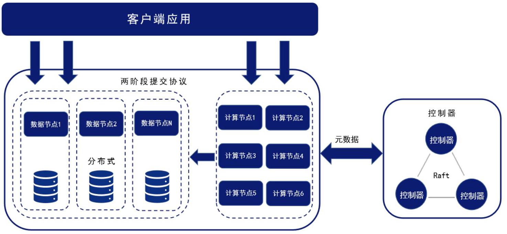

DolphinDB 集群包括以下四种类型的节点:

- 控制节点:DolphinDB 集群的核心部分，负责收集代理节点和数据节点的心跳，监控每个节点的工作状态，管理分布式文件系统的元数据、分配分区位置，并提供对事务的支持。

·代理节点:负责执行控制节点发出的启动和关闭数据节点或计算节点的命令。在一个集群中，每台物理服务器有且仅有一个代理节点。

- 数据节点:既可以存储数据，也可以用于数据的查询和计算。每台物理服务器可以配置多个数据节点。

·计算节点:不存储表数据和元数据，只承担计算相关的任务，负责响应客户端请求并返回结果。适用于数据密集型计算任务。每台物理服务器可以配置多个计算节点。

DolphinDB 分布式集群具备以下优势:

2 - 分布式架构

- 资源得到充分利用:DolphinDB 的数据节点通过 DFS 共享存储，且对数据分割进行了全局优化，实现了数据在各个节点上均匀分布，从而更充分地利用整个集群资源。

- 分区剪枝提高查询效率:DolphinDB 的多列组合分区方案能够支持单表千万级的分区，系统可以根据查询语句进行分区剪枝，以快速确定查询相关的分区和所在的节点，提高了查询的效率。

- 扩展性高:在 DolphinDB 的分布式存储机制中，控制节点统一管理元数据，提高了容错性和可扩展性。

- 便于数据迁移:DolphinDB 的存储逻辑与存储位置分离，可以实现计算和存储的弹性扩展。

·支持高可用:在节点发生故障时，系统也可以根据存储逻辑，自动找到其他节点上的数据副本，保证服务不断线。

DolphinDB 的数据存储是基于底层分布式存储机制构建的，通过元数据管理数据副本。因此，在扩展节点时，不需要对现有数据进行 resharding 操作，也不需要重启集群，新增的数据会直接保存到新的数据节点中。这一特性无需进行大规模数据迁移，极大地简化了扩展集群的过程，也降低了系统维护的复杂性。

DolphinDB 集群既可以采用离线扩展也可以采用在线扩展；既可以通过动态添加服务器实现集群水平扩容， 也可以通过新增磁盘卷来动态扩展数据节点的存储容量。在添加节点或磁盘后，可能出现数据在节点之间分布不均匀的情况。为避免资源浪费，提高系统性能，DolphinDB 允许用户调用函数平衡集群中所有节点间的数据，或平衡一个数据节点内各磁盘卷间的数据。

### 2.2 数据分区机制

分区是进行数据管理和提高分布式存储性能的重要手段之一。通过分区实现对大型表的有效管理。一个合理的分区策略能够仅读取查询所需的数据，以减少扫描的数据量，从而降低系统响应延迟。

DolphinDB 支持最多三个维度的分区，能满足单表百万甚至千万级的分区需求。为了保证每个分区的大小平衡，系统提供了值(VALUE)、范围(RANGE)、哈希(HASH)和列表(LIST)等多种分区方式供用户选择。对于数据量庞大且经常涉及多列的 SQL 查询，DolphinDB 还提供了组合分区，用户可使用2个或3个分区列, 并且每个分区列都支持值、范围、哈希或列表分区。

分区的元数据存储在控制节点，副本数据存储在各个数据节点。分布式文件系统统一管理各个节点的存储空间，分区的规则与分区的存储位置解耦。多个列构成的组合分区，在实现上并没有层次关系，而是进行全局优化。这样一来，分区的粒度更细更均匀，在计算时能充分的利用集群的所有计算资源。DolphinDB 的分区机制具有以下优点:

·系统能够充分利用所有资源。通过选择合适的分区方案，并结合并行计算和分布式计算，系统可以充分利用所有节点来完成通常要在一个节点上完成的任务。若一个任务可以拆分成几个子任务，每个子任务访问不同的分区，可以显著提升效率。

- 提高了系统的可用性。由于分区的副本通常存储在不同的物理节点上，一旦某个分区不可用，系统依然可以调用其他副本分区来确保任务的正常运行。

- 多表可以共享同一个分区机制，在物理存储时实现Co-location，从而具有非常高的连接(Join)效率。

### 2.3 分布式事务

分布式事务是指分布式系统中的事务，一个分布式事务可能涉及到不同节点和分区的操作。参与事务的所有节点的操作，要么全部成功，要么全部回滚，不能出现部分提交的情况。DolphinDB 通过两阶段提交(Two-Phase Commit, 2PC)和多版本并发控制机制(MVCC, Multi-Version Concurrency Control)实现分布式事务，能够确保每个事务的原子性(Atomicity)、数据的一致性(Consistency)、读写操作之间的隔离性 (Isolation)以及已写入数据的持久性(Durability)。

#### 2.3.1 事务基本执行流程

DolphinDB 采用两阶段事务提交机制，每次由事务的发起节点作为协调者(coordinator)推进整个事务的执行流程。

1. 协调者提出请求(例如写入数据)，创建一个事务，向控制节点申请事务 ID(tid)，得到事务所涉及分区在数据节点上的分布情况。

2. 协调者将数据分发到相应的数据节点，各个数据节点将数据写入磁盘。如果存在某个数据节点数据写入失败，则终止该事务。

3. 协调者准备提交，向控制节点申请 commit id (cid) 。

4. 协调者向控制节点和所有参与事务的数据节点 commit 事务，开始两阶段提交的第一阶段。如果控制节点或任意数据节点 commit 失败，则终止并回滚事务。

5. 协调者向控制节点和所有参与事务的数据节点 complete 事务，开始两阶段提交的第两阶段。不管控制节点或数据节点是否 complete 失败，该事务都结束。如果存在 complete 失败的情况，则通过事务决议和 recovery 机制恢复。

## 图 3. 事务基本执行流程

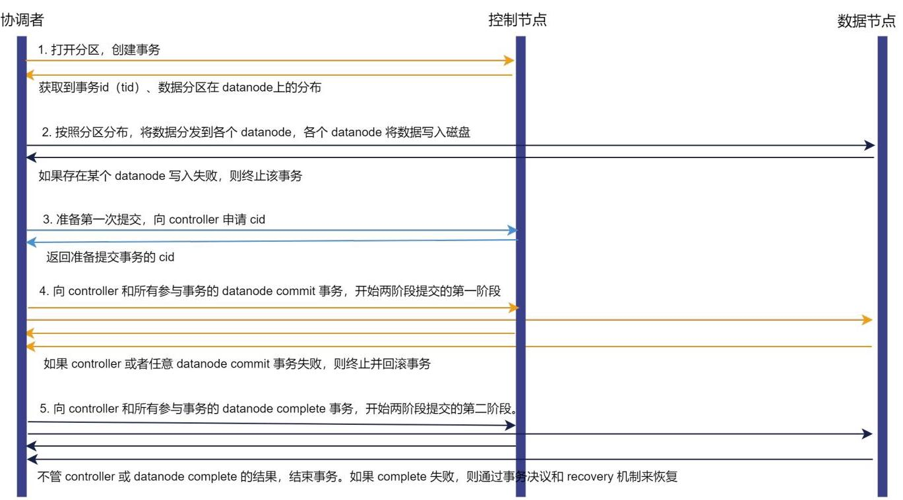

#### 2.3.2 开启 Redo Log 与 Cache Engine 的事务流程

Redo Log 是确保事务持久性的关键机制，即使在系统崩溃时，也能保障数据一致性。缺乏 Redo Log， 事务的持久性将会受到影响，因为数据库无法记录事务所做的修改，从而无法在故障或崩溃发生时进行恢复。DolphinDB 利用 Redo Log 和 Cache Engine 来确保事务的持久性并提升写入性能。

DolphinDB 重做日志(Redo Log)与 预写式日志(Write-Ahead Logging，WAL)的概念相似，其核心理念是:只有在描述事务更改的日志记录已经刷新到持久化存储介质之后，才对数据库的数据文件进行修改。这样做可以避免在每次提交事务时都需要将数据页刷新到磁盘上，同时可以保证数据库发生宕机时，可以通过日志来恢复数据，所有尚未应用的更改都可以通过日志记录回放并重做。

Cache Engine 是 DolphinDB 中的一种数据写入缓存机制。数据在写入 Redo Log 的同时写入 Cache Engine。在 Cache Engine 中的数据累积到一个阈值或者达到一定时间后，再由 Cache Engine 一次性异步写入数据文件。在一个事务涉及多个分区且数据量较小的情况下，如果每次事务结束都立即写入磁盘，写入效率将会受到影响。而利用 Cache Engine 先将这些事务缓存起来，待累积到一定数量后，以批量的方式一次性写入磁盘，则可以提供较高的压缩比此外，批量顺序写入也有助于提高IO吞吐量，从而有效提升整体系统性能。

图 4. 开启 Redo Log 与 Cache Engine 的事务流程

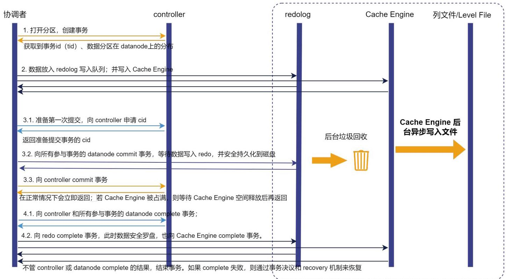

一旦数据写入磁盘，事务完成，系统首先回收该事务的 Cache Engine 缓存，再回收 Redo Log 中的事务。DolphinDB 提供三种 Cache Engine 中事务的回收机制:定期回收、待缓存数据量达到阈值、或通过函数手动清理。同时提供两种 Redo Log的回收机制:定期回收和文件大小达到阈值时回收。

#### 2.3.4 读写隔离级别

DolphinDB 采用两阶段事务机制，结合多版本并发控制机制(MVCC, Multi-Version Concurrency Control)，实现读写快照级别隔离。MVCC 通过保存数据多个事务的数据快照来进行控制，允许同一个数据记录拥有多个不同的版本，记录了一个版本链。每进行一次写入、更新或删除操作，数据的版本号都会增加，

从而确保在用户同时对数据库进行读写操作时，读和写的并发事务能够相互隔离。为了有效管理版本，系统会定期回收版本链。

DolphinDB 的分布式事务提供基于 sid(snapshot id)的快照隔离。结合前文介绍的两阶段提交流程，接下来详细说明 DolphinDB 的读写隔离机制:

1. 协调者创建事务，向控制节点申请事务 tid。

2. 当事务第一次 commit 时，控制节点会生成一个全局递增的 cid，并将其记录在参与事务的所有数据节点上。此时，数据节点会生成一个新的 CHUNK 副本(以“物理表名_tid” 命名)，并在该副本上进行数据的操作；为了防止 CHUNK 目录无限增长，数据节点最多保留5个旧版本的 CHUNK 目录，并根据设置的保留时长进行定期回收。

3. 在完成两阶段提交时，控制节点生成一个全局递增的 sid(snapshot id)，并将其记录在版本链上。sid 的主要作用是协助控制节点获取已完成事务中的最大 cid 并将该 cid 返回给协调节点。如果我们不引入 sid，在查询时直接使用 cid，存在一个潜在问题，即可能某个事务已经完成，但仍然有另一个小于该事务 cid 的事务尚未完成。这种情况可能导致在查询时无法查到最新的已完成事务的数据。通过引入全局唯一的 sid，确保了所有已完成的事务都能被查询到。

4. 当协调者向控制节点请求查询最新的元数据信息时，控制节点通过当前版本链上的最大 sid，查询到满足小于等于这个 sid 的最新的 cid，并返回给数据节点。对应这个 cid 的 CHUNK 版本即为当前可读的最新版本的 CHUNK 数据。

5. 协调者根据获取的 cid 到相应的数据节点上读取此 cid 对应版本的数据。

### 2.4 计算与存储分离

为了提升 DolphinDB 在高并发读写场景下的性能与稳定性，DolphinDB 在架构上引入了计算节点 (compute node)。计算节点轻量无状态，不存储分布式表数据和元数据文件，只承担数据节点计算相关的职能，负责响应客户端请求并返回结果。针对计算密集型计算任务(如流计算、分布式关联和机器学习等)， 集群采用计算与存储分离的部署方案，具备以下优势:

- 保证数据写入和查询的稳定性

对于复杂业务计算，如因子计算和机器学习等，通常需要大量内存资源。这可能导致数据节点由于内存不足而发生内存溢出等问题。如果将计算下沉到计算节点，根据任务将数据从各个数据节点取出到计算节点上的内存中执行计算，可以有效释放数据节点上的内存占用，避免由于后续复杂计算而导致内存消耗增加的问题，从而确保数据节点的写入稳定性。

·降低故障平均修复时间

使用计算节点的集群能显著地降低故障平均修复时间，尽可能地减少对业务的影响。正是由于计算节点不存储和管理分布式数据和元数据，当集群中某一个计算节点出现出现拥塞、无法响应，且无法热修复等情况时，直接重启计算节点即可使其恢复正常服务。重启过程简单，可以在数秒内完成。

DolphinDB 架构实现了计算与存储的分离，通过拓展计算能力，使数据节点专注于高效处理 IO 操作，从而有效提升集群的计算性能，避免计算任务过多对数据写入和读取性能的影响。集群管理者可以根据业务需求和负载情况，灵活地扩展计算和存储资源，实现更精准的资源优化。这一架构设计在保障计算性能的同时，允许集群动态调整，以适应不断变化的业务需求和工作负载。

## 第 3 章. TSDB 存储引擎

TSDB 引擎设计采用经典的 LSMT(Log Structured Merge Tree)模型，并结合了辅助索引的排序列，进一步优化了引擎的性能。LSMT 是一种将数据存储在高效的数据结构中的技术，它将数据按照规定的顺序组织并存储，以便于快速访问和查询。这种数据结构可以有效地处理大量的时间序列数据，提升读写性能。

图 5. TSDB 引擎架构

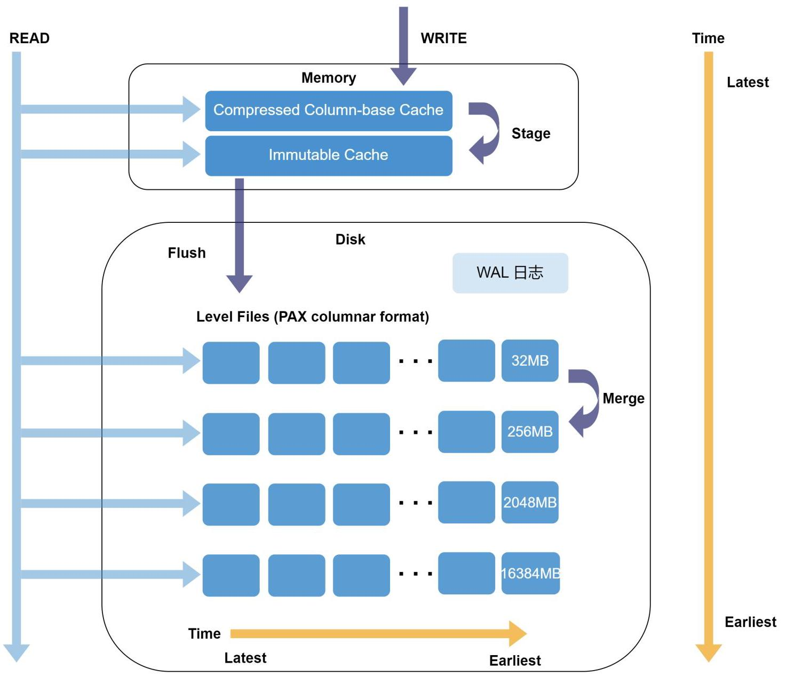

### 3.1 排序列

排序列(Sort Column)是 TSDB 引擎在一个数据分区内部用以数据排序的多个字段。它在 TSDB 引擎的存储和读取流程中发挥着数据去重和索引的双重作用。在创建表时通过参数 sortColumns 来定义排序列，它的最后一列必须是时间类型，而除了最后一列之外的其他列称为排序键(Sort Key)，每个排序键独特值对应的数据按列顺序存储在一起。排序键字段的组合值作为索引键，为数据查询提供了入口，能够迅速定位数据块的位置，从而降低查询时间。在写入过程中，每个事务中的数据会根据排序列进行排序和去重。

### 3.2 存储结构

如上图所示，TSDB 存储引擎采用分层的 LSMT 结构，数据分为两部分:基线数据和增量数据。基线数据是已经被写入和存储在磁盘中的数据，被称作 Level File。增量数据是新写入的还在 Cache Engine 中的数据，它们在一段时间后会被合并到基线数据中。数据首先按分区分组后写入 Cache Engine。Cache Engine 中的数据未被压缩，当缓存的数据量达到刷盘条件时，存储到 Level File 文件中，在转储的过程中对数据进行压缩， 因此 Level File 存储的是压缩后的数据。

Level File 内部采用了行列混存(Partition Attributes Across，简称 PAX)，即数据先按照排序键切分数据， 每个排序键对应的数据仍然按列存储，其中每列的数据按照固定行数划分为多个 block，并在 Level File 的尾部记录这些 block 的地址及其对应的排序键信息。block 是最小的查询单元，也是数据压缩的单元，其内部数据按照时间列的顺序排序。

TSDB 核心的存储结构主要是为了减少随机 I/O。新增、删除或者修改数据，都通过追加记录的方式，而不是直接覆盖原有记录，实现快速地写入。通过存储文件中的保存的索引信息，来提升点查性能。

## Level File 分层

TSDB 引擎中的数据存储于 Cache Engine 和磁盘中。当 Cache Engine 中数据达到一定时间或数据量超过一定阈值时，就会被合并存入到磁盘上，以释放内存。磁盘中的数据以 Level File 的形式分层存储，分层组织形式如下:

图 6. Level File 分层

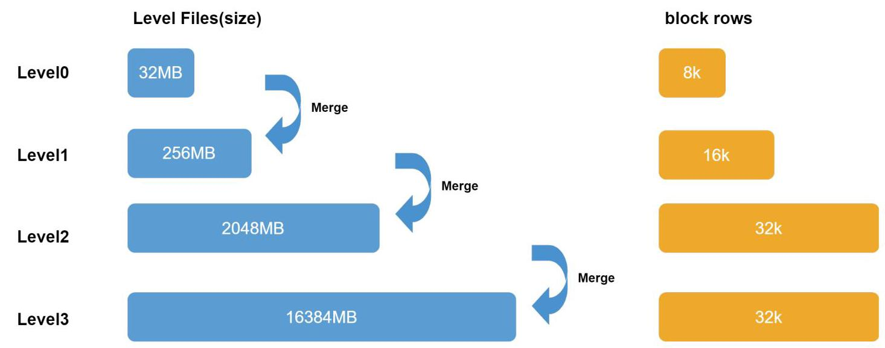

Level File 从 Level 0 到 Level 3 共分为 4 个层级。随着层级的升高，每个 Level File 的文件大小会相应增加。Cache Engine 中的数据被分割为32M大小并压缩后按分区存储到 Level 0 层的 Level File 文件。较低层级的 Level File 文件通过合并生成高层级的 Level File 文件，因此较低层级(Level 0)上的 Level File 文件相对较新，而较高层级的文件相对较旧。

## Level File 合并及数据去重

多次写入后，相同的 sortKey 的数据可能分散在不同的 Level File 里。为减少无效文件数量，TSDB 引擎设计了文件合并的机制，通过合并操作(compaction)可以提高磁盘空间利用率(压缩率提升)以及提升查询性能。

## 合并机制

3 - TSDB 存储引擎

当较低层级的 Level File 的数量超过10个或该层所有 Level File 的大小超过更高一层单个 Level File 文件的大小时，系统会将这些 Level File 合并为更高一层的 Level File。每层 Level File 单个文件的大小参考上文的 Level File 分层组织。

默认情况下，TSDB Level File 文件满足合并要求时，由系统自动触发合并，对用户透明。在某些特殊情况， 可能出现文件过多，却没有合并，DolphinDB 也提供了函数实现手动触发合并。

## 数据去重

TSDB 根据排序列进行去重，建表时通过参数指定去重模式。包含三种去重模式:保留所有数据，仅保留最新数据，仅保留第一条数据。去重发生在写入时数据排序阶段以及 Level File 合并阶段。不同去重机制会对更新操作产生影响:若采用保留所有数据或仅保留第一条数据，则每次更新时都需要将分区数据读取到内存更新后再写回磁盘；若采用仅保留最新数据，则更新数据将以追加的方式写入，真正的更新操作将会在 Level File 合并阶段进行。请注意:

- TSDB 去重策略无法确保磁盘上无冗余，只保证查询时无冗余结果。查询时，读取各 Level File 中排序键对应的数据块，在内存中去重后返回结果。

- DolphinDB 不支持约束。不建议将数据中的主键或唯一约束设置为排序列。因为这样做，会导致每一行都数据都会成为一个索引键，从而索引数据暴增，写入性能和查询性能急剧下降，内存消耗大幅上升。

### 3.3 数据压缩

对数据进行压缩，可以显著地提升数据传输效率和吞吐量。TSDB 支持无损压缩，在数据从 Cache Engine 写入磁盘时进行压缩。支持以下压缩算法:

- 默认采用 LZ4 压缩算法。LZ4 主要针对重复字符进行压缩，压缩率与数据重复频率相关。如果同一列中有较多重复项，LZ4 算法可以获得较高的压缩速度。它侧重于压缩和解压速度，虽然压缩率不是最高的，但解压速度快，适用于需要快速解压的场景。

・zstd 压缩算法:zstd 适用于几乎所有数据类型，其压缩比高于 LZ4，但解压缩速度较 LZ4 慢约1倍。

- delta-of-delta 压缩算法:针对海量时序数据的时间戳都是密集且连续的特点，对时间列采用 delta-of-delta 压缩算法，可以大幅度降低时间戳的存储空间。

- 对于重复次数比较多、唯一值较少且会被比较的字符串，可采用 SYMBOL 类型存储。系统对 SYMBOL 类型数据会使用字典编码，将字符串转化为整型，减少字符串的存储空间。

在实际场景中，譬如金融类无损数据压缩可以达到原数据的10%~25%。

### 3.4 数据写入

TSDB 引擎必须启用 Redo Log 和 Cache Engine。写入时，先写 Redo Log(每个写事务都会产生一个 Redo Log)，并写入 Cache Engine，最后由后台线程异步批量写入磁盘。TSDB 采用多线程方式将 Cache Engine 写入磁盘。具体流程如下:

1. 写 Redo: 先将数据写入 TSDB Redo Log。

2. 写 Cache Engine: 写 Redo Log 的同时，将数据写入 TSDB Cache Engine 的 CacheTable，并在 CacheTable 内部完成数据的排序。

图 7. 数据写入

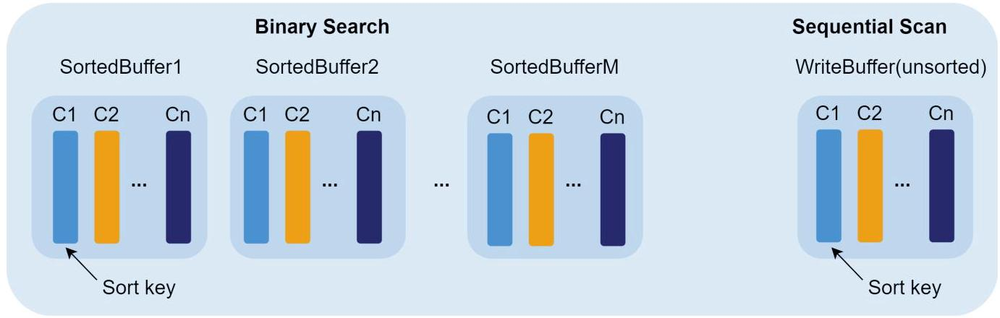

CacheTable 分为两个部分:首先是 write buffer，数据刚写入时会追加到 write buffer 的尾部，该 buffer 的数据是未排序的。当 write buffer 超过 TSDBCacheTableBufferThreshold 的配置值(默认 16384 行)，则按照 sortColumns 指定的列排序，转成一个 sorted buffer(只读)，同时清空 write buffer。

3. 写磁盘:若某写事务到来时，Cache Engine 中 write buffer + sorted buffer 的总数据量达到 TSDBCacheEngineSize 的设置值，或经过一定时间，系统会将数据按分区写入磁盘 Level 0 层的 Level File 文件中(大小约为32M)。若单次写入磁盘的数据量很大，则会产生多个 Level File 文件； 若写入磁盘的数据量不足32 M，也会写为一个 Level File。Level File 写入后变成只读的文件，下次写入不会再向该文件追加数据。若写入磁盘的过程中，又有新的数据写入 Cache Engine，系统会分配新的 Cache Engine 用来接收写入的数据。在极端情况下，TSDB 的 Cache Engine 内存占用会达到两倍的 TSDBCacheEngineSize 的指定值。

根据步骤 2，3，可以发现数据写入磁盘前先局部排序(sorted buffer)，再整体排序，共执行了两次排序操作。实际就是通过分治的思想，提升了排序的效率。

### 3.5 数据查询

相较于 OLAP 引擎，TSDB 引擎引入了索引机制，更适用于点查场景。此外，TSDB 引擎不使用用户态缓存数据，仅使用操作系统的缓存。具体查询流程如下:

1. 分区剪枝:根据查询语句进行分区剪枝，缩窄查询范围。

2. 加载索引:遍历所涉及分区下的所有 Level File，将索引信息加载到内存中。索引信息采用惰性缓存策略，不会在节点启动时立即加载，而是在第一次查询命中该分区时加载。一旦查询命中的分区索引信息被加载到内存，将一直缓存在内存中，除非由于内存不足而被置换。后续查询若涉及该分区则无需重复此步骤，而是直接从内存中读取索引信息。TSDB 提供相关配置项来配置内存中索引区域的大小和 Level File 索引缓存淘汰算法的阈值。

3. 查找内存中的数据:先搜索 TSDB Cache Engine 中的数据。若数据在 write buffer 中，则采用顺序扫描的方式查找；若在 sorted buffer 中，则利用其有序性，采用二分查找。

4. 查找磁盘上的数据:根据索引查找 Level File 中各查询字段的数据块，解压到内存。若查询的过滤条件包含 sortKey 字段，即可根据索引加速查询。

5. 返回查询结果:合并3，4两步的结果并返回。

3 - TSDB 存储引擎

### 3.6 数据更新及删除

## 数据更新

根据去重机制的设置，TSDB 引擎的数据更新操作流程会有所差异。

・若采用保留所有数据或仅保留第一条数据的机制，更新操作的流程与 OLAP 引擎相同。引擎会读出分区下所有 Level File 的数据，在内存中更新对应数据后再次写入新版本目录的 Level File 文件，并删除旧版本的 Level File 文件，该操作的开销非常大。

・若采用仅保留最新数据的机制，更新操作流程与 OLAP 引擎不同。系统将需要更改的数据读取到内存中，修改后直接追加到 Level 0 层级的 Level File 里，不会删除旧文件，也不会产生新的版本目录。旧 Level File 文件将在查询时或手动调用进行合并删除。

## 数据删除

TSDB 引擎支持软删除功能，即删除数据将以追加的方式写入，并附加删除标记，实际的删除操作将在文件合并时执行。

当采用保留所有数据或仅保留第一条数据的机制时，数据删除的流程和数据更新流程基本一致，即按分区读取所有数据，删除后写入一个新版本目录。具体流程如下:

1. 分区剪枝:根据查询语句进行分区剪枝，缩窄查询范围。

2. 查到内存进行删除:取出对应分区所有数据到内存后，根据条件删除数据。

3. 删除后的数据写入数据库:将删除后的数据写入数据库，系统会使用一个新的 CHUNK 目录(默认是 “物理表名_cid”)来保存写入的数据，旧的文件将被定时(默认 30min)回收。

当采用保留最新数据的机制时，可通过参数设置数据删除的流程:

- 建表时设置参数 softDelete=true，则数据删除采用软删除方式，即将待删除的数据读取到内存中，打上删除标记后，以追加的方式写入一个新的 Level File 文件，不会删除旧数据，也不会产生新的版本目录。待删除的数据会在 Level File 文件进行合并时才会删除。

·建表时设置参数 softDelete=false，则数据删除流程同保留所有数据或仅保留第一条数据时的流程相同。

软删除方式因不需要读取整个分区数据，且不会产生新版本目录，可以显著提升删除性能，因此在需要频繁删除数据的场景下，建议开启软删除。

针对不同的数据删除需求，DolphinDB 提供以下方法删除数据:

- 删除整个分区的数据，不保留分区结构。

- 删除分区的数据，保留分区结构。

- 动态生成 SQL delete 语句。

- 删除整个表的数据，不保留表结构。

- 删除整个表的数据，保留表结构。

- 删除整个表的数据，保留表结构。

### 3.7 TSDB 适用场景

TSDB 引擎的综合能力突出，没有明显的短板。对于大多数时序数据处理场景，TSDB 引擎都是首选。与 OLAP 引擎相比，TSDB 引擎在以下场景中的性能表现尤为突出:

·需要快速查询一条或几条时间序列的数据。

- 需要对写入数据进行排序和去重。

- 存储几百几千列的宽表。

- 存储 array vector 和 BLOB 等复杂类型的数据。

- 需要支持数据的更新和删除功能。

## 第 4 章. OLAP 存储引擎

OLAP 引擎适合大规模的数据分析。它采用列式存储，在每个分区内将一列数据保存为一个文件。这种存储策略允许只读取所需的列数据，从而减少不必要的 I/O 操作，显著提高查询速度。

图 8. OLAP 引擎架构

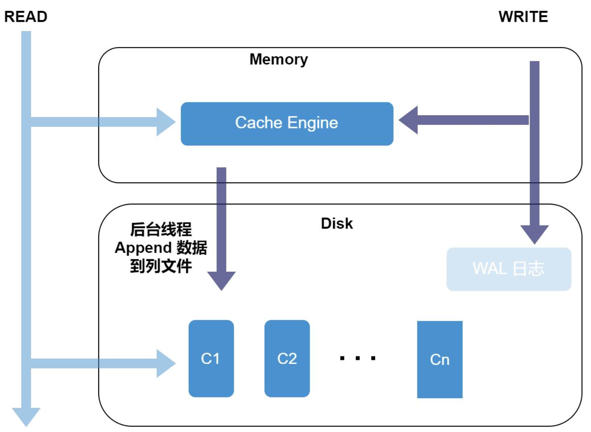

### 4.1 存储结构

OLAP 存储如下图所示，同一列的数据按表中的顺序连续地存放在一起，表的每列构成一个长数组。 数据表中每个分区中的每列都存储在一个单独的数据文件中，数据以追加的方式存储到相应的列文件中，因此，数据写入的顺序决定了它们的存储顺序。这种存储方式具备以下几点优势:

图 9. 存储结构

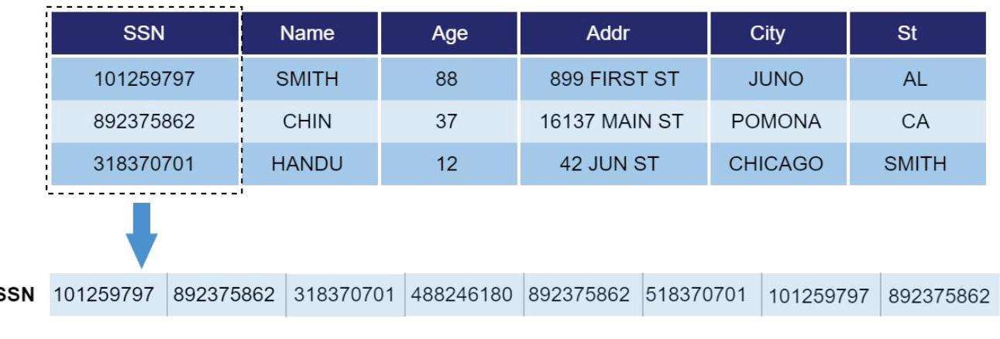

·高效压缩:由于相同类型的数据通常具有相似的值，按列存储可以更好地利用压缩算法，降低了存储空间需求，从而节省成本。

·大规模数据分析:列式存储非常适用于大规模数据分析，因为查询通常只需要读取一部分列，而不是整行数据，从而提高了查询效率。

### 4.2 数据压缩

OLAP 的压缩类型与 TSDB 类似，但与 TSDB 不同的是，OLAP 按照列文件进行压缩。OLAP 采用增量压缩策略，每次只对新增数据进行压缩，批量写入有助于提升压缩效果。若每次仅写入一行记录，且 Cache Engine 未开启，则存于磁盘的数据不会进行压缩。

### 4.3 数据写入

默认情况下，OLAP 引擎是不开启 Cache Engine 的，此时数据不会在内存中缓存，而是直接写入磁盘。这种设置下，若每次进行小批量写入会极大影响磁盘 I/O 性能以及压缩效果。因此，建议开启 Cache Engine 和 Redo Log，把多次少量的写入缓存起来，在一次文件 I/O 中批量写入，从而在整体上提升系统的写入性能。

OLAP 引擎写入操作支持事务，具备事务 ACID 特性，且通过 MVCC 实现快照隔离级别。

### 4.4 数据查询

OLAP 引擎将每列数据存储为一个列文件，所以读取数据时，只需要从磁盘读取所需要的列文件，解压后加载到内存。

具体流程如下:

1. 根据查询语句进行分区剪枝，缩窄查询范围。

2. 将 where 语句过滤条件中包含的列的数据文件读到内存，并进行过滤。

3. 根据过滤出的列数据，读出其对应的其他列的数据。

这种数据读取方式使得 OLAP 引擎在高吞吐量查询情况下拥有较好的性能。 但若需要更新或删除某条数据，OLAP 会将整个分区数据加载到内存中，再对这条数据进行更新或删除，因此性能开销大。

### 4.5 数据更新及删除

## 数据更新

OLAP 引擎对数据的更新操作流程与 TSDB 引擎设置保留所有数据或仅保留第一条数据机制时的更新流程相同。每次更新，系统都会读出对应分区中相关的列文件，在内存中进行更新，同时创建一个新的版本以存储新的数据。整个过程通过事务来确保数据一致性，并通过 MVCC 保证读取的一致性，对于未变化的列，采用创建硬链接的方式，以提升性能并降低不必要的数据读写。在提交事务之前，其他 SQL 语句仍然访问旧版本的数

4 - OLAP 存储引擎

据，直到更新事务完成。若更新操作涉及多个分区，只要其中某一个分区更新失败，系统会回滚所有分区的修改。

## 数据删除

对于 OLAP 引擎的数据删除操作，其流程与更新操作一致，即按分区读取所有数据，执行删除操作后写入一个新版本的目录。整个过程同样通过事务保证数据一致性，并通过MVCC 保证读取一致性。若删除操作涉及多个分区，只要其中某一个分区删除失败，系统会回滚所有分区的修改。

OLAP 引擎除不支持软删除外，其它数据删除方法与 TSDB 引擎相同。

### 4.6 OLAP 适用场景

相比 TSDB 引擎，OLAP 引擎的存储格式更为简单，数据粒度也更粗。OLAP 引擎以分区为存储单位，每个分区内的每列分别存储一个文件。因此 OLAP 引擎读取整个分区数据或整个分区的某几列数据，非常高效，适合扫描分析大量数据等场景，如:查询所有股票在某个时间段内的交易量等。

## 第 5 章. SQL 和库内计算

DolphinDB 提供了强大而灵活的库内计算能力。不仅支持历史数据的批量计算，还支持实时数据的流式计算。DolphinDB 内置了多范式的脚本语言 DolphinScript，以及超过1500个函数的函数库。大部分的数据处理业务，可以直接在数据库内完成。

### 5.1 SQL

SQL(结构化查询语言)是目前最广泛使用的数据库访问和管理的计算机标准语言。DolphinDB 支持标准 ANSI SQL-92 语法，以及SQL-2003引入的分析函数功能，同时引入了 DolphinDB 独有的方便处理时间序列数据的 SQL 语句。在 DolphinDB 中，查询数据的体验与传统的 SQL 体验一样简洁明了。

DolphinDB 提供了丰富的 SQL 功能，包括:

- 3 种常用的 DDL 语句:CREATE、ALTER、DROP，用于管理数据库结构。

- 5 种常用的 DML 语句:SELECT、EXEC、INSERT、UPDATE、DELETE，用于数据查询与修改操作。

- FROM 子句，用于指定数据来源。

- WHERE 条件，用于筛选数据；INTERVAL 子句对结果进行插值处理。

- 分组和排序子句，如 GROUP BY、CONTEXT BY、PIVOT BY、CGROUP BY、ORDER BY、CSORT。

- 支持 TOP、LIMIT，用于限制返回结果集的行数。

- 常见的条件表达式和运算符:NOT、IS NULL、BETWEEN

AND、EXISTS、IN、ANY、ALL、DISTINCT、WITH、NULLIF 等。

- 支持分析函数(也叫窗口函数):12个聚合函数，3个排序函数，2个分布函数和6个分析函数。

·多表关联查询，包括等值连接、内连接、左(外)连接、左半连接、右(外)连接、全连接、交叉连接, 还支持专为时序数据设计的 ASOF JOIN 和 WINDOW JOIN。

- 直接使用 DolphinDB 大部分内置函数，包括窗口函数(支持嵌套多个窗口)、各种聚合函数(计数、 平均值、求和、最大值、最小值、百分位、中位数、标准差、加权平均、协方差、相关性等)，以及在滑动窗口或累计窗口中进行聚合操作。

- 支持自定义函数，增强了灵活性和扩展性。用户自定义的函数无需编译、打包和部署，即可在本节点或分布式环境的 SQL 中使用。

- 支持组合字段(composite column)，可将复杂分析函数的多个返回值输出到数据表的一行

- SQL 与分布式计算框架紧密集成，实现库内计算(in-database analytics)变得更加便捷和高效

DolphinDB SQL 具备的强大功能使得从传统数据库迁移到 DolphinDB 的脚本编写变得极为简单，降低了用户的学习曲线。此外，DolphinDB SQL 不仅是数据库管理的一部分，还融合了向量式编程、函数式编程和命令式编程的特性，使其具备处理复杂数据逻辑的能力。在处理复杂的数据分析问题时，无需将数据转移到第三方客户端进行处理，这不仅方便了数据分析人员，同时也显著提高了数据处理的效率。DolphinDB 多范式编程风格为用户提供了更大的灵活性和选择，使其成为应对各种数据分析挑战的有力工具。

### 5.2 多范式编程

DolphinDB 从流行的 Python 和 SQL 语言汲取了灵感，设计了图灵完备的数据分析脚本语言 DolphinScript。DolphinDBScript 支持命令式编程、向量化编程、函数式编程、SQL 编程和元编程等多种编程范式，表达能力强大，可以满足快速开发和建模的需求。

#### 5.2.1 命令式编程

DolphinDB 与主流的脚本语言(Python 和 JavaScript)和编译型强类型语言(C++, C 和 Java)一样，支持命令式编程，也就是通过执行一条一条的语句，实现最终的目标。DolphinDB 支持包括最常用的赋值语句， 分支语句 if..else, 以及循环语句 for 和 do..while 等。

#### 5.2.2 向量化编程

向量化编程是 DolphinDB 中最基本的编程范式。数据结构表、矩阵、元组、列式元组、数组向量、字典和结集合都可以用向量来表示。DolphinDB 中绝大部分函数支持向量作为函数的输入参数，根据输出结果的不同，向量化函数可以分为标量函数，聚合函数和向量函数。

向量化编程具有以下三个主要优点:

·降低脚本解释成本:向量化操作减少了解释器的负担，提高了执行效率，从而加速了脚本的执行速度。

·性能优化:向量化操作使得许多算法可以进行高效优化，大幅提升了性能，特别适用于处理时间序列数据等大规模数据集。

- 代码简洁:使用向量化操作，可以编写更简洁、可读性更高的代码，减少了繁琐的循环和条件判断。

在时间序列数据分析等应用中，通常可以使用向量化编程来处理数据，而 DolphinDB 作为分析型数据库，尤其适用于这种场景。在应用中，脚本尽可能避免使用 for 循环而采用向量化形式，可以更高效地处理和分析大规模数据。

#### 5.2.3 函数化编程

函数式编程是一种声明式编程范式，其核心思想是将计算过程分解为一系列函数调用的链条，每个函数都接受输入并生成输出，而不是通过修改状态或改变变量的值来实现计算。DolphinDB 的函数式编程支持高阶函数 (Higher Order Function)、部分应用(Partial Application)、自定义函数(User-defined Function，或简称 UDF)、Lambda Function、纯函数(Pure Function)和闭包(Closure)。

在 DolphinDB 中，高阶函数是应用广泛且功能强大的编程工具。通过与基础函数的组合，可以赋予基础函数更强大、丰富、易用的运算表达能力。高阶函数中最常用的是函数模式 ( Function Pattern ) 包括: each、loop、eachLeft、eachRight、eachPre、eachPost、cross、accumulate、reduce、byRow、byColumn、 和 contextby。每个模式类高阶函数都有一个对应的模式符号，可以直接附加在一个函数后面，修饰函数。模式符号可以叠用，以表达更复杂的数据处理逻辑。

部分应用是一种编程技术，指的是在调用函数时只传递部分参数，从而生成一个新的函数，该新函数接收剩余的参数。它经常应用于高阶函数和流计算中。使用高阶函数时，通常对某些参数有特定要求，通过部分应用， 可以确保所有参数符合要求。部分应用可以使函数保持状态，能够满足流计算中需要状态的需求。

DolphinDB 允许用户通过自定义函数来扩展现有功能，其提供了两种管理自定义函数的方法:函数视图 (Function View)和模块(Module)。函数视图是封装了访问数据库以及相关计算语句的自定义函数。用户即使不具备读写数据库原始数据的权限，也可通过执行函数视图，间接访问数据库，得到所需计算结果。 模块则是只包含函数定义的脚本文件，可以将大量函数按目录树结构组织在不同模块中。模块可以在系统初始化时预加载，也可以在需要使用时引入。函数视图可以持久化在分布式数据库中，一旦添加即可在任何节点使用，它也兼具了像模块一样按目录进行管理的能力。模块支持以函数视图的方式持久化到集群的各个节点，便于代码的工程化管理。

#### 5.2.4 元编程

元编程是一种编程范式，它使用脚本来创建可以在运行时动态执行的程序代码。元编程的目的是延迟执行代码或者动态创建代码。DolphinDB 支持使用元编程来动态创建表达式，例如函数调用表达式或 SQL 查询表达式。这适合在业务细节无法在编码阶段确定的场景下使用。延迟执行代码通常出现在以下情况下:

- 提供回调函数:元编程可以用于创建回调函数，以便在特定条件下执行代码。

- 为整体性能优化创建条件:有时为了优化整体性能，需要延迟执行某些部分的代码。

·问题描述在编码阶段完成，但问题实际解决在运行时:某些问题在编码阶段描述清楚，但只能在程序运行时动态解决。

DolphinDB 提供了两种元编程方法，一种是使用一对尖括号<>来表示需要延迟执

行的动态代码；另一种是使用函数来创建各种表达式。常用于元编程的函数包括

objByName、sqlCol、sqlColAlias、sql、expr、eval、partial、makeCall 等。这些工具使 DolphinDB 在运行时具备了动态生成和执行代码的能力，从而更好地满足复杂的业务需求。

### 5.3 分布式计算

DolphinDB 的分布式计算框架以分区为计算粒度，这样可与分布式数据库紧密集成。运行时，计算逻辑既可以下推到数据所在节点，也可以将数据传输到计算节点。系统内置了 pipeline、map-reduce 和迭代的 map-reduce 等多种计算模型。

#### 5.3.1 远程过程调用编程

远程过程调用 (Remote Procedure Call) 是分布式系统最常用的基础设施之一。DolphinDB 不仅在其分布式文件系统、分布式数据库和分布式计算框架中采用了自研的 RPC 系统，还允许数据库用户通过 RPC 在远程机器上执行脚本语言。DolphinDB 的 RPC 特性具有以下几个关键点:

- 灵活的远程执行:DolphinDB 的 RPC 支持执行远程机器上已经注册的函数，同时也允许序列化本地自定义的函数到远程节点上执行。在远程执行代码时，权限等同于当前登录用户在本地的权限。

- 多样化的参数类型:RPC 的函数参数可以是常规的标量、向量、数组向量、元组、列式元组、矩阵、集合、字典和表格，同时还可以包括其他函数，包括自定义的函数。

- 连接选项:DolphinDB 的 RPC 支持多种连接选项。您可以选择使用两个节点之间的独占连接 (remoteRun函数)，也可以使用集群数据节点之间的共享连接(rpc函数)，以适应不同的分布式计算需求。

5 - SQL 和库内计算

DolphinDB 的强大 RPC 功能使得在分布式环境中执行代码变得更加灵活和高效，为分布式数据处理和计算提供了可靠的基础。

#### 5.3.2 数据源

在 DolphinDB 的通用计算框架中，数据源(Data Source)是一种特殊类型的数据对象，用于描述数据元信息。用户可以通过执行数据源获得表、矩阵、向量等数据实体。Data Source 既可以是内置的数据库分区，也可以是外部数据。在 Data Source 之上，可以完成分布式SQL、分布式机器学习以及自定义的分布式批处理计算任务。

#### 5.3.3 分布式 SQL

DolphinDB 的 SQL 支持分布式查询，查询语法与常规 SQL 相同，底层实现使用了map-reduce计算模型。系统根据 WHERE 子句进行分区剪枝，根据关系运算符和逻辑运算符确定相关的分区，然后重写查询，并把新的查询发送到相关分区所在的位置，最后整合所有分区的结果。当查询是分组计算(GROUP BY)时，如果分组字段覆盖了所有分区字段，系统只需对每个相关分区执行查询，然后合并各个查询结果；如没有覆盖全部分区字段，但是聚合函数支持map-reduce，则转写Query进行map-reduce的计算，否则对数据进行重分区。当查询是CONTEXT BY或JOIN时，如果分组字段或关联字段覆盖了所有分区字段，则系统只需对每个相关分区执行查询，否认则对数据进行重分区。

#### 5.3.4 分布式机器学习

DolphinDB 提供了内置的分布式机器学习算法，能在单机或分布式环境下对不同规模的数据执行训练。这些机器学习算法基于数据源的概念和 map-reduce 框架，自动根据给定的数据源，对位于相应结点上的数据进行训练，汇总后生成模型。DolphinDB 实现了一系列常用的机器学习算法，例如最小二乘回归、随机森林、K-平均等，使用户能够方便地完成回归、分类、聚类等任务。

此外，用户也可以基于 map-reduce 框架，自己设计分布式算法。DolphinDB 内置的 mr 函数，接受的参数通常包括数据源、map 函数、reduce 函数、final 函数等。系统会并行地在相应的结点执行 map 函数，并用 reduce 函数和 final 函数汇总，返回最终的计算结果。用户通过脚本自定义这些函数，就能快速开发分布式算法。DolphinDB 还提供了迭代计算的功能，可以弥补传统 map-reduce 框架功 能上的不足。

### 5.4 实时流处理

实时流处理是指将业务系统产生的持续增长的动态数据进行实时的收集、清洗、统计、入库，并对结果进行实时的展示。在金融交易、物联网、互联网/移动互联网等应用场景中，复杂的业务需求对大数据处理的实时性提出了极高的要求，全量查询和计算则无法满足该场景的需求。因此， DolphinDB 精心研发了多种适合流计算场景的引擎，引擎内部采用了增量计算，优化了实时计算的性能。DolphinDB 内置的流数据框架支持流数据的发布、订阅、预处理、实时内存计算、复杂指标的滚动窗口计算等，流数据引擎的计算结果则可以输出到共享内存表、流数据表、消息中间件、数据库、API 等终端，以做进一步的处理。计算复杂表达式时，亦可将多个流数据引擎通过级联的方式合并成一个复杂的数据流拓扑。

DolphinDB 流数据处理系统的优点在于:

- 吞吐量大，低延迟。

- 与时序数据库及数据仓库集成，一站式解决方案。

- 支持使用 SQL 语句进行数据注入和查询分析。

- 支持数据回放、流批一体。

- 支持流计算高可用。

关于 DolphinDB 数据分析和流计算的框架原理及场景应用，请参考《DolphinDB 白皮书:数据分析》和 《DolphinDB 白皮书:流数据》。

### 5.5 函数库

DolphinDB 拥有强大的函数库，目前包含1500多个内置函数，适用于多种数据类型(数值、时间、字符串)、数据结构(向量、矩阵、集合、字典、表)和系统调用(文件、数据库、分布式计算)。这些函数涵盖了数学、统计、逻辑、字符串、时间、数据操作、窗口、连接、高阶、元编程、分布式计算、文件/路径、数据库、流计算、系统管理、批处理作业、定时任务、性能监控和用户权限管理等多个类别。另外，针对时序数据处理中窗口计算的需求，DolphinDB 提供了累积窗口、移动窗口和 TopN 等系列函数。

DolphinDB 内置函数由 C++ 编写，直接嵌入到数据库引擎中，具有高效和稳定的特点。所有内置函数(如非等值连接、移动窗口计算等)都针对应用场景进行了算法优化，大幅提升了性能。

### 5.6 Python Parser

DolphinDB 3.0版本开发了一个原生的 Python 解析器(Python Parser)，旨在方便 Python 用户利用他们熟悉的 Python 语法来访问和操作 DolphinDB 的数据，从而更轻松地进行数据分析、处理和可视化。Python Parser 实际上是 Python 语言在 DolphinDB 中的一个实现，它为通过 Python 编写的脚本提供了运行环境。Python Parser 与 DolphinDB 脚本共享对象系统和运行环境，这意味着 Python Parser 可以直接控制 DolphinDB 的存储引擎和计算引擎，并且可以直接使用 DolphinDB 中的内置函数。此外，我们还为 Python Parser 开发了一个名为 'dolphindb' 和 'pandas' 的第三方库，进一步扩展了 Python 用户与 DolphinDB 的交互操作功能。Python Parser 与 DolphinDB 脚本的融合使得 DolphinDB 成为一个更加强大和灵活的数据处理和分析工具。

目前 Python Parser Alpha 版本，支持了 Python 的部分原生对象、语法以及 pandas 库的部分功能:

- Python 对象类型: list, tuple, set, dict。

这些对象可以通过 toddb() 函数转换为 DolphinDB 的向量，元组，集合和字典。转换为 DolphinDB 对象后，可以在 Python Parser 中直接调用 DolphinDB 的内置函数进行计算。

- Python 编程语法:赋值语法(元组赋值、增强赋值等)、编程语法(for, if, while 等)、函数定义 (def, lambda 等)、列表推导式、类(封装函数、重载运算符等)。

- pandas 三个重要的类及对应类的部分方法:DataFrame，Series 和 Index。

## 第 6 章. 安全与容灾

### 6.1 高可用

DolphinDB 提供了分区数据、元数据和客户端的高可用方案，使得数据库节点发生故障或宕机时，数据库依然可以正常运作，保证业务不会中断。

#### 6.1.1 元数据高可用

DolphinDB 控制节点存储的元数据记录了分区分布的节点，版本信息等。在一个集群中可以部署多个控制节点，通过元数据冗余来保证元数据服务不中断。DolphinDB 采用 Raft 协议保证控制节点的高可用性。一个集群中的所有控制节点组成一个 Raft 组，一个 Raft 组中只有一个 Leader，其他都是 Follower。只有 Leader 与数据节点进行交互，当它收到接收数据节点的请求后，先写入本地日志文件中，并向集群中的每一个 Follower 发送同步日志的请求。Follower 接收并持久化 Leader 同步的日志，在 Leader 告知提交后， 提交日志，保证 Leader 和 Follower上元数据的强一致性。如果当前 Leader 宕机，系统会立即选举出新的 Leader 来提供元数据服务。Raft 组能够容忍小于半数的控制节点宕机，只要宕机的控制节点少于半数，集群仍然可以提供服务，因此可以保证控制节点上元数据的一致性。

#### 6.1.2 分区数据高可用

在分布式环境下，为保证数据读写服务的高可用，DolphinDB 会把同一个分区的数据同时写入到集群中的多个不同的节点上。同一个分区在不同节点上的数据拷贝称为副本(Replica)。为了保证数据的强一致性和事务 ACID 特性，DolphinDB采用了轻量、高效且可行的两阶段提交协议(Two-phase Commit)来管理数据副本之间的一致性。这种方式确保了即使某个节点上的数据出现损坏，仍然可以通过访问其他节点上的副本数据来持续提供服务，从而保证了服务的不中断性。同时，针对数据损坏或其它原因导致的副本数据不一致的情况，系统会通过 recovery 机制将数据恢复到一致状态。

#### 6.1.3 客户端高可用

DolphinDB API 提供了强大的自动重连和切换机制，旨在确保与数据节点/计算节点的交互始终保持高可用性。使用 DolphinDB API 与 DolphinDB 的数据节点/计算节点进行交互时，如果连接的节点宕机，API 会尝试自动重新建立连接，若尝试重连失败，API 会自动连接到集群中其他可用的数据节点/计算节点，以保证客户端与服务器之前连接的稳定性。而且切换过程对用户来说是完全透明的，用户不会察觉到当前连接的节点已经发生了切换。

#### 6.1.4 在线恢复

在线恢复 (Online Recovery) 是一种数据恢复技术，用于在分布式文件系统中修复不一致或损坏的数据副本。与传统的离线恢复方法不同，在线恢复可以在数据节点持续写入数据的过程中进行，而不会中断或影响正常的数据处理操作。DolphinDB Online Recovery 技术仅复制副本之间差异的数据，从而减少分区数据恢复的时间。具体流程如下:

1. 当某个数据节点从故障中恢复重启后，会向控制节点汇报自己的分区信息。

2. 控制节点收到数据节点的汇报后，判断需要进行 Recovery，会将需要 Recovery 的分区放入待 Recovery 队列。

3. Recovery 线程从待 Recovery 队列中取出 Recovery 任务，根据收到的汇报来确定 Recovery 的源节点 (数据拷贝的来源)和目标节点，并向源节点发起 Recovery 任务。

4. 源节点收到任务后，开始一次拷贝，即从自身拷贝数据到目标节点，并接收目标节点返回的拷贝结果 (数据拷贝成功或失败)。此过程异步执行，不影响数据库的正常读写。

5. 重复步骤4，直至两个副本之间的差异小于10W行，或者拷贝次数大于5次时，源节点向控制节点发起转换为同步阶段的请求。

6. 控制节点收到请求后，将分区状态设置为 RECOVERING，阻塞写入。由于同步节点需要拷贝的数据量比较少，因此耗时很短，对数据库的影响也很小。

7. 源节点收到转同步成功的回复后，继续拷贝差异的数据。直到数据完全一致，源节点向控制节点汇报 Recovery 任务结束。

8. 控制节点收到 Recovery 任务结束的报告后，更新副本状态为 COMPLETE。此时允许数据写入。

Online Recovery 只复制增量部分数据，能够有效提高恢复性能，且恢复过程不影响生产数据的写入。

以包含一个控制节点和三个数据节点的集群为例。该集群副本数为2，Datanode1 从故障中恢复。通过图示展示 Online Recovery 的过程:

图 10. 在线恢复流程

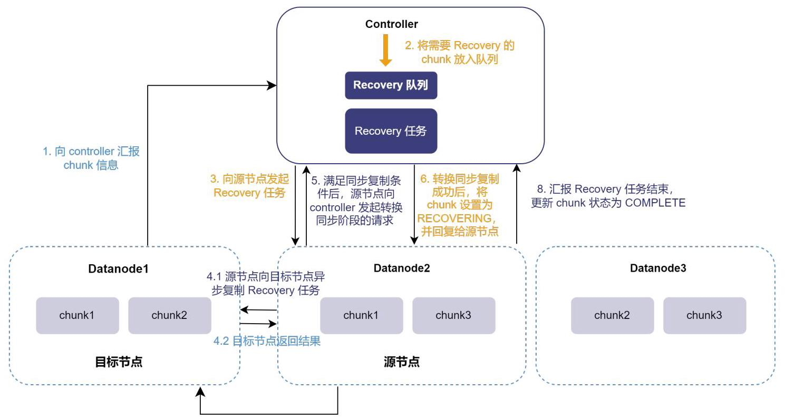

7.1 源节点同步拷贝差异的数据

6 - 安全与容灾

### 6.2 备份恢复

#### 6.2.1 备份

DolphinDB 采用以分区为单位的数据备份策略，将每个分区备份为一个独立的数据文件，支持全量备份和增量备份。DolphinDB 提供了全面的备份功能和多种备份选项，以满足不同用户的需求:

·通过拷贝文件的方式进行备份:此方式备份直接复制数据并生成相应的元数据文件，无需复杂的数据处理步骤，因此速度快，而且操作简单。它可以实现一键备份整个数据库、一键备份指定的数据表、备份指定的部分或全部分区等功能，满足不同级别的备份需求。该方式支持断点续传，支持同步已修改、新增及删除的分区数据，且可以保证数据一致性。

- 通过 SQL 元代码的方式进行备份:此方式允许用户通过 SQL 语句定义备份过程中的特定逻辑和筛选条件，以满足更精确的备份需求。该备份方式采用序列化的数据处理方式，这可能导致较高的内存消耗和相对较慢的备份速度。该方式支持备份整张表或仅备份满足条件的数据，支持同步已修改或新增的分区数据，但不支持同步已删除的分区数据，不能完全保证数据一致性。

#### 6.2.2 恢复

针对上文提到的备份方式，DolphinDB 也提供了相应的恢复方式，可以实现一键恢复整个数据库、一键恢复整个表、恢复部分分区、恢复已筛选数据等功能。此外，DolphinDB 还提供了额外的恢复功能:

·恢复集群下的所有数据库数据:用户可以通过函数恢复一个集群下所有数据库，这提供了更大范围的数据恢复能力。

·保持名称保持一致或重新命名:恢复后的数据库和表可以选择保持与原数据库和表的名称一致，或者重新命名以适应新的需求。

#### 6.2.3 状态监控

运行备份任务之后，一个非常关键的步骤是验证备份是否成功完成，并确保备份文件的完整性。DolphinDB 提供了多个函数，可以监控备份任务、查看备份信息以及验证备份文件的完整性:

- 允许用户查看指定用户的备份或恢复任务的进度。通过此函数可以了解备份任务的执行情况，以及是否成功完成。

- 查看备份的所有分区的基本信息，包括备份的分区信息、备份时间等关键信息，有助于了解备份的整体情况。

- 查看分布式数据表中某个分区的备份信息，其中包括表的 schema 等关键信息。这对于了解备份的内容和结构非常有帮助。

·检查备份文件的完整性和准确性。通过验证备份文件，您可以确保备份过程中没有发生数据损坏或文件丢失等问题。

### 6.3 异步复制

异步复制将一个集群(称为 Master)的数据和操作异步复制到一个远端服务器的集群(称为 Slave)上。

DolphinDB 的异步复制以数据库作为最基本的操作单元，可以选择对集群中的特定数据库进行同步操作。它通过记录日志和数据持久化等操作来保证在节点宕机时不会丢失数据，从而保证主从集群的数据保持一致性。 同时，异步复制支持灵活的权限管理，只有经授权的用户能够执行复制操作，从而提高数据的安全性。

#### 6.3.1 异步复制原理

DolphinDB 异步复制支持分布式事务，其基本原理如下:在 Master 集群中，每个待同步的事务在提交时， 将同步的数据信息提交，并通过配置选择同步或异步地将事务持久化到磁盘，然后将事务加入到任务发送队列。Slave 集群则从 Master 集群的发送队列中获取任务到本地执行队列，然后并行执行队列中的任务，根据任务内容执行相应的语句，启动事务，并执行两阶段提交。一旦事务完成，Slave 节点标记任务为已完成，并通知 Master。Master 节点收到通知后会从发送队列中回收已完成的任务。

## 异步复制流程

## Master 集群:

1. Master 集群中执行 DDL/DML 操作的数据节点(作为协调节点)，在事务 commit 时，将该节点的 IP、port、操作的类型、事务 tid 等信息作为 TaskMeta 一起发送给 Master 集群的控制节点，同时将事务作为 TaskData 异步持久化到该节点上。

2. 控制节点在 commit 时接收到 TaskMeta，并写入事务元数据日志文件。开启 Raft 高可用的集群，通过 Raft 一致性协议确保其他控制节点的日志保持一致。

3. 协调节点提交事务 complete 请求到控制节点。

4. 控制节点 complete 事务，并将 TaskMeta 编号(TaskID)后放到发送队列。

5. 控制节点根据事务操作涉及的分区对事务进行分组，将涉及不同分区的事务放在一组并进行编号。

## Slave 集群:

1. Slave 集群的控制节点定期以 TaskID 作为偏移，到 Master 的控制节点上获取 TaskMeta 到本地任务执行队列。同时向 Master 的控制节点报告最近一批执行成功的 TaskID，以便 Master 从发送队列中回收任务。

2. 控制节点根据队列中组号的大小，顺序地将一组 TaskMeta 对象进行哈希映射，并将它们发送到相应的数据节点。

3. 数据节点收到 TaskMeta 后，根据其中的 sourceIP 和 sourcePort 信息，向主集群相应的数据节点请求 TaskData。

4. 数据节点根据 TaskData 执行对应的语句，在当前节点(协调节点)发起事务，进行两阶段提交。

5. 协调节点向控制节点发送 commit 请求，同时将任务的 TaskID 也发送给控制节点。

6. 控制节点 commit 时，将 TaskID 写入事务元数据日志文件。

6 - 安全与容灾

7. 协调节点向控制节点发送 complete 请求，将 Task 标记为 Finish，完成事务。

8. 如果同一组中的所有 Task 都成功执行，则控制节点会继续推进下一组 Task 执行。直至所有 Task 执行结束。

异步复制主要用于异地容灾备份。当主集群和从集群距离较远或网络带宽有限的情况下，可以使用异步复制技术，保证主集群的数据能够定期同步到从集群。当主集群故障时系统可以快速切换到从集群，确保业务的持续性。

### 6.4 权限管理

DolphinDB 提供了强大、灵活、安全的权限控制系统，以保证数据库的安全性和数据的完整性。控制节点 (controller)作为权限管理中心，使用 RSA 加密方式对用户关键信息进行加密。它具有以下特点:

・提供用户和组角色，方便权限控制:一个用户可以属于多个组，一个组也可以包括多个用户。用户组可以方便地对具有相同权限的用户进行权限配置和管理。

- 提供多种权限控制类别，适应各种场景:DolphinDB 权限类别包含创建/删除/管理数据库、创建/删除指定数据库中的对象、读取/写入/更新/删除指定数据表、运行函数视图/脚本文件、删除作业、执行单元测试、限制用户查询内存的上限。

·丰富的权限控制函数:只有管理员才可设置权限，且只能在控制节点上执行权限类操作。管理员可使用 grant/deny/revoke 命令来设置用户或者组的权限。

- 基于函数视图的权限控制:函数视图提供了一种灵活的方式来控制用户访问数据表，在不给予用户可以阅读数据表所有原始数据的权限的情况下，让用户可以获取由函数视图产生的信息。

·程序调度和流计算中的权限控制:程序调度和流计算在后台运行，很多情况下，没有显式登录，因此权限验证跟用户显式登录的情况有些不同。这两类后台任务都是以创建该任务的用户身份来运行。

• 使用 RSA 对用户关键信息加密:DolphinDB 支持使用 HTTPS 安全协议与 Web 进行通信。DolphinDB 使用服务端证书验证的安全策略。默认情况下，会生成自制证书，客户需要安装服务端的证书，否则浏览器提示不安全连接。

- 支持 SSO，简化登录，方便系统扩展:DolphinDB 提供了用于 SSO 的API 函数，方便 DolphinDB 开发者安全地使用这些接口来对系统进行扩展。

- 权限变更追踪:记录用户/组创建或删除、权限的分配、更改和撤销、角色变更等操作。

### 6.5 审计操作

DolphinDB 可以将对数据库及库内的表的特定操作记录到文件名以 “_audit.log” 结尾的审计日志文件中。 日志中记录了执行操作的用户名称、涉及的数据库和表名、操作的起始时间以及具体的操作内容等信息，为用户提供了便捷的操作审计手段。DolphinDB 的操作审计功能支持以下操作:

表 2. 操作审计功能

<table id="cross-table-1"><tr><td>类型</td><td>操作</td></tr><tr><td>创建数据库</td><td>database 函数，CREATE DATABASE 语句</td></tr><tr></tr><tr><td>创建分布式表</td><td>createPartitionedTable 函数，createDimensionTable 函数，CREATE TABLE 语句</td></tr><tr><td>删除数据</td><td>delete 语句，dropTable 函数，dropPartition 函数，truncate 函数，dropColumns! 函数</td></tr><tr><td>更新数据</td><td>update 语句，upsert! 函数，replaceColumn! 函数</td></tr><tr><td>添加列、删除列</td><td>addColumn 函数，alter 语句，dropColumns! 函数</td></tr><tr><td>修改列名、表名</td><td>rename! 函数，renameTable 函数，</td></tr><tr><td>添加列注释</td><td>setColumnComment</td></tr></table>

## 表 2. 操作审计功能 (续)

DolphinDB 的操作审计功能对系统资源的消耗较小，因此不会影响其运行性能。默认情况下，这一功能处于关闭状态，需要用户通过配置项进行启动或关闭。当开启后，用户可通过特定函数获取详尽的数据库操作信息，包括所有用户的操作或特定用户在特定时间内的特定操作。这些审计日志文件为管理员提供了宝贵的工具，可用来追踪用户活动、监控数据库变化、维护数据完整性，并保障数据安全与合规性。此外，DolphinDB 还设计了灵活的回收机制，允许用户根据实际需求设置审计日志文件的最大保留时间，从而避免审计日志文件的持续增长而造成资源浪费。

## 第 7 章. 运维

### 7.1 运维函数库

为方便数据库管理员更轻松地管理和监控 DolphinDB 集群的性能和数据，DolphinDB 提供了 ops 运维函数库, 实现了以下功能:

- 取消集群中未完成的作业。

·查看数据库磁盘占用情况。

- 关闭不活跃会话。

・获取建库建表语句。

- 强制删除指定数据库正在恢复的分区。

- 获取集群中各个节点的 license 过期时间。在线更新 license。

·根据指定的监控时间和间隔获取集群中各个节点的性能监控信息、获取指定订阅节点的工作线程的状态信息。

- 检查数据库表指定分区的两个副本数据的一致性。

### 7.2 作业管理

作业(Job)是指将 DolphinDB 的一段脚本发送到服务器去执行的任务。作业是 DolphinDB 最基本的执行单位。系统会为作业分配计算资源，并按照优先级和并行度等参数来调度作业的执行，因此合理进行作业管理可以确保系统的高效性和稳定性。

#### 7.2.1 作业类型

作业分为同步作业和异步作业。同步作业会阻塞客户端当前的连接，在当前作业返回之前客户端不能再发送新的作业，适用于对实时性要求较高的场景。

异步作业是在 DolphinDB 后台执行的作业，主要包括:批处理作业、定时作业和流数据作业。这类任务对结果的实时反馈要求较低，系统一般会给予较低的优先级。其中定时作业是指在规定时间以指定频率自动执行作业，它被广泛应用于数据库定时计算分析(如每日休市后分钟级的 K 线计算、每月统计报表生成)、数据库管理(如数据库备份、数据同步)、操作系统管理(如删除过期日志文件)等场景。

#### 7.2.2 作业调度

在 DolphinDB 中，Job 是按照优先级进行调度的，优先级的取值范围为0-9，取值越高优先级则越高。基于作业的优先级，DolphinDB 设计了多级反馈队列来调度作业的执行。具体来说，系统维护了10个队列，分别对应10个优先级。系统总是分配线程资源给高优先级的作业；对于处于相同优先级的作业，系统会以 round-robin 的方式分配线程资源给作业；当一个优先级队列为空的时候，才会处理低优先级的队列中的作业。

一个 Job 可能会被分为多个并行子任务，而处理这些子任务的线程数量取决于 Job 的并行度。并行度可以认为是一种时间片单位。举例来说，在资源比较有限的情况下，如果一个作业的并行度为2，且该作业产生了100个并行子任务，那么系统只会分配2个线程用于子任务的计算，因此需要50轮调度才能完成整个作业的执行。然而，在资源比较充足时，为了充分利用资源，系统会进行优化。如果当前本地执行线程有16个，只有这一个作业在运行，所有线程都处于空闲状态，即使配置的并行度是2，系统也会为其分配16个线程。

当有多个作业时，系统按照作业的优先级来调度子任务，优先级高并行度高的作业会分到更多的计算资源。为了防止处于低优先级的作业长时间等待，DolphinDB 会适当降低作业的优先级。具体的做法是，当一个作业的时间片被执行完毕后，如果存在比其低优先级的作业，那么将会自动降低一级优先级。当优先级到达最低点后, 又回到初始的优先级。因此低优先级的任务迟早会被调度到。

以上调度是 DolphinDB 系统自动完成的，用户无感知。如果需要手动设置作业优先级，可通过以下方法来设置:

- 对于同步作业，其优先级取值为 min(4，通过setMaxJobPrioritysetMaxJobPriority函数设定的该用户最高优先级)。

- 对于通过submitjob提交的批处理作业，系统会给予默认优先级4。用户也可以使用submitjobEx函数来指定优先级。

- 定时任务的优先级设为 4 ，无法改变。

#### 7.2.3 作业取消

DolphinDB 提供了作业取消功能，可以应对以下场景:

·一个作业在执行过程中出现错误或异常时，通过取消作业可以有效地防止进一步的资源浪费。

·一个作业因某种原因需要很长时间才能完成，而用户希望提前取消它，取消作业功能可以满足这一需求。

·在紧急情况下，需要取消正在执行的作业以便立即执行其他紧急任务。

### 7.4 性能监控

DolphinDB 提供了多种性能监控功能，可以帮助用户实时监测系统性能、设置警报，以及提前发现潜在问题，从而有效管理和优化他们的 DolphinDB 环境。监控方式多样:

- 使用内置函数:DolphinDB 提供了多个内置函数，用于获取性能监控度量值。这些函数允许管理员在 DolphinDB 中直接查询性能指标。

- Web 界面:DolphinDB 的 Web 界面提供了部分性能监控度量值的可视化展示，包括内存使用、查询执行时间等。管理员可以通过 Web 界面轻松查看性能数据。

- 第三方系统集成:DolphinDB 支持与第三方系统的集成，如 Prometheus 和 Grafana 等。通过这些工具，管理员可以实现更灵活、强大的性能监控和数据可视化。

通过以上提到的监控方式，灵活组合，可以实现以下功能:

7 - 运维

·资源监控:监控服务器节点的资源使用情况，包括内存、CPU、磁盘等资源的利用率和负载情况。这有助于管理员了解系统的健康状况。

·告警和预警:允许管理员设置告警和预警规则，以便在性能问题或异常情况发生时及时通知管理员。这有助于快速响应问题并采取适当的措施。

·性能监测:实时监视系统的性能指标，如查询响应时间、作业执行情况等。这有助于及时发现性能瓶颈和问题。

- 可视化监控:管理员可以使用工具如 Telegraf 和 Grafana 来采集和可视化性能数据，从而更直观地了解系统状态。这种方式可以实现指标采集、存储、实时处理和展示的一体化监控系统。

DolphinDB 提供了全面的性能监控功能，包括资源监控、告警和预警、实时监测以及可视化监控，以满足不同环境下的需求。管理员可以根据具体情况选择合适的监控方式和工具，以确保 DolphinDB 系统的稳定性和高效性。

## 第 8 章. 生态

DolphinDB 拥有完善、多样、丰富的生态内容，并获得了主流信创生态的兼容认证，使得 DolphinDB 有良好、灵活的集成上游组件并服务下游需求的能力。

### 8.1 API

DolphinDB 支持面向多种编程语言的 API，包括 Python，C++，Java，C#，Go，R，JSON 和 JavaScript 等。通过这些 API，用户可以在自己熟悉的语言环境中执行 DolphinDB 的脚本，查询和操作 DolphinDB 的数据表和分布式表。DolphinDB 数据库的 API 具有高性能，易用性和灵活性的特点，可以满足不同场景和需求的数据分析和处理任务。针对使用率较高的几种 API(Python, C++, Java, C#, Go)，总结它们的功能列表如下:

表 3. API 功能

<table><tr><td>功能</td><td>功能介绍</td></tr><tr><td>会话连接</td><td>实现加密(SSL)连接，支持高可用、负载均衡、异步通讯和压缩通讯等。</td></tr><tr><td>数据库操作</td><td>创建数据库、数据表；删除数据表、删除分区、删除列数据、加载分布式表到内存、向表中追加数据等。</td></tr><tr><td>数据上传/写入</td><td>支持上传本地对象到 DolphinDB；支持多种方式写入数据。</td></tr><tr><td>数据下载/读取</td><td>支持从 DolphinDB 中加载数据到本地对象。</td></tr><tr><td>流数据</td><td>支持断线重连、数据过滤、异构流数据表订阅等。</td></tr></table>

更多 API 介绍请查看相关 API 白皮书。

### 8.2 插件

DolphinDB 提供了多达 30 余种插件，涵盖了数据导入导出、金融市场、物联网、消息队列、机器学习等多个领域，极大地扩展了 DolphinDB 在数据迁移、行情数据获取、数据分析等方面的应用能力。在最新版本中，DolphinDB 将所有的插件集成到插件市场中，进一步方便用户快速下载、安装和使用插件。

表 4. 插件列表

<table id="cross-table-2"><tr><td>插件分类</td><td>插件</td></tr><tr><td>数据导入、交互与转换</td><td>aws, feather, hbase, hdf5, hdfs, kdb, matlab, mongodb, mseed, mysql, odbc, parquet</td></tr><tr><td rowspan="2">流数据</td><td>行情数据:amdQuote, insight, nsq</td></tr><tr><td>流计算应用:MatchingEngine</td></tr><tr><td>消息队列</td><td>HttpClient, kafka , mqtt, zmq</td></tr><tr></tr><tr><td>物联网数据处理与传 opc, opcua, signal    输</td><td></td></tr><tr><td>机器学习</td><td>libsvm, xgboost</td></tr><tr><td>其它工具</td><td>py, zlib, gp, formatArrow, orc</td></tr></table>

8 - 生态

## 表 4. 插件列表 (续)

### 8.3 集成开发环境

DolphinDB 提供了集成开发环境(Integrated Development Environment，IDE)，包括 VS Code、Web、GUI 等，帮助开发人员更高效地进行数据库应用程序的开发、调试和管理。

## VS Code 插件

VS Code 是由微软开发的一款轻量、高性能且具有极强扩展性的代码编辑器，深受开发者欢迎。为了方便用户进行开发，DolphinDB 开发了 VS Code 插件，使用户能够在 VS Code 中编写和运行 DolphinDB 脚本，执行创建、连接、查看 DolphinDB 数据库等一系列操作。该插件具有以下特点:

- 代码高亮。

- 关键字、常量、内置函数的代码补全、内置函数文档和参数提示。

- 终端展示代码执行结果以及 print 输出。

- 在底栏中展示任务执行状态，点击后可取消作业。

- 在底部面板中展示表格、向量、矩阵等数据结构；在浏览器弹窗中显示表格。

- 在侧边面板中管理多个数据库连接，展示会话变量。

- 脚本调试功能，包括实时追踪、变量值显示和函数调用栈信息。

## Web

Web 集群管理提供了一个通过浏览器对 DolphinDB 集群进行操作的便捷界面。它支持以下功能:

·集群总览:Web 提供了可以查看集群，通过该页面开启或关闭数据节点和计算节点，可以查看并修改各个节点的配置参数，也可以查看各个节点的任务负载、内存和 CPU 使用量等信息。

・交互编程:在该页面可以编写脚本，并在浏览器中查看数据库、变量、数据、日志内容。通过界面上的数据库浏览器，用户可以以低代码的方式创建数据库和数据表、添加列和注释，以及查看已创建数据库及其所属表的信息。

- 查询向导与脚本查询:Web 界面提供了向导查询和脚本查询两种方式。向导查询通过简单的表单填写， 帮助用户设置查询条件，并动态生成 SQL 语句，使用户无需深入了解复杂的 SQL 语法即可轻松查询数据。查询成功后，用户可以直接预览并导出 CSV 格式的结果数据。对于熟悉 SQL 的用户，脚本查询功能允许他们直接在界面上编写和执行 SQL 脚本，灵活自由地查询数据，并同样支持结果的预览和导出。

- 数据面板(Dashboard):Dashboard 是一个功能全面的数据可视化工具，通过直观的图表展现，帮助用户更深入地理解和利用数据。它支持多种图表类型，用户可以根据需求自定义布局、颜色和数据源，实现个性化的数据展示。同时，数据面板还支持实时数据更新，确保用户始终掌握最新的信息。

·作业管理与流计算监控:Web 端的作业管理界面提供了查看、停止和删除作业的功能，方便用户对作业进行统一管理。而流计算监控功能则实时监控各类流计算任务的状态，包括发布订阅状态、引擎状态和流数据表状态等，帮助用户随时掌握流计算任务的运行情况。

GUI

GUI 是 DolphinDB 前期开发的一款基于 Java 的图形化界面工具。它可以在所有支持 Java 的操作系统上运行，包括但不限于 Windows、Linux 以及 Mac 系统。它为用户提供了直观且便捷的操作体验，通过 GUI 可以方便地管理 DolphinDB 脚本、模块，查看运行结果、与数据库进行交互等。GUI 具有快速、功能全面、用户友好的特点，适用于管理和开发 DolphinDB 脚本、模块和数据库交互，以及查看运行结果等。GUI 提供了友好的编程界面，包括文本查找替换、保留字高亮显示、系统函数提示、行号显示、选择部分代码执行、执行结果浏览、日志信息、临时变量浏览和数据库浏览等功能。通过 Project 浏览器，用户可以轻松查看和管理所有项目；通过 Database 浏览器，用户可以查看所有 DFS 数据库及其分区表的模式。

### 8.4 可视化

DolphinDB 自身已集成 Dashboard 提供计算结果、流数据实时可视化的方案。

此外，与众多第三方前端可视化组件集成，提供数据展示、实时监控、BI 报表分析等强大功能。

图 11. DolphinDB 前端可视化支持

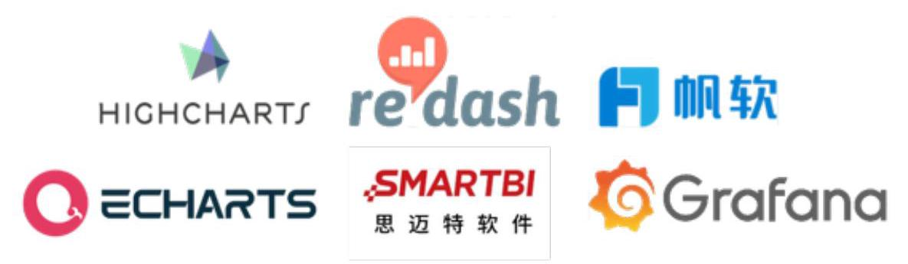

### 8.5 作业调度工具

DolphinDB 内置了脚本语言和丰富的函数库，可用于实现数据存储、计算、分析、仿真和监控等任务。当任务较为简单，不存在依赖关系时，可以使用 DolphinDB 内置的 scheduleJob 功能编排作业。当涉及到任务之间复杂依赖关系时，推荐使用 Airflow 和 DolphinScheduler 等专业的作业调度工具。DolphinDB 已经与 Airflow 和 DolphinScheduler 进行了深度集成，构建了一个强大的数据处理和调度系统。

Airflow 是一个可编程、调度和监控工作流的平台，它允许用户定义一组有依赖关系的任务，并按照依赖关系依次执行。通过 DolphinDBOperator，Airflow 可以连接 DolphinDB 数据库，实现数据写入、查询、计算等操作。这使得用户可以在 Airflow 中按照逻辑指定 DolphinDB 任务，实现任务的编排和调度。

8 - 生态

DolphinScheduler 作为一个分布式、易于扩展的任务调度系统，也支持对 DolphinDB 任务的调度。通过将 DolphinDB 集成到 DolphinScheduler 中，用户可以利用 DolphinScheduler 的调度能力，按照任务之间的依赖关系和条件关系进行编排和调度。这样，任务代码和任务之间逻辑关系的分离使得每个部分都能专注于发挥自己的作用，提高了系统的可维护性和灵活性。

DolphinDB 与作业调度平台的结合，可以帮助用户可以更高效地管理数据ETL作业和任务，提升数据处理效率，并推动业务的快速发展和创新。

### 8.6 信创支持

DolphinDB 于2021年入选信创工委会会员单位，对信创生态有较为完善的支持，且运行在信创服务器及系统上较非新创环境无显著性能差异。

图 12. DolphinDB 信创兼容概览

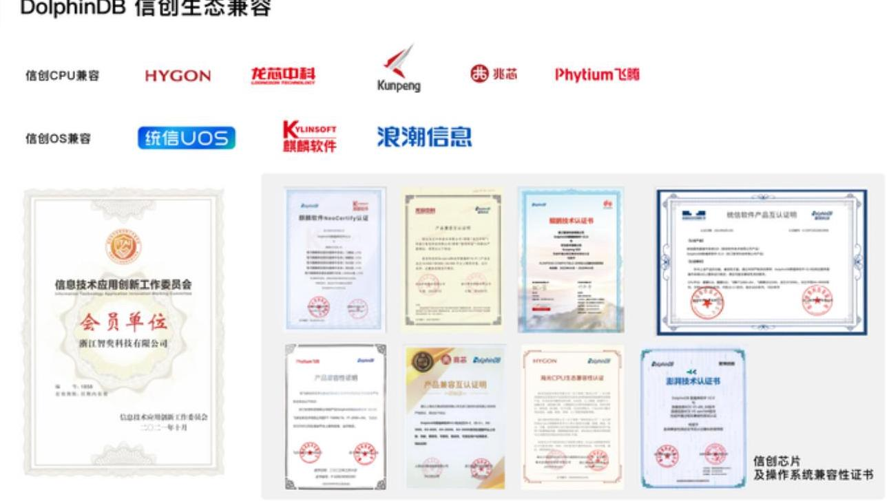

## 信创 CPU 兼容明细

表 5. DolphinDB 信创 CPU 兼容明细表

<table><tr><td>公司名称</td><td>指令集体系</td><td>是否已兼容</td><td>是否有兼容性证书</td><td>平台</td></tr><tr><td>海光</td><td>x86</td><td>是</td><td>是</td><td>海光3000、5000、7000系列</td></tr><tr><td>兆芯</td><td>x86</td><td>是</td><td>是</td><td>兆芯 ZX-C、ZX-C+、KX-5000、KX-6000、KH-20000、 KH-30000系列处理器平台</td></tr><tr><td>龙芯</td><td>MIPS LoongArch</td><td>是</td><td>是</td><td>龙芯3A3000/3B3000/2K1000</td></tr><tr><td>鲲鹏</td><td>ARMv8</td><td>是</td><td>是</td><td>鲲鹏916、鲲鹏920</td></tr></table>

8 - 生态

表 5. DolphinDB 信创 CPU 兼容明细表 (续)

<table><tr><td>公司名称</td><td>指令集体系</td><td>是否已兼容</td><td>是否有兼容性证书</td><td>平台</td></tr><tr><td>飞腾</td><td>ARMv8</td><td>是</td><td>是</td><td>FT-1500A/16、FT-2000+/64、飞腾腾云 S2500处理器平台</td></tr></table>

## 信创操作系统兼容明细

表 6. DolphinDB 信创操作系统兼容明细表

<table><tr><td>系统名称</td><td>是否已兼容</td><td>是否有兼容性证书</td><td>版本</td></tr><tr><td>统信 UOS</td><td>是</td><td>是</td><td>统信服务器操作系统 V20</td></tr><tr><td>银河麒麟 KYLIN</td><td>是</td><td>是</td><td>银河麒麟高级服务器操作系统V10</td></tr><tr><td>中标麒麟 Neokylin</td><td>是</td><td>是</td><td></td></tr><tr><td>浪潮信息 KOS</td><td>是</td><td>是</td><td>浪潮信息KOS V5 x86_64版本   浪潮信息KOS V5 aarch64版本</td></tr><tr><td>超聚变 FusionOS22</td><td>是</td><td>是</td><td>FusionOS22</td></tr><tr><td>龙蜥 OpenAnolis</td><td>是</td><td>是</td><td></td></tr></table>