# DolphinDB 白皮书 流数据

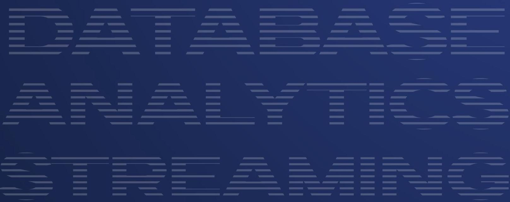

## 内容

第 1 章. 概述. . iii

1.1 流处理示例. .4

1.2 流处理架构 5

第 2 章. 发布与订阅 .8

2.1 流数据表. .8

2.2 发布与订阅 9

2.3 功能特性. 10

第 3 章. 流计算引擎. 12

3.1 引擎分类. 12

3.2 引擎详解 .13

3.3 功能特性 .27

3.4 流式算子. .28

3.5 流水线处理 28

第 4 章. 流批一体. .31

4.1 历史数据回放 .31

4.2 流批一体实现方案 .34

第 5 章. 流数据运维. .37

5.1 权限管理. 37

5.2 流数据监控. 39

5.3 流数据高可用 41

第 6 章. 流计算 API 及插件 .44

6.1 流计算 API. 44

6.2 流计算插件 45

第 7 章. 场景应用 .46

7.1 金融. 46

7.2 物联网 51

第 8 章. 结语. 55

## DolphinDB 流数据白皮书

流数据是一种持续实时生成且动态变化的时间序列数据，涵盖了金融交易、物联网(IoT)传感器采集、物流运营、零售订单等各类持续生成动态数据的场景。DolphinDB 将时间序列数据库与流数据处理框架无缝集成，不仅可以处理海量的历史数据，还广泛支持了实时数据的流式计算，包括流数据发布与订阅、数据预处理、实时内存计算、复杂指标的窗口计算、异常检测、多数据源实时关联等。借助 DolphinDB，企业可以高效地过滤、关联、分析和可视化大规模实时流数据，从中预测趋势、监测异常，辅助实时决策。

本白皮书旨在介绍 DolphinDB 的流数据处理框架、功能特性及应用场景，主要包括以下几个方面:

- 流数据的概念和特点

- 流数据处理框架及实现

- 流数据操作与功能特性

- 流数据应用场景与案例

## 第 1 章. 概述

### 1.1 流处理示例

首先通过简单的 DolphinDB 脚本介绍流数据的订阅与处理过程。

---

	// 创建并共享流数据表 pubTable 与 outputTable

share(streamTable(1:0, `time`id`price`qty, [TIME, SYMBOL, DOUBLE, LONG]),

																			"pubTable")

share(streamTable(1:0, `time`id`price`qty`amount, [TIME, SYMBOL, DOUBLE, LONG,

													DOUBLE]), "outputTable")

go

	// 定义流处理方法

	def streamProcessFunc(msg)\{

											t = select time, id, price, qty, price*qty as amount from msg

															outputTable.append!(t)

\}

	// 提交流订阅

		subscribeTable(tableName="pubTable", actionName="demo1", offset=-1,

												handler=streamProcessFunc, msgAsTable=true)

	// 注入数据到发布表

insert into pubTable values(09:51:49.581, "GOOG", 2.6, 100)

---

上例演示了 DolphinDB 基本的流订阅流程:

- 首先通过 streamTable 函数创建流数据表 pubTable 作为流数据发布表，outputTable 作为订阅数据的接收表。执行 share 语句实现流数据表会话间共享。

·定义函数 streamProcessFunc 用于计算每条消息价格和数量的乘积得出交易总量，并输出到流数据表 outputTable。

-执行 subscribeTable 函数提交订阅，并指定 streamProcessFunc 为数据处理方法。系统会分配后台线程处理订阅到的数据。

- 向发布表 pubTable 插入数据。数据被推送至消费队列，订阅端后台线程处理数据并将结果推送至输出表 outputTable。

图 1-1 流数据订阅示例

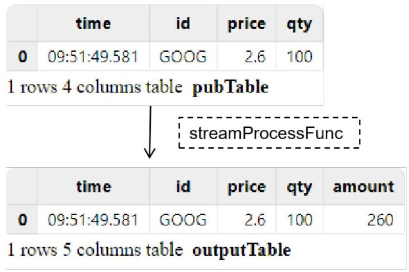

### 1.2 流处理架构

#### 1.2.1 流数据处理

流数据是基于事件持续生成的时间序列数据。与静态有界的历史数据不同，流数据具有以下特点:

- 动态:数据流持续动态生成，流的结束没有明确定义，数据的大小与结构也没有固定限制。

- 有序:每条流数据记录都具有时间戳或者序列号，标识了数据在流中的位置与顺序。

·大规模:流数据通常以高速率生成，数据规模大，对处理引擎的并行处理性能和可扩展性有更高要求。

・强时效:流数据的强时效性要求极低延迟的读取和处理能力，以最大化数据价值，驱动实时业务决策。

流数据处理是指在实时数据流上进行实时计算和分析的过程。与批处理不同，流处理无需等待所有数据全部到位，即可按照时间顺序对数据进行增量处理。这种实时处理方式能够高效利用存储与计算资源，适用于需要快速响应和及时决策的应用场景。

<table><tr><td></td><td>批处理</td><td>流处理</td></tr><tr><td>数据范围</td><td>对数据集中的所有或大部分数据进行查询或处理</td><td>对时间窗口内的数据或对最近的数据记录进行查询或处理</td></tr><tr><td>数据大小</td><td>大批量数据</td><td>单条记录或包含几条记录的小批量数据</td></tr><tr><td>性能</td><td>几分钟至几小时的延迟</td><td>亚毫秒级延迟</td></tr></table>

#### 1.2.2 流处理架构

为实现不同应用场景的业务逻辑，DolphinDB 采用了模块化与可扩展的流处理框架，将核心的流计算组件 (如流数据表、流计算引擎等)设计为可重用的模块。模块可以像积木一样通过发布-订阅的方式灵活组合， 形成功能强大的流水线。此外，DolphinDB 还提供了 1500 多个内置函数，可用作流计算引擎的算子，极大简化了流计算应用的开发过程。同时，用户也可以根据业务需求使用自定义函数实现复杂指标计算，即使是复杂

1 - 概述

的金融算法也可以通过 DolphinDB 的脚本语言灵活实现。此外，JIT 编译等技术的应用也进一步提高了流计算的性能。

## 图 1-2 流数据处理框架

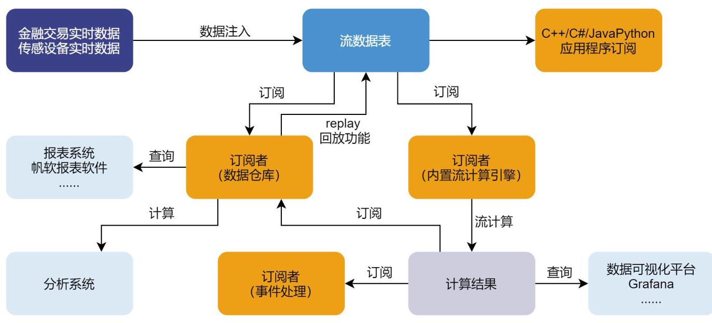

上图展示了 DolphinDB 流数据处理框架。实时数据注入到流数据发布表后可同时供多方订阅消费:

·流数据计算引擎:流数据计算引擎可以订阅流数据进行实时分析。计算结果可以通过可视化平台如 Grafana 进行实时展示，也可以再次发布，供其他数据节点或应用进行二次订阅和事件处理。

・API 客户端:通过 DolphinDB API，第三方客户端如 Python 应用程序可以方便地订阅流数据，进行业务操作。这种灵活的 API 订阅方式使得 DolphinDB 的流数据可以被集成到各种应用场景中，满足多样化的实时数据需求。

·消息中间件:将流数据实时灌注到消息中间件(如 Apache Kafka)的消息队列中，供下游模块订阅程序消费。

- 数据仓库:数据仓库可以订阅并保存流数据，作为分析系统与报表系统的数据源。可以将实时数据用于后续的离线分析和报表生成，实现对历史数据和实时数据的统一分析。

#### 1.2.3 发布/订阅 (Pub/Sub) 模型

DolphinDB 采用了经典的发布/订阅 (Pub/Sub) 通信模型，通过消息队列实现流数据的发布与订阅。该模型将流数据发布端与订阅端解耦，各模块支持独立开发管理，可以增强系统的可拓展性并提升发送者的响应效率。

图 1-3 发布/订阅模型

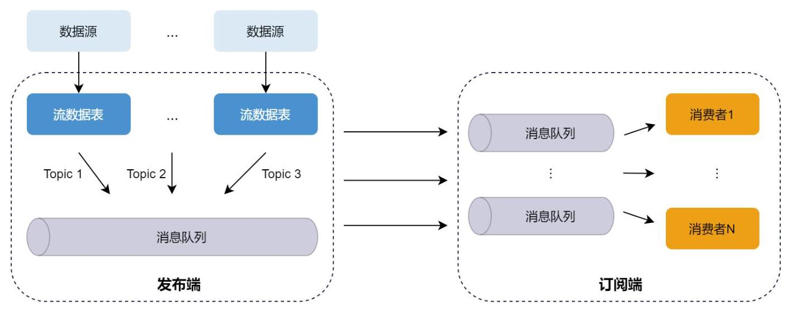

发布数据:发布端在每个节点上维护一个发布队列。当新的流数据注入到该节点的流数据发布表

时，DolphinDB 会将这些数据推送到相应的消息发布队列，再由发布线程将数据发布到各个订阅端的消费队列。

订阅数据:每个订阅线程对应一个消费队列。订阅成功提交后，每当有新数据写入流数据发布表时，DolphinDB 会主动通知所有订阅方，消费线程从消费队列中获取数据进行增量处理。

## 第 2 章. 发布与订阅

### 2.1 流数据表

#### 2.1.1 创建与删除流数据表

DolphinDB 以流数据表作为实时数据流的载体进行流数据的存储、发布与订阅。流数据表是一种特殊的内存表，包括常规流数据表、键值流数据表与高可用流数据表。流数据表可以视为简化的消息中间件，或是消息中间件中的主题(topic)，用户可以向其发布数据，也可以从中订阅数据。

用户可以执行 streamTable 函数创建流数据表。与普通内存表不同，流数据表中的记录支持同时读写， 可以增加记录，但不可修改或删除。使用 share 语句将流数据表共享到所有会话后，表中数据即可被订阅。DolphinDB 支持多个会话中的多个订阅端订阅同一个流数据表。实时数据写入该表后，会向所有订阅该表的订阅端推送数据。

---

	colName=["Name","Age"]

	colType=["string","int"]

	t = streamTable(1:0, colName, colType)

share t as st1

---

通过 streamTable 函数创建的流数据表可以包含重复记录。在订阅多个数据源时，如要避免数据的重复写入，可以使用 keyedStreamTable 函数创建包含主键的键值流数据表。表中主键不包含重复值，如果新写入的数据与已有记录的主键重复，不会更新已有记录。用户也可以使用 haStreamTable 函数创建高可用流数据表，高可用流数据表在日志中持久化了表结构信息，节点重启后不需要重新建表。同时，高可用流数据表也可以通过设置主键过滤重复记录。关于流数据高可用的详细解决方案，请参阅5.3 流数据高可用小节。

用户可以在取消所有订阅后使用 dropStreamTable 删除流数据表。例如，删除上述语句创建的共享流数据表 st1:

---

dropStreamTable(`st1)

---

#### 2.1.2 持久化流数据表

流数据表本质是特殊的内存表，系统在默认情况下会把流数据表的所有数据都保存在内存中。由于流数据持续增长的特性，内存可能会被逐渐耗尽，DolphinDB 因此支持了流数据表持久化功能，用户可将内存中的流数据以异步或同步的方式保存到磁盘中。

要持久化流数据表，首先需要在发布节点设置持久化路径参数 persistenceDir，创建流数据表后执行 enableTableShareAndPersistence 命令共享并持久化流数据表。用户也可以执行 share 语句共享流数据表后再通过 enableTablePersistence 命令持久化流数据表。持久化函数的参数设定可能会影响流数据系统的性能，其中:

·asynWrite 指定是否以异步模式持久化数据到磁盘。采用异步持久化的方式可以提高系统的吞吐量，但是节点重启可能会导致最后几条数据丢失。

- compress 指定是否将持久化的数据压缩后保存到磁盘。数据压缩可以减少磁盘写入量和空间占用。

- cacheSize 限制了流数据表在内存中保留的最大记录数。设置合理的内存占用量可以有效保证数据安全。

- flushMode 表示是否开启同步刷盘。内存中的流数据首先写入操作系统缓存，若开启同步刷盘，一批数据落盘后才会开始下一批数据的写入。

开启流数据表持久化有以下优点:

- 当前最新的一批记录保留在内存中，较早的记录保存在磁盘中，能够有效避免内存不足问题。

- 如发生节点异常重启，用户调用持久化命令会将持久化的流数据重新载入表中。

·流订阅可以从磁盘上保存记录的偏移量重新开始。

下表对比了常规流数据表、共享流数据表与持久化流数据表。

<table><tr><td></td><td>流数据表</td><td>共享流数据表</td><td>持久化流数据表</td></tr><tr><td>生命周期</td><td>当前会话</td><td>当前节点</td><td>重启后仍可加载</td></tr><tr><td>其他会话可见</td><td>否</td><td>是</td><td>是</td></tr><tr><td>可被订阅</td><td>否</td><td>是</td><td>是</td></tr><tr><td>存储方式</td><td>仅内存</td><td>仅内存</td><td>内存和磁盘</td></tr><tr><td>重启后可恢复</td><td>否</td><td>否</td><td>是</td></tr></table>

### 2.2 发布与订阅

#### 2.2.1 发布

DolphinDB 流计算框架采用了发布-订阅的模式。流数据发布首先要定义共享流数据表，实时写入该表的数据将会发布到所有订阅端。流表可部署于 DolphinDB 的数据节点或计算节点上，其所在的节点称为发布节点， 订阅方所在的节点称为订阅节点。例如，通过以下脚本定义并共享流数据表 pubTable:

share streamTable(1:0, `timestamp` temperature, [TIMESTAMP, DOUBLE]) as pubTable

DolphinDB 支持多种方式写入共享流数据表。在研究阶段，用户可以通过 append！或 insert into 语句直接向流数据表写入数据，也可以使用 DolphinDB 内置的 replay 函数将库内历史数据以指定速率回放，模拟流的形式注入流数据表。在实际生产中，可以通过插件将外部数据源产生的记录实时接入流数据表，或通过 DolphinDB API 的写入接口将外部数据写入流数据表。具体使用示例参见 用户手册-实时流数据接入。

#### 2.2.2 订阅

流数据的订阅方和发布方可以处于同一个节点、同一集群中的不同节点、或不同集群中的节点。外部的客户端应用也可以向 DolphinDB 订阅数据。SubExecutor 是 DolphinDB 集群中的消息处理线程，DolphinDB 的一个数据节点或计算节点对应一个进程，每个节点上会有一到多个消息处理线程。若订阅方位于 DolphinDB 节点上，则对应的消费会被分配到后台线程上运行。若订阅方处于外部客户端，则消费运行在外部程序中。

2 - 发布与订阅

## 图 2-1 DolphinDB 订阅模式

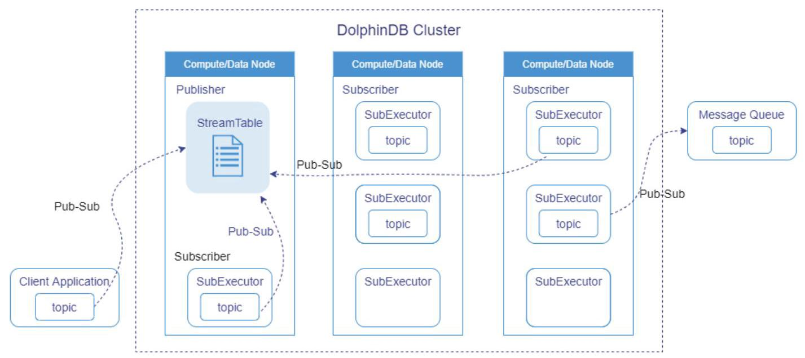

在 DolphinDB 中，用户可以通过 subscribeTable 函数订阅流数据表。只需指定表或引擎名称与数据处理方法即可创建订阅关系，函数也提供了丰富的可选参数用于灵活配置订阅。流处理示例小节演示了基本的订阅流程，通过 subscribeTable 提交订阅后，系统会分配一个后台消费线程接收并处理发布表新增的数据，并把处理后的数据推送至输出表。使用 subscribeTable 函数提交订阅脚本编写简单，在内存中直接处理数据， 降低了数据传输和转换的开销。

DolphinDB API 提供了类似 subscribeTable 的流订阅接口，用户可以在第三方客户端(例如 Python 应用程序)直接订阅 DolphinDB 的流数据表。这种订阅模式可以方便地与其他语言集成，将 DolphinDB 中的流数据应用到各种业务场景中，满足多样化的实时数据需求。

用户也可以通过插件订阅外部的消息中间件(如 Apache Kafka，ZeroMQ 等)的数据。例如可以使用 DolphinDB kafka 插件的 subscribe 接口订阅 Kafka 主题。通过插件对接外部消息中间件实现了数据生产与消费者间的解耦的订阅关系，灵活适应各种数据类型与协议。

### 2.3 功能特性

DolphinDB 的流数据订阅实现了以下功能:

·发布数据过滤:支持指定发布表的过滤列与过滤规则，只将符合特定条件的数据发送给订阅者。发布数据的过滤能够有效减少传输的数据量，提高传输的效率。

·自定义起始偏移量:用户在发起订阅时可以通过参数指定任意起始偏移位置，订阅偏移量与流数据表的行数一一对应，订阅可以从指定偏移量的对应位置开始消费。

·本地及远程订阅:DolphinDB 的发布/订阅模型支持本地和远程订阅，订阅者可以在同一台服务器上或不同服务器之间订阅数据，更好地满足分布式数据处理的需求。远程订阅采用了 TCP/IP 通信协议，保证数据传输的可靠性和实时性。

·多方订阅:发布订阅模型允许多个订阅者同时订阅同一个数据流，实现多方同时消费数据的功能。这为数据的共享和多样化的数据处理需求提供了便利。

·断线重连:在流数据传输过程中，如果订阅者因网络故障或其他原因与服务端断开连接，订阅可以自动重连确保数据传输的稳定性。开启断线重连后，订阅端会记录流数据发布的偏移量，连接恢复时订阅端会从偏移量开始重新订阅。

## 第 3 章. 流计算引擎

使用 DolphinDB 处理历史数据时，可以结合 SQL 语句与内置函数进行全量或增量的查询和计算。但实时数据场景要求高效即时处理，全量查询和计算无法满足这种需求。因此，DolphinDB 研发了适合流式处理的计算引擎，在系统内部采用增量计算，优化了实时计算的性能。流计算引擎是 DolphinDB 实时数据处理解决方案的核心组件，可以视作封装的独立计算黑盒，通过向其写入数据触发计算，并将计算结果输出到目标表。DolphinDB 系统内置了十余种流数据计算引擎，本节会详细介绍引擎分类，主要引擎的计算规则与应用场景，并辅以典型示例进行说明。

### 3.1 引擎分类

DolphinDB 流计算引擎提供了灵活的计算方式和丰富的计算功能，适用于多样化的实时数据处理需求。根据参与计算的表数量和类型，流计算引擎可以分为单表计算和多表连接两种类型:

图 3-1 流计算引擎分类

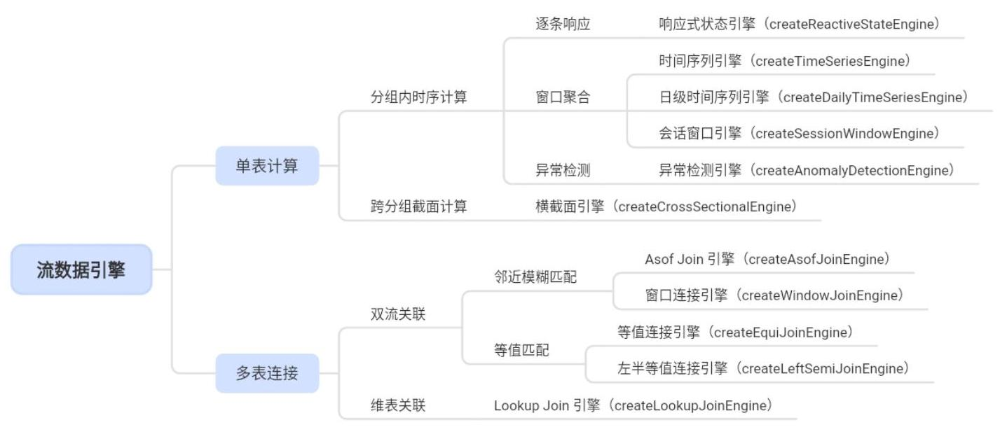

单表计算引擎应用于单个流数据表:

- 分组内时序计算:对数据进行分组，在组内进行逐条计算、窗口聚合或异常检测。

- 跨分组截面计算:对数据进行分组，选取每组的最新数据进行截面计算。

多表连接类似于 SQL 表连接 (JOIN) 操作，用于实时关联两张表。连接引擎的左表都是流数据表，根据右表的类型不同，多表连接可以分为双流关联和维表关联:

·双流关联(右表是流数据表):根据数据的时序关系进行等值或模糊匹配。

- 维表关联(右表可以是流数据表或静态维度表):流数据表实时关联右表快照。

### 3.2 引擎详解

#### 3.2.1 单表计算引擎

## (1)响应式状态引擎(createReactiveStateEngine)

## 计算规则:

响应式状态引擎能够即时响应注入数据，每当有新的数据到达引擎即触发一次计算，并输出一条计算结果。DolphinDB 针对生产业务中常用的状态算子(滑动窗口函数、累积函数、序列相关函数和 topN 相关函数等)进行了优化，采用增量算法大幅提升了这些算子在引擎中的计算效率。在 DolphinDB 提供的内置函数中，响应式状态引擎目前仅支持系统优化过的状态函数；如需实现更加复杂的计算逻辑，用户也可以通过 @state 声明自定义函数封装复杂的状态算子。

## 应用场景:

响应式状态引擎能够快速响应新数据，适用于对单条数据即时响应并实时更新输出计算结果的高频计算场景， 例如:

・金融:实时计算高频因子，如基于快照数据计算股票的短时涨幅等。

•物联网:检测传感器状态的变化，如实时监控温度、湿度、压力等数据指标的波动。

## 使用案例:实时计算 5 分钟涨速

本例通过回放一天的快照行情数据模拟实时数据流，响应式状态引擎实时响应每条输入数据，并基于当前数据计算并输出过去 5 分钟涨速。

---

		// 定义流数据发布表与结果输出表

		schemaTable = loadTable("dfs://SH_TSDB_snapshot_ArrayVector",

																				"snapshot").schema().colDefs

	share(streamTable(1:0, schemaTable.name, schemaTable.typeString),

																							`snapshotStreamTable)

share(streamTable(1:0, ["SecurityID", "DateTime", "factor_5min"], [SYMBOL,

																TIMESTAMP, DOUBLE]), `changeResultTable)

	go

	// 定义自定义状态函数

@state

def calculateChange(DateTime, LastPx, lag)\{

										PREVLASTPX = tmove(DateTime, LastPx, lag)

									return (LastPx - PREVLASTPX) \\ PREVLASTPX

\}

		// 定义响应式状态引擎

	metrics=<[DateTime, calculateChange(DateTime, LastPx, lag=5m)]>

	rse = createReactiveStateEngine(name="calChange", metrics=metrics,

										dummyTable=snapshotStreamTable, outputTable=changeResultTable,

														keyColumn=`SecurityID)

## // 订阅上游输入表

subscribeTable(tableName="snapshotStreamTable", actionName="snapshotFilter",

												offset=-1, handler=rse, msgAsTable=true, hash=0)

// 后台提交回放任务

data = replayDS(sqlObj=<select * from

															loadTable("dfs://SH_TSDB_snapshot_ArrayVector", "snapshot") where

											date(DateTime)=2021.12.01>, dateColumn=`DateTime, timeColumn=`DateTime,

														timeRepartitionSchema=09:00:00 + 0..6 * 60*60)

		submitJob("snapshotReplay", "replay snapshot", replay\{inputTables=data,

													outputTables=objByName("snapshotStreamTable"), dateColumn=`DateTime,

													timeColumn=`DateTime, replayRate=5000, absoluteRate=true\})

---

本例创建了响应式状态引擎，注入引擎的数据按 SecurityID 分组后，根据 metrics 参数指定的计算指标进行计算。@state 标识了自定义状态函数 calculateChange，该指标首先通过 tmove 函数获取 5 分钟前的价格 PREVLASTPX, 再通过 (LastPx - PREVLASTPX) \\ PREVLASTPX 计算涨速。

## (2)时间序列聚合引擎(createTimeSeriesEngine)

## 计算规则:

时间序列聚合引擎以时间度量窗口，根据指定的窗口长度与频率对窗口内的数据进行滑动聚合计算。引擎会根据创建时的参数自动划分和关闭窗口，对窗口内同一个分组内的全部数据应用聚合规则，输出一条结果。

用户可以通过引擎的参数指定基于事件时间 (Event Time) 或系统处理时间 (Processing Time) 的滑动窗口。在股票交易等领域中，实际成交的时刻被记录为事件时间，而引擎处理这些记录的时刻则为系统处理时间。由于通信延迟、调度延迟等因素的影响，事件时间和系统处理时间之间可能存在偏差。在实际应用中，使用系统时间能够提供较低的延迟，而使用事件时间则能确保实盘和回放结果的一致性。

## 应用场景:

时间序列聚合引擎能够快速生成周期性的统计数据，适用于需要基于固定时间窗口分组计算聚合指标的场景， 例如:

- 金融:计算周期性统计指标，如 1 分钟 K 线、 5 分钟 K 线等。

•物联网: 对大量传感器数据进行降采样，如计算设备每 10 分钟内的平均温度。

## 使用案例:计算 1 分钟 K 线

本例通过回放一天的逐笔成交数据模拟实时数据流，使用时间序列聚合引擎生成 1 分钟 K 线和成交量加权平均价格 VWAP。

---

// 创建输入表 tickStream，输出表 OHLCStream

colName =

	`SecurityID`TradeTime`TradePrice`TradeQty`TradeAmount`BuyNum`SellNum`TradeIndex`Cha

nnelNo` TradeBSFlag `BizIndex

colType = [SYMBOL, TIMESTAMP, DOUBLE, INT, DOUBLE, INT, INT, INT, INT, SYMBOL, INT]

share(streamTable(1:0, colName, colType), `tickStream)

colName = `TradeTime` SecurityID`OpenPrice`HighPrice`LowPrice`ClosePrice`Vwap

colType = [TIMESTAMP, SYMBOL, DOUBLE, DOUBLE, DOUBLE, DOUBLE, DOUBLE]

share(streamTable(1:0, colName, colType), `OHLCStream)

// 创建时序聚合引擎

aggrMetrics = <[ first(TradePrice), max(TradePrice), min(TradePrice),

											last(TradePrice), wavg(TradePrice, TradeQty) ]>

		createTimeSeriesEngine(name="OHLCVwap", windowSize=60000,

														step=60000, metrics=aggrMetrics, dummyTable=objByName("tickStream"),

											outputTable=objByName("OHLCStream"), timeColumn="TradeTime", useSystemTime=false,

													keyColumn=`SecurityID, useWindowStartTime=false)

	// 订阅 tickStream 表

subscribeTable(tableName="tickStream", actionName="OHLCVwap", offset=-1,

								handler=getStreamEngine("OHLCVwap"), msgAsTable=true, batchSize=1000, throttle=1,

													hash=0)

	## // 回放历史数据

	testData = select * from loadTable("dfs://SH_TSDB_tick", "tick")

								where date(TradeTime)=2021.12.08, time(TradeTime)>=09:30:00.000,

											time(TradeTime)<=10:30:00.000 order by TradeTime, SecurityID

submit]ob("replay", "replay", replay, testData, objByName("tickStream"), `TradeTime,

																				`TradeTime, 200000, true, 1)

---

本例创建了时间序列聚合引擎 OHLCVwap，指定窗口长度为 1 分钟、步长为 1 分钟的滚动窗口，按 SecurityID 对注入数据分组。参数 metrics 指定了窗口内的聚合规则，分别是价格的高开低收和加权平均值。first 等内置函数在时序聚合引擎内部支持了增量计算，每条数据到来都会计算并更新中间结果，而不是在数据全部到齐、窗口关闭时才进行批量计算。

## (3)日级时间序列聚合引擎(createDailyTimeSeriesEngine)

## 计算规则:

日级时间序列聚合引擎在时序聚合引擎的基础上进一步扩展，除了时序引擎的全部功能外，还可以指定交易时间段，将一个自然日内各个交易时段开始之前的所有未参与计算的数据并入该交易时段的第一个窗口进行计算。

## 应用场景:

日级时序聚合引擎适用于在股票、期货市场等有固定交易时段的场景中，例如:

- 股票:对每个交易时段进行数据聚合，获取开盘价、收盘价等指标。

- 期货:与股票市场类似，可计算每个交易时段的均价、成交量等数据。

## (4)会话窗口引擎(createSessionWindowEngine)

## 计算规则:

会话窗口引擎根据指定事件的活跃频率划分会话窗口，其计算规则和触发计算的方式与时间序列引擎相同。但不同于时间序列引擎具有固定的窗口长度和滑动步长，会话窗口不按固定的频率产生，其窗口长度也是动态变化的。

3 - 流计算引擎

## 应用场景:

会话窗口引擎适用于需要根据事件情况动态划分窗口的场景，例如:

·金融:市场中一次交易会话可以涵盖一段时间内的所有交易操作，而交易活跃的频率可能会受到市场波动的影响，可以统计每个交易会话内的交易指标，如成交量、交易金额等。

• 物联网:统计设备的活跃或不在线时段。例如，统计设备在一天内的活跃时段，或者分析设备在线和离线的模式。

## (5)异常检测引擎(createAnomalyDetectionEngine)

## 计算规则:

异常检测引擎根据指定的条件指标，实时监测流数据，自动筛查并输出符合条件的异常信息。异常检测引擎要求以元代码的形式指定一组用于异常检测判定的布尔表达式，其中可以包含聚合函数、数据列和常量。如指定了聚合指标，也需同步指定聚合计算的窗口长度与计算间隔。下表列举了常见的异常检测指标类型:

<table><tr><td>类型</td><td>示例</td><td>计算规则</td></tr><tr><td>聚合函数 + 常量</td><td>avg(temp) > 60</td><td>将每个窗口的聚合值与常量进行比较</td></tr><tr><td>聚合函数 + 数据列</td><td>temp > percentile(temp, 75)</td><td>将当前窗口的每条记录与上一个窗口的聚合值进行比较</td></tr><tr><td>数据列 + 常量</td><td>temp > 65</td><td>将每条记录与常量进行比较</td></tr></table>

## 应用场景:

异常检测引擎适用于需要实时监控数据并输出异常预警的场景，例如:

- 金融:监控交易记录，检测是否存在异常交易行为，如不合理的交易金额、交易过于频繁等。

·物联网:应用于采集、计算和分析过程中，检测设备传感器数据的异常指标，例如异常温度、湿度等。

## 使用案例:设备异常状态检测

下例使用了异常检测引擎监测设备的异常温度信息。

// 定义流数据表 sensor 接收采集的数据

share streamTable(1:0, `time`temp, [TIMESTAMP, DOUBLE]) as sensor

// 定义异常检测引擎和输出表

share streamTable(1:0, `time` anomalyType` anomalyString, [TIMESTAMP, INT, SYMBOL]) as outputTable

engine = createAnomalyDetectionEngine("engine1", <[temp > 65, temp >

percentile(temp, 75), avg(temp) > 60]>, sensor, outputTable, `time,

, 6, 3)

// 异常检测引擎 engine 订阅流数据表 sensor

subscribeTable(, "sensor", "sensorAnomalyDetection", 0, append!\{engine\}, true)

// 向流数据表 sensor 中写入 10 条数据模拟采集温度

---

timev = 2018.10.08T01:01:01.001 + 1..10

tempv = 59665760635153525655

insert into sensor values(timev, tempv)

---

本例规定了以下异常指标:(1)单次采集的温度超过 65；(2)单次采集的温度超过上一个窗口中 75% 的值；(3)平均温度超过 60。采集的数据推送到流数据表中，异常检测引擎通过订阅流数据表来获取实时数据进行异常检测，并将符合异常指标的数据输出到结果表中。

引擎输出异常信息如下:

横截面引擎对注入数据分组，并取每组数据的最新记录进行计算。横截面引擎主要由两个部分组成:横截面数据

<table><tr><td></td><td>time</td><td>anomalyType</td><td>anomalyString</td></tr><tr><td>0</td><td>2018.10.08 01:01:01.003</td><td>0</td><td>temp > 65</td></tr><tr><td>1</td><td>2018.10.08 01:01:01.003</td><td>1</td><td>temp > percentile(temp, 75)</td></tr><tr><td>2</td><td>2018.10.08 01:01:01.005</td><td>1</td><td>temp > percentile(temp, 75)</td></tr><tr><td>3</td><td>2018.10.08 01:01:01.006</td><td>2</td><td>avg(temp) > 60</td></tr><tr><td>4</td><td>2018.10.08 01:01:01.006</td><td>1</td><td>temp > percentile(temp, 75)</td></tr></table>

5 rows 3 columns table 4

## (6) 横截面引擎 (createCrossSectionalEngine)

计算规则:

横截面引擎对注入数据分组，并取每组数据的最新记录进行计算。横截面引擎主要由两个部分组成:横截面数据表和计算引擎。横截面数据表保存着各个分组的最新记录。计算引擎则包含一组聚合计算表达式和触发器， 根据指定的规则触发对横截面数据表的计算，计算结果将被保存到指定的输出表中。

## 应用场景:

横截面引擎适用于对分组的最新数据进行横向比较和计算，例如:

·金融:基于某个指数所有成分股的最新价格计算该指数的内在价值。

- 工业物联网:对一批设备的最新温度求最值。

## 使用案例:监控各时刻所有股票逐笔成交总额

本例通过回放一天所有股票的逐笔成交总额，通过横截面引擎实时获取交易高峰时段。

// 加载数据

path = "/home/data/csTestData.csv"

data=loadText(path)

colName = extractTextSchema(path).name

colType = extractTextSchema(path).type

3 - 流计算引擎

// 清理流计算环境

dropStreamEngine("csEngineDemo")

unsubscribeTable(tableName=`tick, actionName="csEngineDemo")

## // 定义输入表与输出表

share streamTable(1:0, colName, colType) as tick

share streamTable(1:0, `TradeTime`Amount, [TIMESTAMP, DOUBLE]) as opt

// 创建引擎

csEngine=createCrossSectionalEngine(name="csEngineDemo",

metrics=<[sum(TradeAmount)]>, dummyTable=tick, outputTable=opt,

keyColumn=`Date`SecurityID, triggeringPattern="keyCount", triggeringInterval=1000,

timeColumn=`TradeTime, useSystemTime=false, lastBatchOnly= true)

subscribeTable(tableName='tick', actionName="csEngineDemo", msgAsTable=true,

handler=append!\{csEngine\})

## // 回放历史数据注入引擎

replay(data, tick)

## 本例中输入一天的逐笔成交数据(如图):

<table><tr><td>Date</td><td>SecurityID</td><td>TradeTime</td><td>TradePrice</td><td>TradeQty</td><td>TradeAmount</td><td>BuyNo</td><td>SellNo</td><td>TradeIndex</td><td>ChannelNo</td><td>TradeBSFlag</td><td>BizIndex</td></tr><tr><td>2019.04.02</td><td>601311.SH</td><td>2019.04.02T09:25:00.000</td><td>14.01000000</td><td>300</td><td>4203.00000000</td><td>175,949</td><td>65,893</td><td>311</td><td>3</td><td>'N'</td><td>3,334</td></tr><tr><td>2019.04.02</td><td>601668.SH</td><td>2019.04.02T09:25:00.000</td><td>6.28000000</td><td>300</td><td>1884.00000000</td><td>65,928</td><td>65,929</td><td>2,319</td><td>3</td><td>'N'</td><td>24,232</td></tr><tr><td>2019.04.02</td><td>601997.SH</td><td>2019.04.02T09:25:00.000</td><td>13.39000000</td><td>100</td><td>1339.00000000</td><td>81,474</td><td>81,473</td><td>2,616</td><td>3</td><td>'N'</td><td>25,639</td></tr><tr><td>2019.04.02</td><td>600702.SH</td><td>2019.04.02T09:25:00.000</td><td>33.44000000</td><td>200</td><td>6688.00000000</td><td>73,779</td><td>117,255</td><td>95</td><td>3</td><td>'N'</td><td>1,166</td></tr><tr><td>2019.04.02</td><td>601328.SH</td><td>2019.04.02T09:25:00.000</td><td>6.33000000</td><td>9,300</td><td>58869.000000...</td><td>61,714</td><td>88,703</td><td>2,087</td><td>3</td><td>'N'</td><td>18,094</td></tr><tr><td>2019.04.02</td><td>900957.SH</td><td>2019.04.02T09:25:00.000</td><td>0.76600000</td><td>200</td><td>153.20000000</td><td>1,495</td><td>1,807</td><td>1</td><td>20</td><td>'N'</td><td>94</td></tr><tr><td>2019.04.02</td><td>603517.SH</td><td>2019.04.02T09:25:00.000</td><td>50.98000000</td><td>100</td><td>5098.00000000</td><td>181,507</td><td>160,813</td><td>407</td><td>3</td><td>'N'</td><td>3,562</td></tr><tr><td>2019.04.02</td><td>600111.SH</td><td>2019.04.02T09:25:00.000</td><td>11.55000000</td><td>100</td><td>1155.00000000</td><td>73,774</td><td>23,836</td><td>2,676</td><td>3</td><td>'N'</td><td>28,390</td></tr><tr><td>2019.04.02</td><td>600241.SH</td><td>2019.04.02T09:25:00.000</td><td>7.41000000</td><td>1,300</td><td>9633.00000000</td><td>72,118</td><td>148,402</td><td>1</td><td>3</td><td>'N'</td><td>261</td></tr><tr><td>2019.04.02</td><td>600522.SH</td><td>2019.04.02T09:25:00.000</td><td>10.30000000</td><td>100</td><td>1030.00000000</td><td>73.335</td><td>73,338</td><td>1,884</td><td>3</td><td>'N'</td><td>14,810</td></tr><tr><td>2019.04.02</td><td>601860.SH</td><td>2019.04.02T09:25:00.000</td><td>9.20000000</td><td>500</td><td>4600.00000000</td><td>158.569</td><td>94,187</td><td>131</td><td>6</td><td>'N'</td><td>2,725</td></tr><tr><td>2019.04.02</td><td>600352.SH</td><td>2019.04.02T09:25:00.000</td><td>20.44000000</td><td>300</td><td>6132.00000000</td><td>23</td><td>922</td><td>425</td><td>6</td><td>'N'</td><td>14,700</td></tr><tr><td>2019.04.02</td><td>600928.SH</td><td>2019.04.02T09:25:00.000</td><td>12.21000000</td><td>700</td><td>8547.00000000</td><td>14.711</td><td>8,060</td><td>430</td><td>3</td><td>'N'</td><td>10,900</td></tr><tr><td>2019.04.02</td><td>600128.SH</td><td>2019.04.02T09:25:00.000</td><td>9.47000000</td><td>300</td><td>2841.00000000</td><td>52,805</td><td>74,818</td><td>243</td><td>3</td><td>'N'</td><td>2,107</td></tr></table>

引擎输出如下:

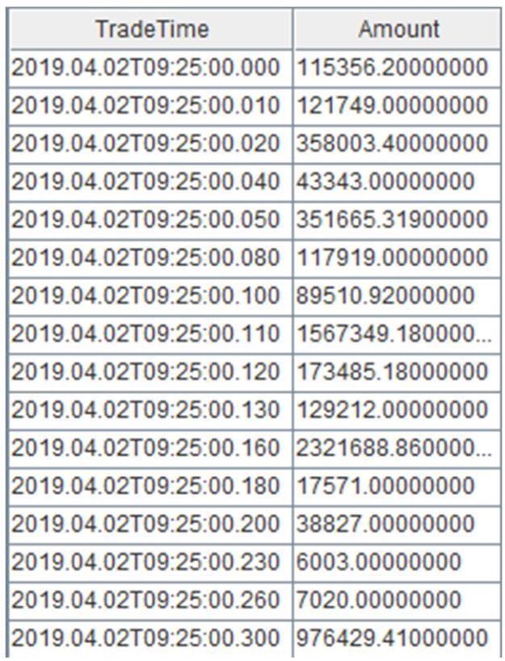

绘制一天中各个交易时间点的交易总额，可见上午 10:00，11:30 前后都呈现了一个交易高峰。

---

AMOUNT = EXEC AMOUNT from OPT

TradeTime = exec TradeTime from opt

plot(Amount, TradeTime)

---

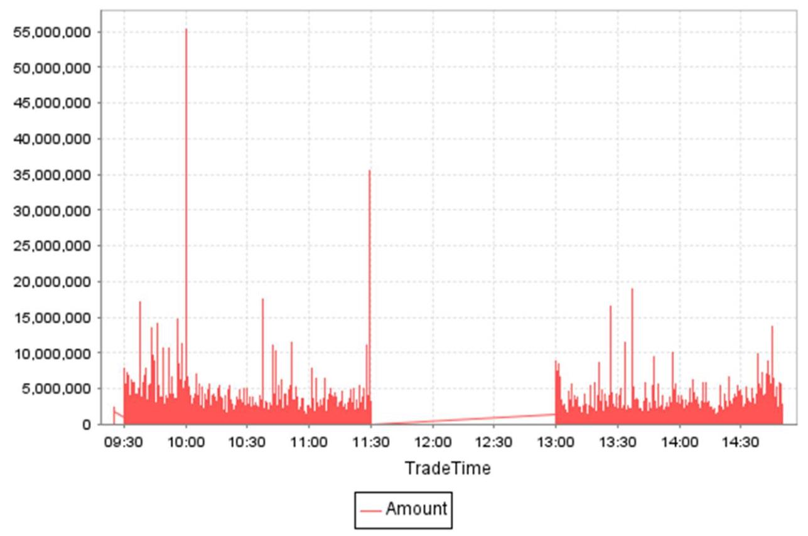

#### 3.2.2 多表连接引擎

## (1)AsofJoin 引擎 (createAsofJoinEngine)

## 关联规则:

Asof Join 引擎按连接列分组，在每个分组内按时间邻近度关联左右表。对于左表的每一条记录，在右表缓存中选取在该条左表记录的时刻之前且最接近(包括时刻相等)的一条记录。在时间序列分析中，模糊临近匹配是一种常见操作。特别是在时间精度较高的场景下，两个表的时间戳往往不会完全匹配。在这种情况下，可以使用 Asof Join 引擎关联两表进行信息整合。

## 应用场景:

Asof Join 引擎主要应用于非等值匹配场景中，可以获取业务相关的最新信息，例如:

·金融:将交易数据与行情数据进行关联，获取特定交易时刻的行情信息。

•物联网:将传感器数据与时间对齐的参考数据关联，实现实时状态监测和分析。

## 使用案例:Asof Join 引擎关联逐笔成交数据和报价数据

由于报价与成交数据发生时间不可能完全一致，往往需要以成交时间为基准找到交易发生前的最近一次报价数据，因此需要以邻近匹配的方式关联两个数据流。

// 创建连接表与输出表

share streamTable(1:0, `Sym`TradeTime`TradePrice, [SYMBOL, TIME, DOUBLE]) as trades share streamTable(1:0, `Sym`Time`Bid1Price`Ask1Price, [SYMBOL, TIME, DOUBLE, DOUBLE]) as snapshot

share streamTable(1:0, `TradeTime`Sym`TradePrice`TradeCost`SnapshotTime, [TIME, SYMBOL, DOUBLE, DOUBLE, TIME]) as output

// 创建 Asof Join 引擎

ajEngine = createAsofJoinEngine(name="asofJoin", leftTable=trades,

rightTable=snapshot, outputTable=output, metrics=<[TradePrice,

abs(TradePrice-(Bid1Price+Ask1Price)/2), snapshot.Time]>, matchingColumn=`Sym,

timeColumn=`TradeTime`Time, useSystemTime=false, delayedTime=1000)

// 订阅左右表

subscribeTable(tableName="trades", actionName="appendLeftStream",

handler=getLeftStream(ajEngine), msgAsTable=true, offset=-1, hash=0)

subscribeTable(tableName="snapshot", actionName="appendRightStream",

handler=getRightStream(ajEngine), msgAsTable=true, offset=-1, hash=1)

// 生成并注入数据

t1 = table(`A`A`B`A`B`B`B as Sym, 10:00:02.000+(1.6)*700 as TradeTime, (3.4 3.5 7.7 3.5 7.5 7.6) as TradePrice)

t2 = table(`A`B`A`B as Sym, 10:00:00.000+(3 3 6 6)*1000 as Time, (3.5 7.6 3.5 7.6) as Bid1Price, (3.5 7.6 3.6 7.6) as Ask1Price)

snapshot.append!(t2)

---

sleep(1500)

trades.append!(t1)

---

上例对每条成交记录匹配一条时刻早于自己的报价记录，输出结果与原始成交记录一一对应。关联得到的结果表如图所示，左表中 7 条数据都有对应的输出。本例在创建引擎时指定了 delayedTime 参数，因此对于分组 B，即使右表 snapshot 中没有比 10:00:06.200 更大的时间戳，左表 trades 中最后一条数据 (B,10:00:06.200, 7.6) 仍然能够在注入引擎 2s 后强制输出。

<table><tr><td></td><td>TradeTime</td><td>Sym</td><td>TradePrice</td><td>TradeCost</td><td>SnapshotTime</td></tr><tr><td>0</td><td>10:00:02.700</td><td>A</td><td>3.40</td><td></td><td></td></tr><tr><td>1</td><td>10:00:03.400</td><td>A</td><td>3.50</td><td>0.00</td><td>10:00:03.000</td></tr><tr><td>2</td><td>10:00:04.800</td><td>A</td><td>3.50</td><td>0.00</td><td>10:00:03.000</td></tr><tr><td>3</td><td>10:00:04.100</td><td>B</td><td>7.70</td><td>0.10</td><td>10:00:03.000</td></tr><tr><td>4</td><td>10:00:05.500</td><td>B</td><td>7.50</td><td>0.10</td><td>10:00:03.000</td></tr><tr><td>5</td><td>10:00:06.200</td><td>B</td><td>7.60</td><td>0.00</td><td>10:00:06.000</td></tr></table>

6 rows 5 columns table output

## (2) Window Join 引擎 (createWindow) JoinEngine)

## 关联规则:

Window Join 引擎根据连接列对数据分组，将每条左表记录与右表在指定窗口内的聚合结果相匹配，适用于关联不同的数据频率的数据源。该引擎的连接机制类似于 SQL WINDOW JOIN，左表按时间邻近关联右表指定时间窗口内的数据，窗口范围由左表中记录的时刻和创建引擎时指定的窗口长度(参数 window)共同决定。

## 应用场景:

使用 Window Join 引擎可以使用窗口内的聚合结果替代单条记录参与数据关联，降低单条匹配结果的偶然性，为业务决策提供更有价值的信息。例如估计个股交易成本时，将交易数据表关联报价数据表的窗口聚合值以获取更合理的报价基准。

## 使用案例:Window Join 引擎融合行情快照与逐笔成交数据

本例在行情快照数据的基础上融合前后两个快照之间的逐笔成交数据，左表为快照，右表为成交数据。

---

	// 创建连接表与输出表

share streamTable(1:0, `Sym`TradeTime`Side`TradeQty, [SYMBOL, TIME, INT, LONG]) as

																	trades

share streamTable(1:0, `Sym`Time`Open`High`Low`Close, [SYMBOL, TIME, DOUBLE, DOUBLE,

														DOUBLE, DOUBLE]) as snapshot

	share streamTable(1:0,

																			`Time`Sym`Open`High`Low`Close`BuyQty`SellQty`TradeQtyList`TradeTimeList, [TIME,

										SYMBOL, DOUBLE, DOUBLE, DOUBLE, DOUBLE, LONG, LONG, LONG[], TIME[]]) as output

// 创建 Window Join 引擎

wjMetrics = <[Open, High, Low, Close, sum(iif(Side==1, TradeQty, 0)),

													sum(iif(Side==2, TradeQty, 0)), TradeQty, TradeTime]>

---

3 - 流计算引擎

fillArray = [00:00:00.000, "", 0, 0, 0, 0, 0, 0, [], []]

wjEngine = createWindowJoinEngine(name="windowJoin", leftTable=snapshot, rightTable=trades, outputTable=output, window=0:0, metrics=wjMetrics, matchingColumn=`Sym, timeColumn=`Time`TradeTime, useSystemTime=false, nullFill=fillArray)

## // 订阅数据

subscribeTable(tableName="snapshot", actionName="appendLeftStream",

handler=getLeftStream(wjEngine), msgAsTable=true, offset=-1, hash=0)

subscribeTable(tableName="trades", actionName="appendRightStream",

handler=getRightStream(wjEngine), msgAsTable=true, offset=-1, hash=1)

## // 注入数据

t1 = table(`A`B`A`B`A`B as Sym, 10:00:00.000+(3 3 6 6 9 9)*1000 as Time, (NULL NULL 3.5 7.6 3.5 7.6) as Open, (3.5 7.6 3.6 7.6 3.6 7.6) as High, (3.5 7.6 3.5 7.6 3.4 7.5) as Low, (3.5 7.6 3.5 7.6 3.6 7.5) as Close)

t2 = table(`A`A`B^A^B`B^B^A^B^A^A as Sym, 10:00:02.000+(1.10)*700 as TradeTime, (12 11 1 1 1 2 1 2 2) as Side, (1..10) * 10 as TradeQty)

trades.append!(t2)

snapshot.append!(t1)

输入数据如下:

<table><tr><td></td><td>Sym</td><td>TradeTime</td><td>Side</td><td>TradeQty</td></tr><tr><td>0</td><td>A</td><td>10:00:02.700</td><td>1</td><td>10</td></tr><tr><td>1</td><td>A</td><td>10:00:03.400</td><td>2</td><td>20</td></tr><tr><td>2</td><td>B</td><td>10:00:04.100</td><td>1</td><td>30</td></tr><tr><td>3</td><td>A</td><td>10:00:04.800</td><td>1</td><td>40</td></tr><tr><td>4</td><td>B</td><td>10:00:05.500</td><td>1</td><td>50</td></tr><tr><td>5</td><td>B</td><td>10:00:06.200</td><td>1</td><td>60</td></tr><tr><td>6</td><td>A</td><td>10:00:06.900</td><td>2</td><td>70</td></tr><tr><td>7</td><td>B</td><td>10:00:07.600</td><td>1</td><td>80</td></tr><tr><td>8</td><td>A</td><td>10:00:08.300</td><td>2</td><td>90</td></tr><tr><td>9</td><td>A</td><td>10:00:09.000</td><td>2</td><td>100</td></tr></table>

10 rows 4 columns (240 B) table trades

<table><tr><td></td><td>Sym</td><td>Time</td><td>Open</td><td>High</td><td>Low</td><td>Close</td></tr><tr><td>0</td><td>A</td><td>10:00:03.000</td><td></td><td>3.50</td><td>3.50</td><td>3.50</td></tr><tr><td>1</td><td>B</td><td>10:00:03.000</td><td></td><td>7.60</td><td>7.60</td><td>7.60</td></tr><tr><td>2</td><td>A</td><td>10:00:06.000</td><td>3.50</td><td>3.60</td><td>3.50</td><td>3.50</td></tr><tr><td>3</td><td>B</td><td>10:00:06.000</td><td>7.60</td><td>7.60</td><td>7.60</td><td>7.60</td></tr><tr><td>4</td><td>A</td><td>10:00:09.000</td><td>3.50</td><td>3.60</td><td>3.40</td><td>3.60</td></tr><tr><td>5</td><td>B</td><td>10:00:09.000</td><td>7.60</td><td>7.60</td><td>7.50</td><td>7.50</td></tr></table>

6 rows 6 columns (280 B) table snapshot

如下图展示的输出结果所示，引擎既可以计算窗口聚合值(如交易总量)，也可以以数组向量的形式保留窗口内的全部逐笔成交明细(如最后两个字段)。

<table><tr><td></td><td>Time</td><td>Sym</td><td>Open</td><td>High</td><td>Low</td><td>Close</td><td>BuyQty</td><td>SellQty</td><td>TradeQtyList</td><td>TradeTimeList</td></tr><tr><td>0</td><td>10:00:03.000</td><td>A</td><td>0.00</td><td>3.50</td><td>3.50</td><td>3.50</td><td>10</td><td>0</td><td>[10]</td><td>[10:00:02.700]</td></tr><tr><td>1</td><td>10:00:06.000</td><td>A</td><td>3.50</td><td>3.60</td><td>3.50</td><td>3.50</td><td>40</td><td>20</td><td>[20, 40]</td><td>[10:00:03.400, 10:00:04.800]</td></tr><tr><td>2</td><td>10:00:09.000</td><td>A</td><td>3.50</td><td>3.60</td><td>3.40</td><td>3.60</td><td>0</td><td>160</td><td>[70, 90]</td><td>[10:00:06.900, 10:00:08.300]</td></tr><tr><td>3</td><td>10:00:03.000</td><td>B</td><td>0.00</td><td>7.60</td><td>7.60</td><td>7.60</td><td>0</td><td>0</td><td>0</td><td>0</td></tr><tr><td>4</td><td>10:00:06.000</td><td>B</td><td>7.60</td><td>7.60</td><td>7.60</td><td>7.60</td><td>80</td><td>0</td><td>[30, 50]</td><td>[10:00:04.100, 10:00:05.500]</td></tr></table>

5 rows 10 columns table output

对比结果表与左表输入数据，可以看出左表中分组 B 内时间戳为 10:00:09.000 的数据没有输出，这是因为右表中分组 B 内没有等于或大于 10:00:09.000 的数据，无法触发窗口关闭。为演示目的，本例使用了左表时间(指定参数 useSystem=false)确定窗口并触发计算。在实际生产中，推荐使用系统时间，即指定 useSystemTime=true。接入实时数据时，左表一旦到达引擎便立即输出。这时对于任意一条左表记录，右表窗口包含了前一条左表记录到本条记录之间进入引擎的全部右表数据。

## (3) Equi Join 引擎 (createEquiJoinEngine)

## 关联规则:

Equi Join 引擎将具有相同事件时间频率的数据进行等值关联，一般用于关联两表公共列并汇总表信息。引擎的连接机制类似 SQL 中的 EQUI JOIN，按连接列和时间列等值关联数据源，对于表 A 中的每一条记录，当它成功匹配上表 B 中记录时，引擎将输出一条结果。注意，无论进入引擎的数据无论已关联匹配数据，引擎都会根据指定规则定期清理缓存数据。

## 应用场景:

Equi Join 引擎适用于对不同数据源基于指定字段进行等值拼接，例如:

- 关联日线行情数据和日行情指标数据，进一步测试动态交易策略。

·对逐笔数据和行情快照数据进行实时分钟聚合并拼接两张分钟指标表。

## 使用案例:拼接不同数据源的实时分钟指标

本例使用两个独立的时序聚合引擎对快照和成交数据流做实时聚合，每一分钟的降采样指标分别作为左右表注入 Equi Join 引擎进行数据拼接。

// 创建数据表

share streamTable(1:0, `Sym` TradeTime`Side`TradeQty, [SYMBOL, TIME, INT, LONG]) as trades

share streamTable(1:0, `UpdateTime`Sym`BuyTradeQty`SellTradeQty, [TIME, SYMBOL, LONG, LONG]) as tradesMin

share streamTable(1:0, `Sym`Time`Bid1Price`Bid1Qty, [SYMBOL, TIME, DOUBLE, LONG]) as snapshot

share streamTable(1:0, `UpdateTime`Sym`AvgBid1Amt, [TIME, SYMBOL, DOUBLE]) as snapshotMin

share streamTable(1:0, `UpdateTime`Sym`AvgBid1Amt`BuyTradeQty`SellTradeQty, [TIME, SYMBOL, DOUBLE, LONG, LONG]) as output

// 创建 Equi Join 引擎与时序聚合引擎

3 - 流计算引擎

eqJoinEngine = createEquiJoinEngine(name="EquiJoin", leftTable=tradesMin, rightTable=snapshotMin, outputTable=output, metrics=<[AvgBid1Amt, BuyTradeQty, SellTradeQty]>, matchingColumn=`Sym, timeColumn=`UpdateTime)

tsEngine1 = createTimeSeriesEngine(name="tradesAggr", windowSize=60000, step=60000, metrics=<[sum(iif(Side==1, 0, TradeQty)), sum(iif(Side==2, 0, TradeQty))]>, dummyTable=trades, outputTable=getLeftStream(eqJoinEngine), timeColumn=`TradeTime, keyColumn=`Sym, useSystemTime=false, fill=(0, 0))

tsEngine2 = createTimeSeriesEngine(name="snapshotAggr", windowSize=60000, step=60000, metrics=<[avg(iif(Bid1Price!=NULL, Bid1Price*Bid1Qty, 0 )]>, dummyTable=snapshot, outputTable=getRightStream(eqJoinEngine), timeColumn=`Time, keyColumn=`Sym, useSystemTime=false, fill=(0.0))

// 订阅数据

subscribeTable(tableName="trades", actionName="minAggr", handler=tsEngine1, msgAsTable=true, offset=-1, hash=1)

subscribeTable(tableName="snapshot", actionName="minAggr", handler=tsEngine2, msgAsTable=true, offset=-1, hash=2)

// 注入数据

t1 = table(`A`B`A`B`A`B as Sym, 10:00:52.000+(3 3 6 6 9 9)*1000 as Time, (3.5 7.6

3.6 7.6 3.6 7.6) as Bid1Price, (1000 2000 500 1500 400 1800) as Bid1Qty)

t2 = table(`A`A`B`A`B`B`A`B`B`A as Sym, 10:00:54.000+(1.10)*700 as TradeTime, (1 11 1 1 2 1 2 2) as Side, (1..10) * 10 as TradeQty)

trades.append!(t2)

snapshot.append!(t1)

由于 Equi Join 引擎是等值连接，若时序聚合引擎 1 输出了股票 A 时间戳 9:30 的数据，但时序聚合引擎 2 没有输出股票 A 对应时间的数据，则 Equi Join 引擎不会输出股票 A 时间戳 9:30 的汇总数据。关联结果如下:

<table><tr><td></td><td>UpdateTime</td><td>Sym</td><td>AvgBid1Amt</td><td>BuyTradeQty</td><td>SellTradeQty</td></tr><tr><td>0</td><td>10:01:00.000</td><td>A</td><td>2,650.00</td><td>90</td><td>50</td></tr><tr><td>1</td><td>10:01:00.000</td><td>B</td><td>13,300.00</td><td>0</td><td>220</td></tr></table>

2 rows 5 columns table output

(4) Left Semi Join 引擎 (createLeftSemiJoinEngine)

## 关联规则:

Left Semi Join 引擎的连接机制类似 SQL EQUI JOIN，按连接列等值关联左右表，对于左表中的每一条记录，成功匹配上右表中的记录时，引擎将输出一条结果。未成功匹配的左表的记录将一直由引擎缓存，等待与右表中更新的记录匹配。如果右表中存在多条匹配的记录，用户可以通过参数 updateRightTable 来选择匹配右表的最早或最新一条记录。

## 应用场景:

Left Semi Join 引擎常用于数据关联和过滤场景中，它能够帮助用户快速筛选出左表中与右表相关的记录，而无需返回全部左表和右表的信息。例如:

·金融:对逐笔成交数据补充原始委托信息；关联股票和指数行情并计算其相关性。

## 使用案例:对逐笔成交数据补充原始委托信息

本例基于股票代码和订单号关联逐笔成交与逐笔委托数据，对成交数据补充原始委托信息。每条逐笔成交都匹配对应的委托单，输出结果与原始输入中的逐笔成交记录一一对应。在成功匹配委托信息前，该条逐笔成交记录暂时不输出。以下脚本用两个 Left Semi Join 引擎级联的方式，对成交表 trades 中的卖方委托单、买方委托单依次进行了关联。

## // 创建数据表

share streamTable(1:0, `Sym` BuyNo` SellNo` TradePrice `TradeQty` TradeTime, [SYMBOL, LONG, LONG, DOUBLE, LONG, TIME]) as trades

share streamTable(1:0, `Sym`OrderNo`Side`OrderQty`OrderPrice`OrderTime, [SYMBOL, LONG, INT, LONG, DOUBLE, TIME]) as orders

share streamTable(1:0,

`Sym` SellNo` BuyNo` TradePrice` TradeQty` TradeTime` BuyOrderQty` BuyOrderPrice` BuyOrderT ime, [SYMBOL, LONG, LONG, DOUBLE, LONG, TIME, LONG, DOUBLE, TIME]) as outputTemp share streamTable(1:0,

`Sym`BuyNo`SellNo`TradePrice`TradeQty`TradeTime`BuyOrderQty`BuyOrderPrice`BuyOrderT ime` SellorderQty`SellorderPrice`SellorderTime, [SYMBOL, LONG, LONG, DOUBLE, LONG, TIME, LONG, DOUBLE, TIME, LONG, DOUBLE, TIME]) as output

// 创建 Left Semi Join 引擎

ljEngineBuy=createLeftSemiJoinEngine(name="leftJoinBuy", leftTable=outputTemp, rightTable=orders, outputTable=output, metrics=<[SellNo, TradePrice, TradeQty, TradeTime, BuyOrderQty, BuyOrderPrice, BuyOrderTime, OrderQty, OrderPrice, OrderTime]>, matchingColumn=[`Sym`BuyNo, `Sym`OrderNo])

ljEngineSell=createLeftSemiJoinEngine(name="leftJoinSell", leftTable=trades, rightTable=orders, outputTable=getLeftStream(ljEngineBuy), metrics=<[BuyNo, TradePrice, TradeQty, TradeTime, OrderQty, OrderPrice, OrderTime]>, matchingColumn=[`Sym`SellNo, `Sym`OrderNo])

## // 订阅数据

subscribeTable(tableName="trades", actionName="appendLeftStream",

handler=getLeftStream(1jEngineSell), msgAsTable=true, offset=-1)

subscribeTable(tableName="orders", actionName="appendRightStreamForSell", handler=getRightStream(ljEngineSell), msgAsTable=true, offset=-1)

subscribeTable(tableName="orders", actionName="appendRightStreamForBuy", handler=getRightStream(ljEngineBuy), msgAsTable=true, offset=-1)

## // 构造数据写入发布表

t1 = table(`A`B`B`A as Sym, [2, 5, 5, 6] as BuyNo, [4, 1, 3, 4] as SellNo, [7.6, 3.5, 3.5, 7.6]as TradePrice, [10, 100, 20, 50]as TradeQty, 10:00:00.000+(400 500 500 600) as TradeTime)

t2 = table(`B`A`B`A`B`A as Sym, 1..6 as OrderNo, [2, 1, 2, 2, 1, 1] as Side, [100, 10, 20, 100, 350, 50] as OrderQty, [7.6, 3.5, 7.6, 3.5, 7.6, 3.5] as OrderPrice, 10:00:00.000+(1.6)*100 as OrderTime)

3 - 流计算引擎

---

orders.append!(t2)

trades.append!(t1)

---

上例首先将 trades 和 orders 分为作为左、右表注入引擎 leftJoinSell，以 trades 数据中的卖单号关联 orders 中的对应订单。再将上述引擎的输出直接注入连接引擎的左表，该引擎的右表仍然设置为 orders。trades 数据流中的每一条记录将分别和 orders 数据流中的两条记录关联，进而取得 orders 中的委托量、价、时间等字段，关联得到的结果表如下:

<table><tr><td></td><td>Sym</td><td>BuyNo</td><td>SellNo</td><td>TradePrice</td><td>TradeQty</td><td>TradeTime</td><td>BuyOrderQty</td><td>BuyOrderPrice</td><td>BuyOrderTime</td><td>SellOrderQty</td><td>SellOrderPrice</td><td>SellOrderTime</td></tr><tr><td>0</td><td>A</td><td>2</td><td>4</td><td>7.60</td><td>10</td><td>10:00:00.400</td><td>100</td><td>3.50</td><td>10:00:00.400</td><td>10</td><td>3.50</td><td>10:00:00.200</td></tr><tr><td>1</td><td>A</td><td>6</td><td>4</td><td>7.60</td><td>50</td><td>10:00:00.600</td><td>100</td><td>3.50</td><td>10:00:00.400</td><td>50</td><td>3.50</td><td>10:00:00.600</td></tr><tr><td>2</td><td>B</td><td>5</td><td>1</td><td>3.50</td><td>100</td><td>10:00:00.500</td><td>100</td><td>7.60</td><td>10:00:00.100</td><td>350</td><td>7.60</td><td>10:00:00.500</td></tr><tr><td>3</td><td>B</td><td>5</td><td>3</td><td>3.50</td><td>20</td><td>10:00:00.500</td><td>20</td><td>7.60</td><td>10:00:00.300</td><td>350</td><td>7.60</td><td>10:00:00.500</td></tr></table>

4 rows 12 columns table output

## (5) Lookup Join 引擎 (createLookup JoinEngine)

## 关联规则:

Lookup Join 引擎将实时数据源与一张描述数据源固有属性的表(通常是维度表或不频繁更新的内存表)关联，以补全表信息。引擎内部的连接机制类似于 SQL LEFT JOIN，按连接列等值关联左右表。每一条左表记录注入引擎时会立刻关联当前时刻的右表，不论是否在右表中匹配到连接列一致的记录，引擎都会立刻输出一条结果，若未能匹配上则结果中右表相关的字段为空。

与 Left Semi Join 引擎需要等待匹配才输出的机制不同，每当左表接收一条数据，引擎都会立即触发连接操作，无论是否在右表中找到连接列匹配的记录，Lookup Join 引擎都会立刻输出结果。

## 应用场景:

Lookup Join 引擎主要用于实时数据与描述数据源属性的表关联，可以用来补充数据、进行属性映射和增加维度信息。例如:

- 金融:关联实时的交易价格表和保存汇率信息的维度表，以便对交易进行进一步分析。

## 使用案例:关联实时行情数据和历史日频指标

下例关联了实时行情数据(流数据表)与历史日频指标(不频繁更新的内存表)。

---

share streamTable(1:0, `Sym` Time`Open`High`Low`Close, [SYMBOL, TIME, DOUBLE, DOUBLE, DOUBLE,

												DOUBLE, DOUBLE]) as snapshot

historicalData = table(`600020`600068 as Sym, [0.8, 0.2] as PreWeight, [3.39, 6.58]

														as PreClose)

	share table(1:0, `Sym` Time `Open`High` Low Close`PreWeight` PreClose, [SYMBOL, TIME,

											DOUBLE, DOUBLE, DOUBLE, DOUBLE, DOUBLE, DOUBLE]) as output

// 创建引擎

		lookupJoinEngine = createLookupJoinEngine(name="lookupJoin", leftTable=snapshot,

											rightTable=historicalData, outputTable=output, metrics=<[Time, Open, High, Low,

													Close, PreWeight, PreClose]>, matchingColumn=`Sym, checkTimes=1s)

// 订阅数据

---

---

	subscribeTable(tableName="snapshot", actionName="appendLeftStream",

											handler=getLeftStream(lookupJoinEngine), msgAsTable=true, offset=-1)

	// 注入数据

	insert into snapshot values(`600020, 09:43:50.000, 3.39, 3.4, 3.35, 3.36)

	insert into snapshot values(`600068, 09:43:54.000, 6.58, 6.59, 6.52, 6.53)

insert into snapshot values(`600020, 09:44:30.000, 3.39, 3.4, 3.35, 3.37)

insert into snapshot values(`600020, 09:44:32.000, 3.39, 3.4, 3.35, 3.37)

	insert into snapshot values(`600068, 09:44:57.000, 6.58, 6.59, 6.52, 6.54)

	insert into snapshot values(`600068, 09:45:00.000, 6.58, 6.59, 6.52, 6.54)

	select * from output

---

指定 checkTimes 后，引擎定期同步最新的右表数据。左表每到达一条数据，引擎都会检查是否和右表记录匹配，输出表数据记录数与左表记录数一致。

<table><tr><td></td><td>Sym</td><td>Time</td><td>Open</td><td>High</td><td>Low</td><td>Close</td><td>PreWeight</td><td>PreClose</td></tr><tr><td>0</td><td>600020</td><td>09:43:50.000</td><td>3.39</td><td>3.40</td><td>3.35</td><td>3.36</td><td>0.80</td><td>3.39</td></tr><tr><td>1</td><td>600068</td><td>09:43:54.000</td><td>6.58</td><td>6.59</td><td>6.52</td><td>6.53</td><td>0.20</td><td>6.58</td></tr><tr><td>2</td><td>600020</td><td>09:44:30.000</td><td>3.39</td><td>3.40</td><td>3.35</td><td>3.37</td><td>0.80</td><td>3.39</td></tr><tr><td>3</td><td>600020</td><td>09:44:32.000</td><td>3.39</td><td>3.40</td><td>3.35</td><td>3.37</td><td>0.80</td><td>3.39</td></tr><tr><td>4</td><td>600068</td><td>09:44:57.000</td><td>6.58</td><td>6.59</td><td>6.52</td><td>6.54</td><td>0.20</td><td>6.58</td></tr><tr><td>5</td><td>600068</td><td>09:45:00.000</td><td>6.58</td><td>6.59</td><td>6.52</td><td>6.54</td><td>0.20</td><td>6.58</td></tr></table>

6 rows 8 columns (944 B) table output

### 3.3 功能特性

DolphinDB 内置的流计算引擎具有以下特性:

·支持表接口:流计算引擎均实现了数据表接口，流数据表与引擎之间能够灵活串联形成流处理流水线。

·分组计算:引擎支持按指定键值进行分组计算。用户可以为不同分组的数据应用指定的计算规则并分别进行计算。

·状态计算:有状态计算指需要用到历史状态的计算。流计算引擎内部缓存历史状态并实现了部分算子的增量优化，以便高效地进行实时数据处理。为避免缓存状态不断增长，引擎也提供了自动清理无用历史数据的功能。

·检查点机制:开启引擎快照后，系统会为引擎启用检查点(Checkpoint)机制，定期保存引擎快照。若出现异常情况，可及时将引擎恢复到最新的快照，保证数据的完整性与可用性。

3 - 流计算引擎

·高可用:DolphinDB 基于 Raft 协议实现了流计算引擎高可用。用户在 leader 节点创建流计算引擎后， 系统会同步在 follower 节点创建该引擎，引擎快照也会在节点间同步。如果 leader 节点离线，系统会自动切换到新 leader 节点重新订阅流数据表，恢复到最新快照状态继续实时处理。

・并行执行:当数据流量较大时，用户可以配置订阅节点消息处理的线程数，并行从消息队列中读取并处理数据，提高订阅端的消费效率与吞吐量，确保流数据的实时与高效处理。

### 3.4 流式算子

DolphinDB 内置了丰富的批处理函数，在大部分流计算引擎中可以直接调用定义计算指标，称为流式算子。 在流数据处理中，通常需要在一定时间内存储所接收的事件或中间结果，以供后续的某个时间点(例如收到下一个事件或者经过指定时间后)访问并进行后续处理，此类变量值的变化和计算产生的中间结果统称为状态。 部分流计算引擎内部维护了流数据状态，并针对其应用场景对内置函数的计算进行了增量优化，实现了算子的有状态计算:

·时间序列聚合引擎的算子分为增量计算和全量计算两种:增量计算算子不会保留所有的历史数据， 每当数据到达后更新计算结果与引擎类的变量状态；而全量计算算子(例如自定义聚合函数或未经优化的内置聚合函数)会保留窗口内完整的数据，在窗口关闭时触发全量计算。时序引擎对以下聚合计算算子实现了增量计算优化，显著提升了性能:corr, covar, first, last, max, med, min, percentile, quantile, std, var, sum, sum2, sum3, sum4, wavg, wsum, count, firstNot, ifirstNot, lastNot, ilastNot, imax, imin, nunique, prod, sem, mode, searchK.

- 类似时间序列聚合引擎，Window Join 引擎优化了部分基于右表窗口计算的聚合算子，其中包括: sum, sum2, avg, std, var, corr, covar, wavg, wsum, beta, max, min, last, first, med, percentile.

·响应式状态引擎通常需要通过时序相关的内置函数完成状态获取或者实现相关计算。DolphinDB 针对生产业务中的常见状态算子(滑动窗口函数、累积函数、序列相关函数和 topN 相关函数等)进行优化， 实现了增量算法，大幅提升了计算效率。同时，用户也可以自定义包含 @state 标识的状态函数，在函数定义中调用状态算子，对复杂指标实现有状态计算。

### 3.5 流水线处理

DolphinDB 针对不同场景提供了多种流计算引擎，例如用户可以使用响应式状态引擎访问历史状态数据，通过横截面引擎实时计算截面数据等。对于简单的业务场景，只需使用单一引擎即可解决，而对于一些复杂任务，往往需要将计算过程分解成多个阶段，将多个流计算引擎通过级联的方式合并成一个复杂的数据流拓扑， 共同完成计算任务。

图 3-2 流水线处理

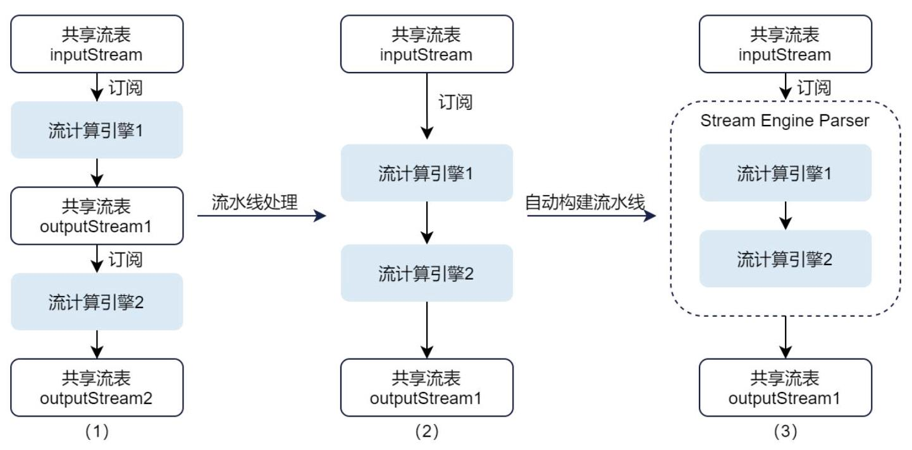

上图中流程 1 以中间流数据表串联两个流计算引擎，通过两次订阅串联了两个引擎的计算，而 DolphinDB 只需一次订阅即可实现引擎多级级联(如流程 2、3 所示)，所有的计算均在一个线程中顺序完成。引入流水线处理，不仅可以提高计算性能，还可以实现更为复杂的实时计算逻辑。下文分别介绍手动搭建引擎流水线，以及通过解析引擎 streamEngineParser 实现引擎自动级联。

#### 3.5.1 手动搭建流水线

由于流计算引擎实现了数据表接口，向引擎添加数据可以视作向一个流数据表写入数据，因此可以将两个引擎间的中间流数据表省略，将一个引擎的返回结果作为另一个引擎的输入，串联调用引擎搭建引擎流水线。实时数据首先注入流数据表，订阅该表的流计算引擎会随着实时数据的注入自动完成计算。

下例展示了 World Quant Alpha001 因子在 DolphinDB 中的流水线实现。

Alpha001 因子计算逻辑:rank(Ts_ArgMax(SignedPower((returns<0?

stddev(returns,20):close), 2),5))-0.5

// 创建横截面引擎，计算股票的排序

dummy = table(1:0, `sym`time`maxIndex, [SYMBOL, TIMESTAMP, DOUBLE])

resultTable = streamTable(1:0, `time`sym`factor1, [TIMESTAMP, SYMBOL, DOUBLE])

ccsRank = createCrossSectionalEngine(name="alpha1CCS", metrics=<[sym, rank(maxIndex, percent=true) - 0.5]>, dummyTable=dummy, outputTable=resultTable, keyColumn=`sym, triggeringPattern='keyCount', triggeringInterval=3000, timeColumn=`time,

useSystemTime=false)

@state

def wqAlpha1TS(close)\{

ret = ratios(close) - 1

v = iif(ret < 0, mstd(ret, 20), close)

return mimax(signum(v)*v*v, 5)

---

\}

		// 创建响应式状态引擎，输出到横截面引擎 ccsRank

	input = table(1:0, `sym`time`close, [SYMBOL, TIMESTAMP, DOUBLE])

	rse = createReactiveStateEngine(name="alpha1", metrics=<[time, wqAlpha1TS(close)]>,

										dummyTable=input, outputTable=ccsRank, keyColumn="sym")

---

#### 3.5.2 streamEngineParser 自动级联

为降低用户开发脚本的复杂度，DolphinDB 针对只涉及一个分组键的指标计算研发了引擎流水线解析器(streamEngineParser)。手动串联引擎需要定义每一层引擎实例并按照特定顺序进行级联，而使用解析器可以自动解析表达式并构建流水线。用户只需将嵌套因子按规则改写，系统将自动解析各层嵌套涉及的计算逻辑，形成流计算引擎流水线，将数据分发给对应的引擎进行计算，高效实现复杂业务逻辑。streamEngineParser 为只涉及横截面、历史状态、时序窗口三种逻辑嵌套的复杂因子提供了统一的计算入口。其中:

- row 系列函数分发给横截面引擎进行计算;

- rolling 函数分发给时序聚合引擎进行计算;

·其余所有计算分发给响应式状态引擎进行计算。

下例通过 streamEngineParser 计算 Alpha001 因子。解析器基于因子表达式自动识别横截面操作和时间序列操作，形成流水线处理。相比之下，通过解析器自动级联的实现更简洁，指标表达式几乎等同于因子的数学公式，用户无需考虑计算涉及的引擎类型与各层引擎的计算逻辑即可完成复杂因子计算。

---

@state

def wqAlpha1TS(close)\{

	ret = ratios(close) - 1

	v = iif(ret < 0, mstd(ret, 20), close)

	return mimax(signum(v)*v*v, 5)

\}

// 构建计算因子

metrics=<[sym, rowRank(wqAlpha1TS(close), percent=true)- 0.5]>

streamEngine=streamEngineParser(name=`alpha1_parser, metrics=metrics,

dummyTable=input, outputTable=resultTable, keyColumn=`sym, timeColumn=`time,

triggeringPattern='keyCount', triggeringInterval=3000)

---

## 第 4 章. 流批一体

### 4.1 历史数据回放

在 DolphinDB 中，用户可以使用 replay 函数将数据库或者内存表中的历史数据严格按照事件发生的时间顺序写入流数据表，模拟实时注入的数据流，实现历史数据回放。用户可以通过回放功能将同一套代码应用于回测与实盘交易，为量化策略开发和实盘运行提供了便利。

图 4-1 历史数据回放

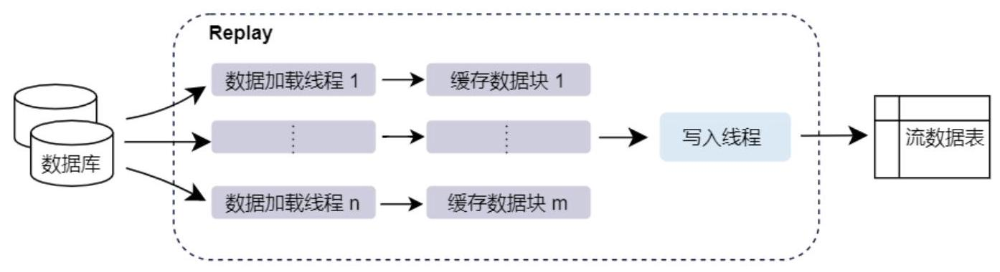

#### 4.1.1 回放形式

根据输入表到输出表的映射 (mapping), DolphinDB 支持 1 对 1, N 对 N, N 对 1 三种回放形式:

## 1 对 1 单表回放

单表回放，即 1 对 1 回放，是最基础的回放模式，即将一个输入表回放至一个相同表结构的目标表中。

下例演示了将数据库 "dfs://trade" 中的 "trade" 表中 2020 年 12 月 31 日的数据以每秒 1 万条的速度注入目标表 tradeStream 中:

---

tradeDS = replayDS(sqlObj=<select * from loadTable("dfs://trade", "trade") where

											Date = 2020.12.31>, dateColumn=`Date, timeColumn=`Time)

	replay(inputTables=tradeDS, outputTables=tradeStream, dateColumn=`Date,

													timeColumn=`Time, replayRate=10000, absoluteRate=true)

---

## N 对 N 多表回放

replay 也支持 N 张表的同时回放，即 N 对 N 回放，将多张输入表以元组的形式传入 replay，并为每一个输入表分别指定输出表，输出表和输入表一一对应且具有相同的表结构。

下例基于原始数据生成数据源 orderDS, tradeDS, snapshotDS，并分别回放至输出表 orderStream, tradeStream, snapshotStream:

---

orderDS = replayDS(sqlObj=<select * from loadTable("dfs://order", "order") where

										Date = 2020.12.31>, dateColumn=`Date, timeColumn=`Time)

tradeDS = replayDS(sqlObj=<select * from loadTable("dfs://trade", "trade") where

														Date = 2020.12.31>, dateColumn=`Date, timeColumn=`Time)

						snapshotDS = replayDS(sqlObj=<select * from loadTable("dfs://snapshot", "snapshot")

										where Date = 2020.12.31>, dateColumn=`Date, timeColumn=`Time)

							replay(inputTables=[orderDS, tradeDS, snapshotDS], outputTables=[orderStream,

														tradeStream, snapshotStream], dateColumn=`Date, timeColumn=`Time, replayRate=10000,

																		absoluteRate=true)

---

注意，这种 N 对 N 的回放模式并不能严格保证回放数据的时序关系。一方面，多个输入表同一秒内的数据可能无法按照时间字段先后回放；另一方面，如果由多个消息处理线程分别对 N 个回放输出表进行订阅和消费， 表与表之间的数据的处理顺序关系也很难保证。

## N 对 1 多表回放

为了严格保证数据可以按照时间顺序回放，DolphinDB 引入了 N 对 1 多表回放模式，将多张数据表同时注入一张二进制异构流数据表。异构流数据表和普通流数据表一样可以被订阅消费，即多种结构的数据回放至同一张表中发布，且由同一个线程实时处理，因此保证了数据消费的时序性。

例如，将数据源 orderDS, tradeDS, snapshotDS 统一回放至输出表 messageStream:

---

	orderDS = replayDS(sqlObj=<select * from loadTable("dfs://order", "order") where

														Date = 2020.12.31>, dateColumn=`Date, timeColumn=`Time)

	tradeDS = replayDS(sqlObj=<select * from loadTable("dfs://trade", "trade") where

												Date = 2020.12.31>, dateColumn=`Date, timeColumn=`Time)

snapshotDS = replayDS(sqlObj=<select * from loadTable("dfs://snapshot", "snapshot")

							where Date = 2020.12.31>, dateColumn=`Date, timeColumn=`Time)

	inputDict = dict(["order", "trade", "snapshot"], [orderDS, tradeDS, snapshotDS])

		replay(inputTables=inputDict, outputTables=messageStream, dateColumn=`Date,

												timeColumn=`Time, replayRate=10000, absoluteRate=true)

---

若要对异构流数据表进行数据处理(如指标计算等)操作，需要将二进制格式的消息内容反序列化为原始结构的数据。DolphinDB 支持流数据分发引擎 streamFilter 反序列化异构流数据表并过滤分发数据；同时，各 API 在流数据订阅功能的基础上，也支持了订阅时指定 StreamDeserializer 对异构流数据表进行反序列化操作。

#### 4.1.2 回放速率

根据参数 replayRate 的不同设定，历史数据可以按照以下速率回放:

- 指定每秒回放记录数:回放的速率基于记录数计算，系统按照每秒 replayRate 条记录进行回放。

- 指定时间跨度回放加速倍数:根据输入表数据的时间跨度加速 replayRate 倍回放，此时每秒回放的记录数是相同的。

- 精确速度回放:根据输入表数据到来的时间截以尽可能精确的速度加速 replayRate 倍回放。

- 全速回放:系统以最快的速率进行回放。

#### 4.1.3 异构回放应用案例

在实际数据分析应用中，通常需要多种不同类型的消息协作。以量化策略研发为例，在生产环境中实时数据的处理通常是由事件驱动的。而为了更好地在研发环境模拟实际交易中的实时数据流，可能需要将逐笔委托、逐笔成交、快照等行情数据同时回放进行关联分析。异构多表回放是准确模拟实盘环境的关键手段，它保证了不同类型数据的绝对时序，从而使策略开发测试中的行为完全复现实盘交易中的处理逻辑。

下例结合股票行情回放展示异构多表回放功能在实际场景中的应用。脚本将逐笔成交数据与快照数据回放至一个异构流数据表，并通过 streamFilter 反序列化、筛选并分发数据，使用 Asof Join 引擎实时关联并计算个股交易成本。

---

		// 创建异构流数据表 messageStream

	colName = `timestamp`source`msg

	colType = [TIMESTAMP, SYMBOL, BLOB]

messageTemp = streamTable(1:0, colName, colType)

enableTableShareAndPersistence(table=messageTemp, tableName="messageStream",

									asynWrite=true, compress=true, cacheSize=1000000, retentionMinutes=1440,

													flushMode=0, preCache=10000)

	messageTemp = NULL

		// 创建计算结果输出表 prevailingQuotes

	colName =

																		`TradeTime` SecurityID` Price `TradeQty` BidPX1` OfferPX1` TradeCost` Snapshot Time

	colType = [TIME, SYMBOL, DOUBLE, INT, DOUBLE, DOUBLE, DOUBLE, TIME]

prevailingQuotesTemp = streamTable(1:0, colName, colType)

	enableTableShareAndPersistence(table=prevailingQuotesTemp,

										tableName="prevailingQuotes", asynWrite=true, compress=true, cacheSize=1000000,

											retentionMinutes=1440, flushMode=0, preCache=10000)

	prevailingQuotesTemp = NULL

			## // 创建连接引擎

def createSchemaTable(dbName, tableName)\{

														schema = loadTable(dbName, tableName).schema().colDefs

														return table(1:0, schema.name, schema.typeString)

\}

		tradeSchema = createSchemaTable("dfs://trade", "trade")

snapshotSchema = createSchemaTable("dfs://snapshot", "snapshot")

		joinEngine=createAsofJoinEngine(name="tradeJoinSnapshot", leftTable=tradeSchema,

													rightTable=snapshotSchema, outputTable=prevailingQuotes, metrics=<[Price,

													TradeQty, BidPX1, OfferPX1, abs(Price-(BidPX1+OfferPX1)/2), snapshotSchema.Time]>,

													matchingColumn=`SecurityID, timeColumn=`Time, useSystemTime=false, delayedTime=1)

		// 创建流计算过滤与分发引擎

def filterAndParseStreamFunc(tradeSchema, snapshotSchema)\{

															filter1 = dict(STRING, ANY)

															filter1["condition"] = "trade"

														filter1["handler"] = getLeftStream(getStreamEngine(`tradeJoinSnapshot))

---

4 - 流批一体

---

	filter2 = dict(STRING, ANY)

	filter2["condition"] = "snapshot"

	filter2["handler"] = getRightStream(getStreamEngine(`tradeJoinSnapshot))

	schema = dict(["trade", "snapshot"], [tradeSchema, snapshotSchema])

	engine = streamFilter(name="streamFilter", dummyTable=messageStream,

	filter=[filter1, filter2], msgSchema=schema)

	subscribeTable(tableName="messageStream", actionName="tradeJoinSnapshot",

	offset=-1, handler=engine, msgAsTable=true, reconnect=true)

\}

filterAndParseStreamFunc(tradeSchema, snapshotSchema)

// 回放历史数据

def replayStockMarketData()\{

	timeRS = cutPoints(09:15:00.000..15:00:00.000, 100)

	tradeDS = replayDS(sqlobj=<select * from loadTable("dfs://trade",

	"trade") where Date = 2020.12.31>, dateColumn=`Date, timeColumn=`Time,

	timeRepartitionSchema=timeRS)

	snapshotDS = replayDS(sqlObj=<select * from loadTable("dfs://snapshot",

	"snapshot") where Date =2020.12.31>, dateColumn=`Date, timeColumn=`Time,

	timeRepartitionSchema=timeRS)

	inputDict = dict(["trade", "snapshot"], [tradeDS, snapshotDS])

	submitJob("replay", "replay for factor calculation", replay, inputDict,

	messageStream, `Date, `Time, 100000, true, 2)

\}

replayStockMarketData()

---

上述脚本读取数据库中的结构不同的数据表进行全速的异构回放，回放通过 submit Job 函数提交后台作业来执行。对于回放产生的流数据表 messageStream，首先通过函数 streamFilter 反序列化，并根据过滤条件处理订阅数据。数据经过筛选处理后，符合条件的 trade 数据被注入到 Asof Join 引擎的左表，snapshot 数据注入到引擎右表，实现数据关联。完整应用脚本与示例数据可参考教程股票行情回放。

### 4.2 流批一体实现方案

流批一体是指将研发环境中基于历史数据建模分析研发的因子表达式直接应用于生产环境的实时数据中，并保证流计算的结果和批量计算完全一致，二者使用同一套代码，称为 “流批一体”。DolphinDB 将历史数据和实时数据分析整合，在研发环境中开发的核心因子表达式可以直接应用于生产环境的实时数据中。实时行情订阅、行情数据收录、交易实时计算、盘后研究建模，全都用同一套代码完成，保证在历史回放和生产交易当中数据完全一致。相比传统的 Python 与 C++ 两套代码的方案，开发上线周期可缩短 90% 以上。在生产环境中，DolphinDB 提供了实时流计算框架。在流计算框架下，用户在投研阶段封装好的基于批量数据开发的因子函数，可以无缝投入交易和投资方面的生产程序中。同时，流计算框架在算法路径上进行了精细的优化，兼顾了高效开发和计算性能的优势。用户无需维护两套代码，节约了开发成本，还规避了两套体系可能带来的批计算与流计算结果不一致的问题。

图 4-2 流批一体实现方案

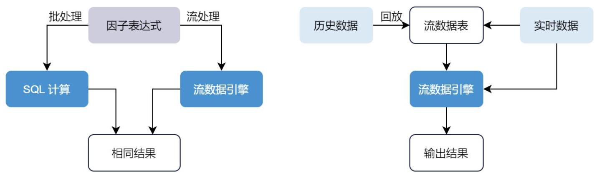

流批一体在 DolphinDB 中有两种实现方法:

## (1)使用一套核心函数定义或表达式，代入不同的计算引擎实现历史数据或流数据的计算。

流计算引擎可以直接重用批处理(研发阶段)中基于历史数据编写的表达式或函数，避免在生产环境重写代码，降低了维护研发和生产两套代码的负担。DolphinDB 脚本语言的表达式实际上是对因子语义的描述，因子计算的具体实现则交由相应的计算引擎完成。DolphinDB 确保流式计算的结果与批量计算完全一致，因此代码只要在历史数据的批量计算中验证正确，即可保证流数据的实时计算正确，极大降低了实时计算的调试成本。实际应用中，投研批处理阶段定义的因子表达式无需修改，在生产阶段只需创建流式计算引擎指定该指标即可实现增量流计算。

例如，计算每天主买成交量占全部成交量的比例，可以自定义函数 buyTradeRatio:

---

@state

def buyTradeRatio(buyNo, sellNo, tradeQty)\{

	return cumsum(iif(buyNo>sellNo, tradeQty, 0))\\cumsum(tradeQty)

\}

---

在批处理模式下，可以使用 SQL 查询，发挥库内并行计算的优势，使用 csort 语句对组内数据按照时间顺序排序:

---

factor = select TradeTime, SecurityID, `buyTradeRatio as

											factorname, buyTradeRatio(BuyNo, SellNo, TradeQty) as val from

												loadTable("dfs://tick_SH_L2_TSDB","tick_SH_L2_TSDB") where

												date(TradeTime)<2020.01.31 and time(TradeTime)>=09:30:00.000 context by SecurityID,

														date(TradeTime) csort TradeTime

---

在流处理模式下，可以通过响应式状态引擎指定该因子实现增量计算。在批计算中定义的因子函数

buyTradeRatio，只需增加 @state 标识声明其为状态函数即可在流式计算中复用。通过以下代码创建响应式状态引擎 demo，以 SecurityID 作为分组键，输入的消息格式同内存表 tickStream。

---

tickStream = table(1:0,

	`SecurityID` TradeTime` TradePrice `TradeQty` TradeAmount` BuyNo` SellNo,

	[SYMBOL, DATETIME, DOUBLE, INT, DOUBLE, LONG, LONG])

result = table(1:0, `SecurityID`TradeTime`Factor, [SYMBOL, DATETIME, DOUBLE])

factors = <[TradeTime, buyTradeRatio(BuyNo, SellNo, TradeQty)]>

---

4 - 流批一体

demoEngine = createReactiveStateEngine(name="demo", metrics=factors, dummyTable=tickStream, outputTable=result, keyColumn="SecurityID")

## (2)回放历史数据模拟实时数据流入，使用流数据计算引擎完成计算。

为确保研发和生产环境使用同一套代码，可以研发阶段需将历史数据严格按照事件发生的时间顺序进行回放， 以此模拟交易环境。使用这种方法计算历史数据的因子值，效率会略逊与基于 SQL 的批量计算。

下例通过用户自定义函数 sum_diff 与内置函数 ema (exponential moving average) 计算高频因子 factor1:

---

def sum_diff(x, y)\{

														return (x-y)/(x+y)

\}

	factor1 = <ema(1000 * sum_diff(ema(price, 20), ema(price, 40)),10) - ema(1000 *

															sum_diff(ema(price, 20), ema(price, 40)), 20)>

	// 定义响应式状态引擎实现因子流式计算

share streamTable(1:0, `sym`date`time`price, [STRING, DATE, TIME, DOUBLE]) as

														tickStream

	result = table(1:0, `sym` factor1, [STRING, DOUBLE])

		rse = createReactiveStateEngine(name="reactiveDemo", metrics = factor1,

											dummyTable=tickStream, outputTable=result, keyColumn="sym")

subscribeTable(tableName=`tickStream, actionName="factors",

														handler=tableInsert\{rse\})

---

回放历史数据模拟实时数据注入引擎触发计算:

---

// 从 trades 表中加载一天的数据，回放到流数据表 tickStream 中

inputDS = replayDS(<select sym, date, time, price from loadTable("dfs://TAQ",

											"trades") where date=2021.03.08>, `date, `time, 08:00:00.000 + (1.10) * 3600000)

replay(inputDS, tickStream, `date, `time, 1000, true, 2)

---

## 第 5 章. 流数据运维

### 5.1 权限管理

DolphinDB 为流数据表与引擎引入了灵活且安全的权限管理方案，允许管理员和创建表或引擎的用户对应用权限控制。只有经过授权的用户能够访问特定的流数据，从而维护数据的安全性和完整性。更多有关权限管理的详细内容，请参考权限管理教程。

DolphinDB 提供了 TABLE_READ 和 TABLE_WRITE 权限类型，用于控制流数据表与引擎的读取和写入权限。

---

//创建用户user1, user2

login(`admin, `123456)

createUser(`user1, "pwd111");

createUser(`user2, "pwd222");

//登录用户user1并创建流数据表和引擎

	login(`user1, "pwd111")

share streamTable(1:0, `time`sym`volume, [TIMESTAMP, SYMBOL, INT]) as trades

share streamTable(1:0, `time`sym`sumVolume, [TIMESTAMP, SYMBOL, INT]) as output1

	engine1 = createTimeSeriesEngine(name="engine1", windowSize=600, step=600,

										metrics=<[sum(volume)]>, dummyTable=trades, outputTable=output1, timeColumn=`time,

														useSystemTime=false, keyColumn=`sym, garbageSize=50, useWindowStartTime=false)

---

## (1)访问控制

管理员或创建表或引擎的用户可以执行 addAccessControl，对共享流数据表或引擎对象增加访问控制，限制其他用户访问。在创建引擎后若没有执行 addAccessControl，则任何用户对该引擎有访问权限，能够进行写入和注销。

下例中 user1 用户调用 addAccessControl 对表和引擎增加了访问控制:

---

	addAccessControl(`trades)

addAccessControl(`output1)

addAccessControl(engine1)

---

用户 user2 读取表 trades 中数据或注入数据到引擎均失败:

---

login(`user2, "pwd222")

select sum(volume) from trades // ERROR: No access to shared table [trades]

	insert into engine1 values(2018.10.08T01:01:01.785, A,10) // ERROR: No access to

														table [engine1]

---

## (2)权限设置

管理员或创建表或引擎的用户可以通过 grant、revoke 和 deny 命令管理流数据表和流计算引擎的读写权限。

5 - 流数据运维

登录管理员 admin，并赋予用户 user2 引擎的写入权限:

---

login(`admin, `123456)

	grant("user2", TABLE_WRITE, "engine1")

---

用户 user2 成功向引擎注入数据:

---

login(`user2, "pwd222")

insert into engine1 values(2018.10.08T01:01:01.785+1.600, take(`A,600),1..600)

---

## (3)流数据订阅

用户订阅流数据时，要求该用户具有发布表的 TABLE_READ 权限。

・若订阅流数据写入流数据表，用户应具有目标表的 TABLE_READ 和 TABLE_WRITE 权限。

例如，用户 user2 订阅表 trades 到 output1，必须具有 trades 表的 TABLE_READ 权限和 output1 表的 TABLE_READ 和 TABLE_WRITE 权限:

---

	login(`admin, `123456)

grant("user2", TABLE_READ, "trades")

grant("user2", TABLE_WRITE, "output1")

grant("user2", TABLE_READ, "output1")

	login(`user2, "pwd222")

subscribeTable(tableName="trades", actionName="engine1", offset=0,

													handler=append!\{output1\}, msgAsTable=true);

---

## ・若订阅流数据写入分布式表，用户应具有目标表的 TABLE_WRITE 权限。

例如，管理员创建分布式数据库 "dfs://valuedb/pt":

---

login(`admin, `123456)

dbName = "dfs://valuedb"

		t = table(10000:0, `time`sym`sumVolume, [TIMESTAMP, SYMBOL, INT])

insert into t values(2018.10.08T01:01:01.785+1..600, take(`A,600),1..600)

db=database(dbName, VALUE, 1..10)

pt=db.createPartitionedTable(t, "pt", "sumVolume").append!(t)

---

赋予用户 user2 订阅分布式表的 TABLE_WRITE 权限:

---

grant("user2", TABLE_WRITE,"dfs://valuedb/pt")

---

用户 user2 成功提交订阅:

---

login(`user2, "pwd222")

def saveTradesToDFS(mutable dfsTrades, msg): dfsTrades.append!(msg)

subscribeTable(tableName="trades", actionName="agg1", offset=0,

										handler=saveTradesToDFS\{pt\}, msgAsTable=true);

---

### 5.2 流数据监控

#### 5.2.1 状态监控

在 DolphinDB 中提交订阅后，流数据注入实时处理时所有的计算都在后台进行。订阅端可以实时查询发布订阅的状态信息，了解当前订阅的数据流状态，例如数据是否正常传输、订阅是否生效等。用户可以执行 getStreamingStat 函数查询流数据发布、订阅、消费、持久化等每个阶段的状态，全方位监控流数据处理过程。函数返回一个字典，包含以下表格:

- subWorkers:订阅节点的工作线程的状态。

- subConns: 本地订阅节点和发布节点之间的连接状态。

•pubConns:本地发布节点和所有订阅节点之间的连接状态。

- pubTables:流数据表状态。

- persistWorkers:负责持久化流数据表的工作线程的状态。

用户也可以执行 getStreamEngineStat 查看系统中定义的流计算引擎、各个引擎的内存占用等状态。函数返回一个字典，其键为各个引擎类型的名称，值为对应引擎的状态。例如，键 ReactiveStreamEngine 对应的返回表包含了系统中各个响应式状态引擎的状态:

ReactiveStreamEngine->

<table><tr><td>name</td><td>user</td><td>status</td><td>lastErrMsg</td><td>numGroups</td><td>numRows</td><td>numMetrics ...   ---</td></tr><tr><td>RSE</td><td>guest</td><td>OK</td><td></td><td>0</td><td>0</td><td>3 ...</td></tr><tr><td>reactiveDemo</td><td>admin</td><td>OK</td><td></td><td>1</td><td>7</td><td>2 ...</td></tr><tr><td>test001</td><td>userA</td><td>OK</td><td></td><td>3</td><td>20</td><td>4 ...</td></tr></table>

自 2.00.11 版本起，DolphinDB 的 Web 管理器新增了独立的流计算监控模块。用户可以点击功能面板里的流计算监控访问该模块，查看并管理流数据发布订阅、流计算引擎与流数据表状态，在面板中统一监控流计算资源使用情况与异常信息。

图 5-1 Web 流计算监控模块

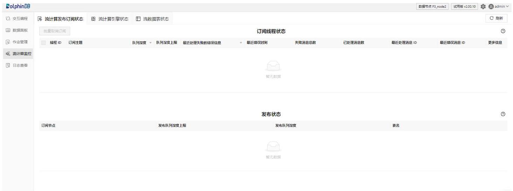

5 - 流数据运维

#### 5.2.2 可视化

DolphinDB 2.00.11 版本在 Web 管理器中内置了 Dashboard 数据面板模块。用户可以搭建多种类型图表的组合面板，订阅多个数据源并将实时数据集中展示在数据面板中，并指定数据更新的频率。数据面板模块访问方便、使用灵活，支持个性化的面板布局与配色方案，能够灵活适配用户的使用习惯，辅助用户高效挖掘数据价值，获得关键业务洞察。下图通过数据面板集中展示了选定标的的实时订单簿行情数据，其中左下角全市场买卖压力指标柱状图展示了全市场的买卖压力相对强度指数，用于观测市场上买方和卖方的力量对比，帮助交易者评估市场的动态，进而制定和调整交易策略。

图 5-2 数据面板展示多种数据指标

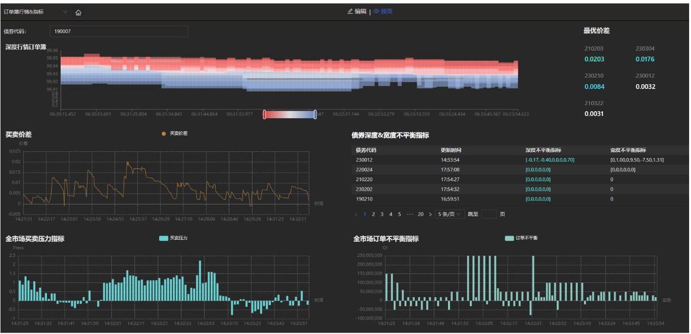

除数据面板外，DolphinDB 开发了 Grafana 数据源插件，用户可以在 Grafana 面板中编写查询脚本，基于 WebSocket 与 DolphinDB 进行交互，实现 DolphinDB 数据的可视化，监控 DolphinDB 集群的节点状态、 流数据表状态以及订阅状态。下图展示了通过 Grafana 监控 DolphinDB 数据表中的数据情况，监控每分钟的主买小单资金、主卖小单资金、主买大单资金和主卖大单资金流入情况。

图 5-3 DolphinDB 连接 Grafana 展示流数据

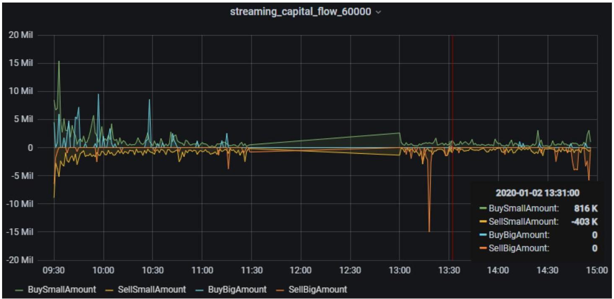

DolphinDB 与 Altair Panopticon 共同搭建了高性能时序数据分析平台，用户能够访问和分析实时流数据、日内累计数据和历史数据，并对接收到的数据实时地进行可视化展示。下图使用 DolphinDB 时序聚合引擎搭配 Panopticon 可视化应用搭建价格分析仪表盘，将 OHLC、移动平均指数、交易量等信息组合在一张图中，快速查看市场整体趋势与关键指标。DolphinDB 和 Panopticon 的流计算引擎支持实时流数据分析或历史数据回放，用户可以选择实时监控或回放任意频率、任意时间段的交易活动。

图 5-4 使用 Altair Panopticon 分析订单簿

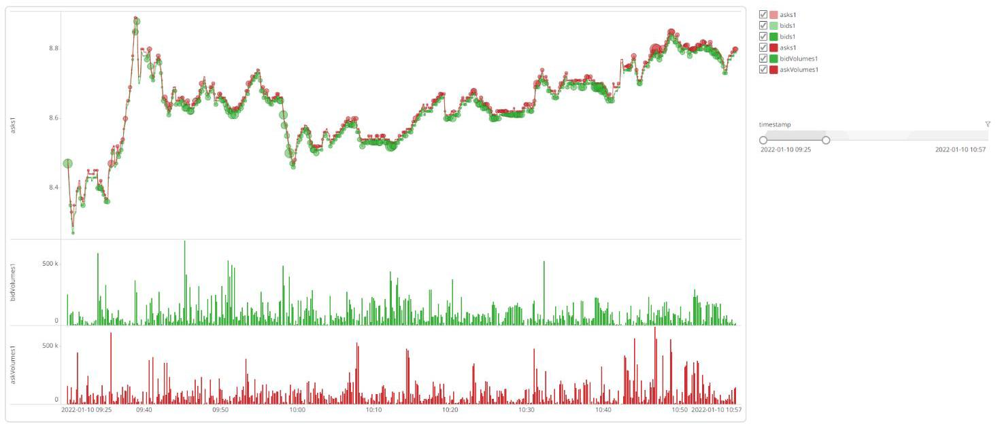

### 5.3 流数据高可用

为满足流数据服务不中断的需求，DolphinDB 提供了流数据的高可用功能，保证稳定的数据传输。DolphinDB 中流数据高可用主要通过两种方案实现:基于 Raft 协议的高可用流数据表和单机双路写入。

#### 5.3.1 高可用集群部署

在 DolphinDB 中，用户可以基于 Raft 协议的高可用多副本架构在多个数据或计算节点上部署 Raft 组，数据分布在 Raft 组的各个节点中。在组内任一节点执行函数 haStreamTable 并指定参数 raftGroup 创建高可用流数据表，该表自动在 Raft 组内的节点进行数据同步。

客户端只需订阅 Raft 组中任一节点上的高可用流数据表，并启用订阅的自动重连功能，即可实现高可用。Raft leader 上的高可用流数据表在接收到数据后会自动向订阅端发布。如果 leader 离线，系统会选举出新的 leader 继续发布数据，客户端会自动重新订阅新 leader 上的高可用流数据表。

此外，DolphinDB 也支持了流计算引擎的高可用。若引擎开启高可用(创建时指定参数 raftGroup)， 在 leader 节点创建流计算引擎后，系统会同步在 follower 节点同步创建，引擎保存的快照也会同步到 follower。当 leader 节点离线时，会自动切换新的 leader 节点重新订阅流数据表，自动恢复到最新快照的状态，继续处理数据。

图 5-5 高可用流数据表

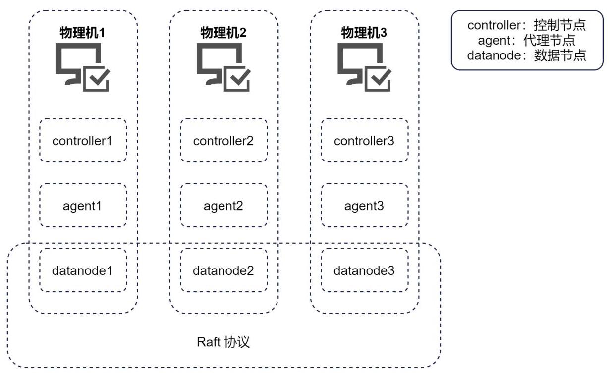

#### 5.3.2 单机部署

DolphinDB 还提供了基于单机双路计算的高可用解决方案。用户只需在 2 台独立的服务器上各部署一个单机节点，并接入相同的实时行情源、提交相同的实时计算任务，即可实现流数据的双路写入。流数据的实时计算结果可以通过主备模式写入，或写入 DolphinDB 的键值流数据表去重后推送到外部消息中间件或消息总线。

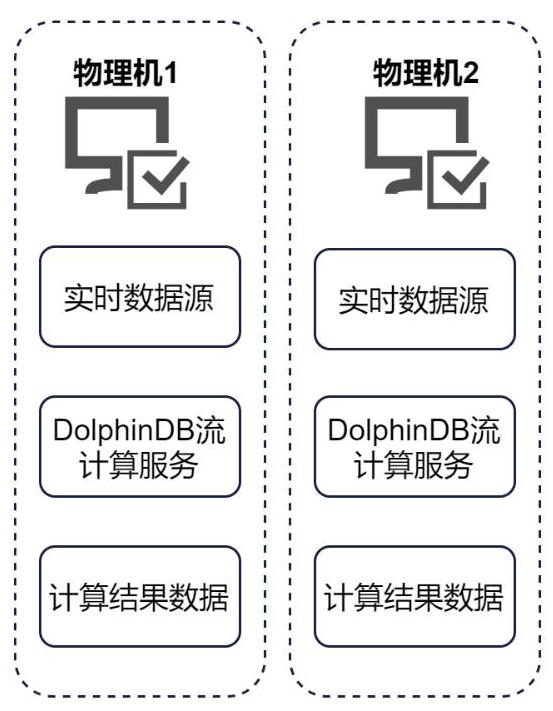

在实际生产环境下，单机部署双路计算的方案能够更好的利用机器资源，只需指定一台高性能机器作为主可用服务器；而由于 Raft 组中 leader 由随机选举产生，必须保证三台性能均衡机器，机器资源要求更高。使用高可用流数据表可能会带来存储空间的浪费和维护副本一致性的耗时开销，相比之下采用双副本的单机模式降低了运维成本，提高了写入性能。

## 第 6 章. 流计算 API 及插件

### 6.1 流计算 API

DolphinDB 支持多种语言的 API，包括 C++, C#, Java, Python, Go, NodeJS, JavaScript 等。外部程序可以通过 DolphinDB API 与 DolphinDB 服务端交互，向 DolphinDB 中的流数据表写入数据并进行流数据处理。同时，DolphinDB API 提供了单线程回调、多线程回调与主线程阻塞式轮询三种流订阅方式，构造订阅对象后， 用户可以 subscribe 接口订阅 DolphinDB 中的流数据表。具体参见 DolphinDB API 白皮书。

常用 DolphinDB API 支持写入或订阅高可用流数据表。在数据写入时指定高可用参数，连接到 server 端 Raft 组中。当 leader 发生异常时，客户端可以重新连接新 leader 并继续写入数据；客户端向 server 的高可用流数据表订阅数据时，也可通过开启自动重订阅实现高可用。leader 上的高可用流数据表会向订阅端发布数据。如果 Raft 组中的 leader 离线，系统会选举出新的 leader 继续发布数据，客户端会自动切换订阅到新 leader 上的高可用流数据表。

下例展示了如何通过 Python API 向 DolphinDB 订阅流数据:

---

import dolphindb as ddb

import numpy as np

import time

s = ddb.Session()

s.connect("192.168.1.113", 8848, "admin", "123456")

s.run("""

share streamTable(1:0, time `sym` price `id, [TIMESTAMP, SYMBOL, DOUBLE, INT]) as trades

""")

#开启流订阅，对于2.0版本的DolphinDB，若版本小于2.00.9，需指定端口

s.enableStreaming()

## #指定订阅数据的处理方法

def handler(lst):

	print(lst)

## #订阅流数据

s.subscribe("192.168.1.113", 8848, handler, "trades", "SingleMode", offset=-1)

## #插入模拟数据

s.run("insert into trades values(take(now()), 6),

take(`000005` 600001` 300201` 000908` 600002, 6), rand(1000, 6)/10.0, 1..6)")

time.sleep(3)

## #取消订阅

s.unsubscribe("192.168.1.113", 8848, "trades", "SingleMode")

---

订阅数据输出结果如下:

[numpy.datetime64('2023-03-17T12:06:30.439'), '000905', 36.7, 1]

[numpy.datetime64('2023-03-17T12:06:30.439'), '600001', 80.7, 2]

[numpy.datetime64('2023-03-17T12:06:30.439'), '300201', 68.7, 3]

[numpy.datetime64('2023-03-17T12:06:30.439'), '000908', 52.2, 4]

[numpy.datetime64('2023-03-17T12:06:30.439'), '600002', 45.1, 5]

[numpy.datetime64('2023-03-17T12:06:30.439'), '000905', 55.1, 6]

### 6.2 流计算插件

DolphinDB 支持通过动态加载外部插件来扩展功能，进行实时数据接入与输出。目前 DolphinDB 已经开发提供了丰富的插件，包括历史数据导入，实时数据接入，消息队列对接等。例如，针对金融场景实时数据接入， 目前已经开发并开源了多个插件，用于对接恒生 NSQ、华泰 Insight、华锐 AMD 等行情数据源。用户可以加载这些插件并编写简单的脚本，轻松实现各种实时数据接入需求。此外，DolphinDB 还支持自定义插件的开发，私有的接口及模型能够以插件的形式在 DolphinDB 中运行。

与流计算 API 相比，插件的数据接入方式更加高效，因为插件和 DolphinDB server 在同一进程中运行，数据源直接发送到 server 进程中回调解析；同时，使用已有插件扩展功能时，只需学习 DolphinDB 脚本语言即可实现数据接入逻辑，减少了用户的学习成本。通过插件的方式与 DolphinDB 交互，不但可以做到和 C++ 相同的处理速度，而且使用 DolphinDB 的脚本语言进行业务开发，可以节省 90% 的开发工作量，显著提升开发效率，降低开发成本，极大缩减开发到生产的周期。但需要注意的是，插件不支持高可用。当插件所在节点发生故障时，写入操作可能会失败。与之不同，API 支持高可用，因为应用程序可以迁移到其他可用的节点继续写入数据。

DolphinDB 流数据相关插件列表:

<table><tr><td>插件</td><td>类别</td><td>简介</td></tr><tr><td>amdQuote</td><td>市场行情</td><td>连接 AMD 行情服务器获取行情信息。</td></tr><tr><td>ctp</td><td>市场行情</td><td>对接综合交易平台(Comprehensive Transaction Platform)系统，支持订阅期货市场数据。</td></tr><tr><td>insight</td><td>市场行情</td><td>接华泰 INSIGHT 行情服务软件，获取交易所的行情。</td></tr><tr><td>nsq</td><td>市场行情</td><td>对接恒生 NSQ 极速行情服务软件，获取沪深市场的行情。</td></tr><tr><td>ricequant</td><td>市场行情</td><td>对接米筐(RiceQuant)数据</td></tr><tr><td>kafka</td><td>消息队列</td><td>用于发布或订阅 Kafka 流服务。</td></tr><tr><td>mqtt</td><td>消息队列</td><td>用于向 MQTT 服务器发布或订阅消息。</td></tr><tr><td>zmq</td><td>消息队列</td><td>用于 zmq 消息队列库的请求应答、发布、订阅和管道消息传输。</td></tr><tr><td>MatchingEngine Simulator</td><td>流计算应用</td><td>模拟撮合插件。</td></tr><tr><td>backtest</td><td>流计算应用</td><td>策略回测插件。</td></tr></table>

## 第 7 章. 场景应用

### 7.1 金融

#### 7.1.1 高频因子计算

因子计算是指根据一些预定义的规则或公式，从原始数据中提取出能够反映市场或个股特征的数值。因子可以用于描述市场的风险、收益、价值、动量、质量等方面，也可以用于筛选股票、构建投资组合、评估绩效等目的。DolphinDB 作为分布式计算、实时流计算与分布式存储一体化的高性能时序数据库，适合因子的存储、 计算、建模、回测和实盘交易。

下例基于逐笔成交数据计算过去 $\mathrm{n}$ 分钟主动成交占比。

## 因子计算逻辑:

主动成交占比即主动成交量占总成交量的比例, 其计算公式如下:

${\text{ actVolumes }}_{t} = \mathop{\sum }\limits_{{i = t - \text{ window }}}^{t}{\text{ tradeQty }}_{i} * {I}_{\text{ buy No } > \text{ sellNo }}$

${\text{ totalVolume }}_{t} = \mathop{\sum }\limits_{{i = t - \text{ window }}}^{t}{\text{ tradeQty }}_{i}$

${\text{ actVolumePercent }}_{t} = \frac{{\text{ actVolume }}_{t}}{{\text{ totalVolume }}_{t}}$

其中 actVolume ${}_{\mathrm{t}}$ 表示 t-window 时刻到 t 时刻区间内的主动成交量; totalVolume ${}_{\mathrm{t}}$ 表示 t-window 时刻到 t 时刻区间的总成交量；指示函数 I 含义如下:

$$
{I}_{\text{ buyNo>sellNo }} = \left\{  \begin{matrix} 1,\text{ buyN }{o}_{t} > {\text{ sellNo }}_{t} \\  0,\text{ others } \end{matrix}\right.
$$

## 实现脚本:

---

		// 自定义状态函数 actVolumePercent

	@state

def actVolumePercent(tradeTime, tradeQty, buyNo, sellNo, window)\{

														return tmsum(tradeTime, iif(buyNo > sellNo, tradeQty, 0), window) \\

															tmsum(tradeTime, tradeQty, window)

\}

		// 定义输入输出表结构

	inputTable = table(1:0,

																				`securityID`tradeTime`tradePrice`tradeQty`tradeAmount`buyNo`sellNo`tradeBSFlag`trad

	eIndex channelNo, [SYMBOL, DATETIME, DOUBLE, INT, DOUBLE, LONG, LONG, SYMBOL, INT, INT])

		resultTable = table(10000:0, ["securityID", "tradeTime", "factor"], [SYMBOL,

															TIMESTAMP, DOUBLE])

	// 创建响应式状态引擎

	try\{dropStreamEngine("reactiveDemo")) catch(ex)\{ print(ex) \}

metrics = <[tradeTime, actVolumePercent(tradeTime, tradeQty, buyNo, sellNo, 5m)]>

	rse = createReactiveStateEngine(name="reactiveDemo", metrics = metrics,

										dummyTable=inputTable, outputTable=resultTable, keyColumn="securityID")

---

以上代码首先通过 @state 标识声明了自定义状态函数 actVolumePercent。由于该因子需要计算过去 n 分钟内的主动成交量与交易总量，在函数定义中使用了内置时间滑动窗口函数 tmsum 指定窗口滑动规则并计算窗口内总和。滑动窗口函数在系统内部进行了增量优化，其计算效率也获得了大幅提升。

然后执行 createReactiveStateEngine 创建响应式状态引擎 reactiveDemo，指定分组键 securityID， 即在引擎中按照股票代码分组。输入引擎的数据结构与 inputTable 一致。数据注入引擎后触发计算指标的计算，参数 metrics 通过元代码指定了直接输出列 tradeTime，并使用已定义的 actVolumePercent 状态函数计算前 5 分钟内的主动成交占比。

## 数据写入:

模拟数据写入引擎，并观察计算结果。

---

// 输入数据

insert into rse values(`000155, 2020.01.01T09:30:00, 30.85, 100, 3085, 4951, 0, `B,

	1, 1)

insert into rse values(`000155, 2020.01.01T09:31:00, 30.86, 100, 3086, 4952, 1, `B,

	2, 1)

insert into rse values(`000155, 2020.01.01T09:32:00, 30.85, 200, 6170, 5001, 5100,

	S, 3, 1)

insert into rse values(`000155, 2020.01.01T09:33:00, 30.83, 100, 3083, 5202, 5204,

	S, 4, 1)

insert into rse values(`000155, 2020.01.01T09:34:00, 30.82, 300, 9246, 5506, 5300,

	B, 5, 1)

insert into rse values(`000155, 2020.01.01T09:35:00, 30.82, 500, 15410, 5510, 5600,

	S, 6, 1)

insert into rse values(`000155, 2020.01.01T09:36:00, 30.87, 800, 24696, 5700, 5600,

	B, 7, 1)

// 查看结果

select * from resultTable

---

7 - 场景应用

<table><tr><td></td><td>securityID</td><td>tradeTime</td><td>factor</td></tr><tr><td>0</td><td>000155</td><td>2020.01.01 09:30:00.000</td><td>1.0000</td></tr><tr><td>1</td><td>000155</td><td>2020.01.01 09:31:00.000</td><td>1.0000</td></tr><tr><td>2</td><td>000155</td><td>2020.01.01 09:32:00.000</td><td>0.5000</td></tr><tr><td>3</td><td>000155</td><td>2020.01.01 09:33:00.000</td><td>0.4000</td></tr><tr><td>4</td><td>000155</td><td>2020.01.01 09:34:00.000</td><td>0.6250</td></tr><tr><td>5</td><td>000155</td><td>2020.01.01 09:35:00.000</td><td>0.3333</td></tr><tr><td>6</td><td>000155</td><td>2020.01.01 09:36:00.000</td><td>0.5789</td></tr></table>

7 rows 3 columns table

每一条注入响应式状态引擎的数据会触发一次计算并输出一条对应的结果。引擎根据输入数据的 tradeTime 向前选择 5 分钟的窗口范围，计算过去 5 分钟主动成交占比。

#### 7.1.2 交易实时监控

通过数据库进行交易实时监控是一种有效的金融安全措施，通过实时跟踪交易数据并与历史记录对比，及时检测任何异常活动。不仅可以帮助银行和金融机构检测潜在的信用卡盗刷行为，还可以迅速响应并拦截异常交易，以确保客户的资金和信用卡信息得到充分保护，降低了金融欺诈的风险。

## 信用卡欺诈交易判定规则:

信用卡欺诈交易的一般模式为:先用盗得的信用卡进行很小额度的例如一美元或者更小额度的消费进行测试。 如果测试消费成功，再使用该卡进行大笔消费。一个账户中如果出现小于 \$1 的交易后紧跟着一笔大于 \$500 的交易，且两笔交易的间隔在一分钟之内，认定为欺诈交易。

## 实现脚本:

---

	## // 定义输入输出的表结构

inputTable = table(1:0, `accountID`time`amount, [SYMBOL, TIMESTAMP, DOUBLE])

	resultTable = table(1:0, `accountID`time`amount`isFraud, [SYMBOL, TIMESTAMP, DOUBLE,

															BOOL])

// 自定义状态函数 fraudDetection

@state

def fraudDetection(amount, time, SMALL_AMOUNT=1.0, LARGE_AMOUNT=500.0,

																INTERVAL_MINUTE=1)\{

												return (time-prev(time))<=INTERVAL_MINUTE*60*1000 and amount>LARGE_AMOUNT and

															prev(amount) <SMALL_AMOUNT

\}

	// 创建响应式状态引擎

	try\{\{ dropStreamEngine("fraudDetectioneEngine")\} catch(ex)\{ print(ex) \}

	rse = createReactiveStateEngine(name="fraudDetectioneEngine", metrics

											=<[time, amount, fraudDetection(amount, time)]>, dummyTable=inputTable,

															outputTable=resultTable, keyColumn="accountID")

---

以上代码通过 @state 标识声明了自定义状态函数 fraudDetection。在函数定义中多次使用了内置状态函数 prev 获取上一行记录，使用内置状态函数时引擎会自动缓存历史状态，而无需用户手动维护。因此 fraudDetection 函数中用与数学表达式近似的语句直观表达了欺诈交易的判定规则。

然后执行 createReactiveStateEngine 创建响应式状态引擎 fraudDetectioneEngine，指定分组键 accountID，即在引擎中按照账户分组，对每个账户的检测是相互独立的。输入引擎的数据结构与 inputTable 一致。数据注入引擎后触发计算指标的计算，参数 metrics 通过元代码指定了直接输出列，并使用已定义的 fraudDetection 状态函数标识每条记录是否为欺诈交易。

## 数据写入:

模拟数据写入引擎，并观察计算结果。

// 输入数据

insert into rse values(`000001, 2020.01.01T13:20:01.000, 25.00)

insert into rse values(`000001, 2020.01.02T09:32:10.000, 0.09)

insert into rse values(`000003, 2020.01.02T09:32:10.100, 25.00)

insert into rse values(`000001, 2020.01.02T09:32:15.590, 510.00)

insert into rse values(`000001, 2020.01.02T09:33:00.710, 6000.00)

insert into rse values(`000001, 2020.01.02T13:18:00.710, 1020.62)

insert into rse values(`000001, 2020.01.02T13:19:00.000, 91.50)

insert into rse values(`000003, 2020.01.02T14:00:00.000, 0.75)

insert into rse values(`000003, 2020.01.02T14:00:12.200, 30.01)

insert into rse values(`000003, 2020.01.02T14:00:56.950, 701.83)

insert into rse values(`000003, 2020.01.02T14:00:00.950, 31.92)

// 查看结果

select * from resultTable

<table><tr><td></td><td>accountID</td><td>time</td><td>amount</td><td>isFraud</td></tr><tr><td>0</td><td>000001</td><td>2020.01.01 13:20:01.000</td><td>25</td><td>false</td></tr><tr><td>1</td><td>000001</td><td>2020.01.02 09:32:10.000</td><td>0.09</td><td>false</td></tr><tr><td>2</td><td>000003</td><td>2020.01.02 09:32:10.100</td><td>25</td><td>false</td></tr><tr><td>3</td><td>000001</td><td>2020.01.02 09:33:00.710</td><td>510</td><td>true</td></tr><tr><td>4</td><td>000001</td><td>2020.01.02 09:33:00.710</td><td>6,000</td><td>false</td></tr><tr><td>5</td><td>000001</td><td>2020.01.02 13:18:00.710</td><td>1,020.62</td><td>false</td></tr><tr><td>6</td><td>000001</td><td>2020.01.02 13:19:00.000</td><td>91.5</td><td>false</td></tr><tr><td>7</td><td>000003</td><td>2020.01.02 14:00:00.000</td><td>0.75</td><td>false</td></tr><tr><td>8</td><td>000003</td><td>2020.01.02 14:00:12.200</td><td>30.01</td><td>false</td></tr><tr><td>9</td><td>000003</td><td>2020.01.02 14:00:56.950</td><td>701.83</td><td>false</td></tr><tr><td>10</td><td>000003</td><td>2020.01.02 14:00:00.950</td><td>31.92</td><td>false</td></tr></table>

11 rows 4 columns table

7 - 场景应用

每一条注入响应式状态引擎的数据会触发一次计算并输出一条对应的结果。在同一个账户内比较两笔相邻交易的时间间隔以及两次交易的金额大小，为每一笔交易打上是否为欺诈交易(isFraud)的标识。

进阶 1: 仅输出认定为欺诈交易的记录

---

	## // 定义输入输出的表结构

inputTable = table(1:0, `accountID`time`amount, [SYMBOL, TIMESTAMP, DOUBLE])

resultTable = table(1:0, `accountID`time` amount`isFraud, [SYMBOL, TIMESTAMP, DOUBLE,

															BOOL])

	// 自定义状态函数 fraudDetection

@state

def fraudDetection(amount, time, SMALL_AMOUNT=1.0, LARGE_AMOUNT=500.0,

																INTERVAL_MINUTE=1)\{

										return (time-prev(time))<=INTERVAL_MINUTE*60*1000 and amount>LARGE_AMOUNT and

															prev(amount)<SMALL_AMOUNT

\}

	// 创建响应式状态引擎

	try\{ dropStreamEngine("fraudDetectioneEngine")\} catch(ex)\{ print(ex) \}

		rse = createReactiveStateEngine(name="fraudDetectioneEngine", metrics

												=<[time, amount, fraudDetection(amount, time)]>, dummyTable=inputTable,

														outputTable=resultTable, keyColumn="accountID", filter=<fraudDetection(amount,

																time)==true>)

---

在创建响应式状态引擎增加指定参数 filter，该参数通过元代码指定了对于引擎输出进行过滤的条件，此处为调用 fraudDetection 状态函数后被标识为欺诈交易的计算结果将被输出。

模拟输入数据并查看结果，此时只有一条标记为欺诈交易的记录被输出。

<table><tr><td></td><td>accountID</td><td>time</td><td>amount</td><td>isFraud</td></tr><tr><td>0</td><td>000001</td><td>2020.01.02 09:32:15.590</td><td>510</td><td>true</td></tr></table>

1 rows 4 columns table

进阶 2: 增强欺诈交易判定规则

## 欺诈交易判定规则:

1. 对于一个账户，如果出现小于 \$1 的交易后紧跟着一笔大于 \$500 的交易，且两笔交易的间隔在一分钟之内，认定为欺诈交易。

2. 对于一个账户，如果发生了上述情况后紧跟着又有一笔或多笔大于 \$500 的交易，且相邻两笔交易的间隔在一分钟之内，同样认定为欺诈交易。

---

	## // 定义输入输出的表结构

inputTable = table(1:0, `accountID`time`amount, [SYMBOL, TIMESTAMP, DOUBLE])

	resultTable = table(1:0, `accountID`time`amount`isFraud, [SYMBOL, TIMESTAMP, DOUBLE,

												BOOL])

	// 自定义函数 fraudDetection

	def iterateFraudDetection(prevIsFraud, time, prevTime, amount, prevAmount,

														SMALL_AMOUNT=1.0, LARGE_AMOUNT=500.0, INTERVAL_MINUTE=1)\{

														rule1 = (time-prevTime) <=INTERVAL_MINUTE*60*1000 and amount>LARGE_AMOUNT and

																prevAmount<SMALL_AMOUNT

													rule2 = (prevIsFraud and (time-prevTime)<=INTERVAL_MINUTE*60*1000 and

																amount>LARGE_AMOUNT)

																return rule1 or rule2

\}

	// 创建响应式状态引擎

try\{ dropStreamEngine("fraudDetectioneEngine")\} catch(ex)\{ print(ex) \}

rse = createReactiveStateEngine(name="fraudDetectioneEngine", metrics =<[time,

													amount, genericStateIterate([time, prev(time), amount, prev(amount)],

																(iif(cumcount(time)==1, false, NULL)), 0, iterateFraudDetection)]>,

																dummyTable=inputTable, outputTable=resultTable, keyColumn="accountID",

																filter=< genericStateIterate([time, prev(time), amount, prev(amount)],

																		(iif(cumcount(time)==1, false, NULL)), 0, iterateFraudDetection)>)

---

判定规则 2 需要用到迭代计算，即当前记录是否为欺诈交易取决于上一条记录的状态。以上代码在引擎的 metrics 中使用内置函数 genericStateIterate 实现迭代计算，对于第一条记录总是判断为 false，即不是欺诈交易，之后的每一条记录的欺诈标识由自定义函数 iterateFraudDetection 计算得到，iterateFraudDetection 函数的第一个参数为上一条交易的欺诈标识，函数体内分别实现了两种判定规则的逻辑，任何一种规则下被判定为 true 则该笔交易都是欺诈交易。

模拟输入数据并查看结果:

<table><tr><td></td><td>accountID</td><td>time</td><td>amount</td><td>isFraud</td></tr><tr><td>0</td><td>000001</td><td>2020.01.02 09:32:15.590</td><td>510</td><td>true</td></tr><tr><td>1</td><td>000001</td><td>2020.01.02 09:33:00.710</td><td>6,000</td><td>true</td></tr></table>

2 rows 4 columns table

### 7.2 物联网

#### 7.2.1 异常检测

在物联网场景下，用户可以通过 DolphinDB 对物联网设备产生的各种传感器数据进行实时监控，如温度、湿度、压力、电压等，并对这些数据进行实时的异常检测、警告通知、故障诊断和预测维护，从而提高物联网系统的安全性和稳定性。同时，用户也可以对物联网系统产生的业务数据进行实时分析，如设备的使用率、能耗、效率等，以及用户的行为、偏好、满意度等，从而提供物联网系统的运营管理和优化建议。

## 场景需求:

现有一个物联网监控系统，其中每个监控传感器每一秒钟采集一次数据。希望实现以下异常检测需求:

7 - 场景应用

- 每3分钟内，若传感器温度出现 2 次 40 摄氏度以上并且 3 次 30 摄氏度以上，系统输出警告信息。

・若传感器网络断开，5 分钟内无数据，系统输出警告信息。

## 实现脚本:

## // 定义流数据表

share streamTable(1:0, `deviceID`ts`temperature, [INT, DATETIME, FLOAT]) as sensor share streamTable(1:0, `time` deviceID` anomalyType` anomalyString, [DATETIME, INT, INT, SYMBOL]) as warningTable

// 创建异常检测引擎

engine1 = createAnomalyDetectionEngine(name="engine1", metrics=<[sum(temperature > 40) > 2 && sum(temperature > 30) > 3]>, dummyTable=sensor,

outputTable=warningTable, timeColumn=`ts, keyColumn=`deviceID , windowSize= 180, step=180)

subscribeTable(tableName="sensor", actionName="sensorAnomalyDetection", offset=0, handler= append!\{engine1\}, msgAsTable=true)

// 创建会话窗口引擎，五分钟无数据则输出结果到告警表中

defg warning1()\{

return 1

\}

defg warning2()\{

return "五分钟无数据"

\}

engine2 =

createSessionWindowEngine(name='engine2', sessionGap=300, metrics=[<warning1()>,<warn ing2()), dummyTable=sensor, outputTable=warningTable, timeColumn=`ts, keyColumn=`device ID, useSessionStartTime=false, forceTriggerTime=301)

subscribeTable(tableName="sensor", actionName="warning", offset=0, handler= append!\{engine2\}, msgAsTable=true)

上述脚本定义并共享了流数据表 sensor 用于接收实时采集的传感器数据，表 warningTable 用于保存异常信息的输出结果。由于本例中只涉及温度指标的监测，发布表结构简化为三列，即传感器编号 deviceID，时间列 ts 和温度列 temperature。

- 为实现第一个温度异常报警需求，在创建异常检测引擎时，设置异常指标为 sum(temperature > 40) > 2 && sum(temperature > 30) > 3 ，分组列为传感器编号 deviceID，数据窗口为 180 秒，计算的时间间隔为 180 秒。

- 为实现第二个长时间无数据报警需求，创建会话窗口引擎并将会话间隔 sessionGap 设定为 300 秒，以判断是否已有五分钟未采集数据。若分组内经过五分钟后仍未接收数据，则关闭当前会话窗口。每个分组内的最后一条数据注入后，经过 forceTriggerTime(本例中为 301 秒)，强制触发未计算的窗口进行计算。

## 数据写入:

通过以下脚本模拟写入 2 个设备的温度监控数据:

// 模拟写入流数据表

startTime = 2023.09.01T15:30:00

insert into sensor values (1, startTime+10,43)

insert into sensor values (2, startTime+10,41)

insert into sensor values (1, startTime+15,45)

insert into sensor values (1, startTime+20,35)

insert into sensor values (1, startTime+30,41)

insert into sensor values (1, startTime+120,41)

insert into sensor values (1, startTime+200,25)

// 检查结果

select * from warningTable

模拟数据写入后，查询警告输出表 warningTable，会首先收到设备1温度异常的警告结果。若五分钟后仍未接收数据，结果表中还会输出设备 “五分钟无数据” 的警告信息。

<table><tr><td></td><td>time</td><td>deviceID</td><td>anomalyType</td><td>anomalyString</td></tr><tr><td>0</td><td>2023.09.01 15:33:00</td><td>1</td><td>0</td><td>sum(temperature > 40) > 2 && sum(temperature > 30) > 3</td></tr><tr><td>1</td><td>2023.09.01 15:38:20</td><td>1</td><td>1</td><td>五分钟无数据</td></tr><tr><td>2</td><td>2023.09.01 15:35:00</td><td>2</td><td>1</td><td>五分钟无数据</td></tr></table>

3 rows 4 columns table warningTable

#### 7.2.2 数据降采样

在工业生产中，设备产生的数据经常是成百上千亿条的，但在进行数据处理分析时，关注的仅仅是设备状态的整体趋势，在这种情况下存储全量数据不仅是对存储资源的浪费，也会因为全量数据的规模降低数据分析效率。在此场景下可以通过 DolphinDB 流计算进行实时计算和降采样，提高分析效率并降低存储成本。

## 场景需求:

对收集的设备数据每 10 秒进行一次数据降采样，计算当前窗口的最值并保留最后一秒的原始数据

## 实现脚本:

// 定义流数据表

share streamTable(1:0, `ts`deviceID`value, [DATETIME, INT, FLOAT]) as deviceDate

share streamTable(1:0, `ts`deviceID`value`max`min, [DATETIME, INT, FLOAT, FLOAT, FLOAT, FLOAT])

---

as result

---

// 创建时间序列引擎

tsEngine = createTimeSeriesEngine(name="engine2", windowSize=

10, step=10, metrics=<[last(value), max(value), min(value)]>, dummyTable=deviceDate,

outputTable=result, timeColumn=`ts, keyColumn=`deviceID)

subscribeTable(tableName='deviceDate', actionName='downsample', offset=0, handler=appe

nd!\{tsEngine\}, msgAsTable=true)

7 - 场景应用

以上代码首先创建了两个流数据表，deviceDate 用于接入原始数据，result 用于储存降采样后的数据结果。

执行 createTimeSeriesEngine 创建时间序列引擎 tsEngine 并指定分组键为 deviceID，即在引擎内按照设备 ID 进行分组计算。收集的数据注入时序引擎后每 10 秒触发一次聚合计算，参数 metrics 通过元代码指定了需要进行的聚合操作，即取窗口内的最后一条数据和并求最大、最小值。

由于 DolphinDB 优化了聚合计算算子 last, min 与 max, 实现了引擎中的增量计算，显著提高了数据降采样的性能。

## 数据写入:

模拟数据写入引擎，并观察计算结果。

---

	insert into deviceDate values(2023.09.01T00:00:01,1,100)

	insert into deviceDate values(2023.09.01T00:00:02,1,101)

	insert into deviceDate values(2023.09.01T00:00:05,1,102)

insert into deviceDate values(2023.09.01T00:00:06,1,103)

insert into deviceDate values(2023.09.01T00:00:10,1,104)

insert into deviceDate values(2023.09.01T00:00:11,1,105)

insert into deviceDate values(2023.09.01T00:00:20,1,106)

//查看结果

select * from result

---

模拟数据写入后，查询计算结果表，输出结果如下:

<table><tr><td></td><td>ts</td><td>deviceID</td><td>value</td><td>max</td><td>min</td></tr><tr><td>0</td><td>2023.09.01 00:00:10</td><td>1</td><td>103</td><td>103</td><td>100</td></tr><tr><td>1</td><td>2023.09.01 00:00:20</td><td>1</td><td>105</td><td>105</td><td>104</td></tr></table>

2 rows 5 columns table

## 第 8 章. 结语

DolphinDB 作为集成了分布式计算、实时流计算及分布式存储一体化的高性能时序数据库，为不同领域的流数据处理提供了完备的解决方案。本白皮书从流处理的基本概念出发，介绍了 DolphinDB 流数据处理高性能、低延迟、模块化的核心特性，并通过具体的示例展示了 DolphinDB 流数据处理在不同领域的高效采集、 传输、计算和分析应用。

我们致力于为用户提供更多创新的流数据解决方案，满足多样化的实时数据处理需求，从而发挥流数据处理的最大潜力。在未来的设计路线中，DolphinDB 将持续优化流数据的功能和性能，不断拓展应用领域:

- 支持 UDP 等通信协议，进一步提升流数据传输与处理的实时性并确保数据可靠性；

- 开发复杂事件处理(CEP)流计算引擎，支持实时复杂事件处理；

- 支持基于 SQL 语句的引擎级联解析器，增强流处理流水线的自动化搭建；

- 深度融合流处理与批处理，提升计算精度与准确性。